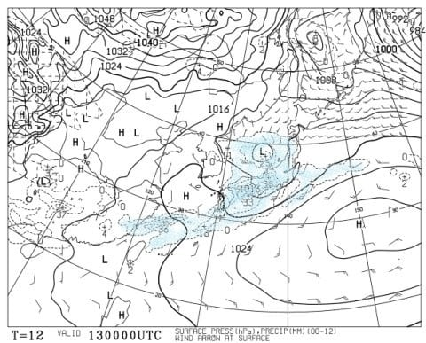

# 2月15，16日の週末の志賀高原の天気は？…気温はむちゃくちゃ上がるけど，15日は何とか降らずに済みそう！16日もギリギリ降らないでいてくれるか…

📅 投稿日時: 2020-02-13 02:39:14

🏷️ カテゴリ: [スキー天気予想](c6554f5c3c106093b511a8daae23757e8.md)

どうやら，本日の志賀高原は．

朝からすっきり晴れで，朝は

最高シマシマが滑れたようですね…

おそらく，昼ごろにはかなり気温が

上がり，残念ながら雪はかなり

緩み始めたのではないかと

思いますが…

ってなことで．

本日午後から気温が上がり始め．

これから16日まで，降れば液体確実という，

恐怖の高温危険ゾーン

に突入するわけですが．

果たして．

これから週末まで．

空から液体が落ちてこずに済むのか？

それとも…

空から恐怖の大王が落ちてくるのか？？

というところを，ドキドキしながら

見てみようかと思います…

まずは，週末の前．

13日の木曜の850hpa気温からみてみますが…

ふぎゃーーー！！

なんじゃこりゃ！！

赤い0℃線が北海道より北って…

これは，2月では絶対ありえない

レベルなんですが！！！！

志賀に近づいているのは，水色の+6℃線．

これは…13日の昼間，気温が+10℃近くまで

上がっても不思議じゃないですね（涙）

志賀高原の2月で，あるまじき気温です（激涙）

これで，降水量があるとヤバいんですが．

13日木曜の地上天気図を見ると…

…（屍）．

ダメです．

降ります．

…というか．

この記事を書いている，午前2時現在．

志賀高原でも，気温は+3℃を超えて．

雨になってるようです（涙）

ライブカメラのレンズが，水滴でぬれてます…（泣）

（[北信建設事務所道路気象状況ページ](http://hokushin.pref-nagano-roadcamera.jp/)より）

ただし，液体が落ちてくるのは，

これから木曜の朝9時ごろまでで

済みそうです！

それ以降は，雨は止んで．

リフト営業中は，ほぼ雨にぬれずに

済みそう！！

降るのは，明け方数時間のみ．

…もし，明日木曜．

営業時間中は雨が止んでいたなら…

それはおそらく．

私の強い祈りのなせる業です．←違うから

皆さん，志賀高原の天気を決めている私に感謝しましょう…←しないから

で．

翌14日の金曜の850hpa図を見てみると．

うううーーん．

この日も，赤い0℃線は志賀高原より北…

降れば液体の気温です(涙)

さて．

この日の降水域は…？？

をををを！！

無事，志賀高原には降水域がかかっていません！

この日は，気温は上がるものの．

雨は降らずに済みそう…

ってか，もしかしたら晴れ間もありそう！

そして，肝心の週末

15日の土曜の850hpa図ですが．

うがーーー！

この日も，赤い0℃線は北海道付近まで

北上しちゃってます…

志賀高原は，水色の+6℃線より南．

この日も，気温が上がりそう…（涙）

ただ，15日土曜の地上天気図を見ると．

をを！

この日も，降水域が志賀高原にはかかっていません！！

この天気図のままなら，土曜は，

空から液体が降ってくることは

なさそうです！！

続いて，16日の日曜の850hpa図ですが…

おっと．

この日はようやく0℃線が志賀高原の

南まで下がってくれそうです…

そして，16日の地上天気図を見ると．

何とかぎりぎり志賀高原は降水域が

かかって無いように見えます…

とりあえず，この天気図のままなら．

日曜も降らずに済みますね…

なんと．

これからの高温危険ゾーン中に，

液体が降るのは，木曜のこれから

朝9時ごろまでのせいぜい数時間．

それ以降木曜昼間から，土日の週末まで，

空から液体が降ってくる

危険性が無くなりそうな天気図に

なってきましたっ！！

運がいい…というより．

それもこれも，みんな私の必死の祈りの

効果に違いありません！！！←読者の踊りのおかげでは！？？

ってなことで．

まとめると．

13日（木）：早朝3時ごろ～8時過ぎまで雨．時折強く降る．

　ただ，9時くらいには雨は止む．

　朝からプラス気温．昼間の気温は+10℃くらいまで

　上がりそう．

　この日は，9時以降は曇り時折晴れ間も．

　雪質は，雨でしっとりと水分を含んだうえ，

　高温で溶けた，重い4月の雪．

14日（金）：朝は焼額山頂でギリギリ0℃くらい．

　この日は朝は曇ってるかもしれないけど，

　昼間は晴れそう．

　朝のうちはちょっと固まった固めのバーン．

　標高が低い斜面は，あまり固まらずに柔らかい

　ままかも…

　固まったバーンも，昼近くになると気温が+5℃くらい

　まで上がり，緩んで春の雪になっていく．

　

15日（土）：朝から気温はプラス．

　朝はわずかに固まった感じのシマシマバーンか．

　硬いのは朝のうち一瞬で，

　全体的に朝から緩いシャーベット状の4月ごろの雪．

　まぁ，それでも雪があるだけマシか…

　終日曇り空だけど，時折日も射すかも？

　最高気温は+5℃程度と高く，

　昼間も雪が緩み，全体的にかなり

　重い春の雪になる．

16日（日）：この日も朝は気温はプラス．

　あさイチは，締まっていない柔らか雪の

　シマシマかな．

　ただ，昼間のどこかの段階で前線が通過し，

　ぐっと気温が下がる．

　その後のゲレンデはだんだん硬くなっていき，

　ラストリフトのころにはガリガリになり，

　スケートリンク化している部分も…

　

というような感じでしょうか．

…あまりにも先週の週末と違いすぎて，

先週は冷え冷え最高雪を楽しめたのに．

今週末は，重い雪＆ガリガリアイスバーンに

悩まされそうです…（涙）

…一応，17日以降はまた結構冷えそうなので．

そこで雪質が復活することを期待…っ！！

## 💬 コメント一覧

### 💬 コメント by (新米パパさん)
**タイトル**: Unknown
**投稿日**: 2020-02-13 05:53:25

いつも気象予報ありがとうございます。

12日奥志賀、朝からシマシマいただきました、気温はぐんぐんあがり暑いくらいで、雪も緩んでました。

朝6時の上信越道でもう覆面パトカー様がお仕事されておりビビリました。気をつけなくては、、、

### 💬 コメント by (North fox)
**タイトル**: Unknown
**投稿日**: 2020-02-13 13:05:08

天気予報ありがとうございます。来週また冷えそうで一安心です。

先日の飛び石連休は雪に恵まれラッキーでした！

しかし4日間も滑っても全然滑り足りない。毎週でも志賀高原で滑りたいと思うようになってきました。

“滑らないと死んじゃう＂ウィルスに感染したのかも＾＾；

因みに物欲選手権ウィルスには感染、自覚症状有りです。幸いここ1ヶ月は症状治ってますが。

でもそろそろ来季モデルが発表され始めましたね。。。。

### 💬 コメント by (Kon Suke)
**タイトル**: 20000メートル
**投稿日**: 2020-02-13 14:09:23

２月なのに暖かいですね。

来週のアイスバーンに期待が持たそうな予報で感激です。

１０日に　naoちゃんねるさんが、２００００メートル達成されました。

私も昼飯を食べずに立ち会いましたが、頑張りましたね。

skiline　終了後でファミリーにおいて２００００ルートを達成した方は、リフト搭乗時に紙に書き記録していました。

遊びではありますが、しっかりとした裏付をお願いいたします。

記録の認定に関してですが、iSKIを楽しんでいる方も多いと思います。

しかし、ｉＳＫＩは多くカウントされてしまうようで、２００００メートル達成のツールにはならないようです。

私がゴールドシールをお配りしていますので、どのリフトに何本乗ったかもお渡しするときにお教えいただけれれば幸いです。

だんだんと日が伸びましたのでファミリーのリフト終了時間も１０～２０分遅くなると思われます。

次の達成者を心待ちにしています。

### 💬 コメント by (ゆーき)
**タイトル**: Unknown
**投稿日**: 2020-02-13 15:37:21

どうも。先週末は、朝イチリーゼンってことで、八方尾根て、新雪を楽しみました。で、今週は焼額山に一泊2日ですので、しっかり祈り踊りをお願いします。雨のスキーって、最悪ですからね、、、

### 💬 コメント by (ゴン太(gonta)@SALLOT CLUB)
**タイトル**: 志賀籠りweek
**投稿日**: 2020-02-13 19:31:51

本日13日(木)、祈りのおかげで8時頃には雨はあがりました。気温は予報通り、朝一ヤケビ山頂でプラス2℃。天気は予報に反し晴天。

太陽光と気温上昇で、「晴れ時々妖怪板つかみ現る、所によりN体大ウジャウジャ」な一日でした。

あまりの暑さに、午後からは熊横へ移動してしまいました（でも暑かった）。

### 💬 コメント by (なるなる)
**タイトル**: Unknown
**投稿日**: 2020-02-13 20:09:33

本日の志賀高原。起きた時には雨でしたが、S様・皆様の踊りのおかげで、リフトが動く頃には晴天になりました。

朝一は、雨が降ったと言われなけれわからないくらい良い状況でした。まぁ、昨日までに比べれば…ですが…

11時頃からは、日差しが激しく、もう春スキーでした。ピタッと止まる雪になりウェアを着ていると暑さとの戦いに。先日までの寒さとの戦いは何だったんだろうかと。

あまりの滑らない雪で、これ以上やると怪我しそうと思い、時間潰しにスタンプラリーでもやるかと、数年ぶりに熊の湯方面に遠征しました。

さすがに横手山山頂付近と渋峠の雪は腐ってませんでした。

しかし、2月とは思えない高温ですね…

### 💬 コメント by (レインボー)
**タイトル**: Unknown
**投稿日**: 2020-02-13 21:36:07

13日は8時半にはあめもあがり、うそのような晴天、

でも、気温が上がり過ぎで、早くも妖怪足引っ張りが出現しました。会いたくない妖怪です。

とにかく、春が来たを思わせる、嬉しくないキセツの到来です。

### 💬 コメント by (西館)
**タイトル**: まだまだ思案中：20000mへの道
**投稿日**: 2020-02-14 01:29:03

>Kon Sukeさま

skilineでずっとお名前見ていました。

なんか、なんか感動すると共にど緊張してしまっております。

ネットって凄いですね、こんな記録を残す方ってどんな方なんだろうと思いはしても、分かる筈など無いと思っていましたのに、ここでお言葉を目にすることができるなんて。

>Sさま

おっしゃる通りでございます。

まずは「4時間滑り続ける」ことを目標にしてみようと思っています。

調子が良ければ更に1時間ずつ延長するようにしてみようと。

で、あかんと思ったら撤退して改善策を模索します。

体力かも知れないし精神力かも知れないし、コンディションかも知れないし。

ご存知でしたら教えていただきたいのですが、Kon Sukeさんが書いてくださっているとおり、一瀬クワッドの営業時間は既に16:40までに延長されていますが、16:50まで延長されていたような記憶があるのですが記憶違いでしょうか。

昨シーズンまでやったからと言って今シーズンもそうだとは言えないと思いますが。

もう一つ。先日アドバイスいただいた際に、ファミリーのナイターの限界は滑降2000mと教えていただきましたが、ダイアモンド、高天原だとそれぞれいかほどでしょう。

高天原は第2トリプルで2分45秒61ｍ18:30～20:30、ダイアモンドクワッド2分15秒105m18:30～21:00(3月20日21日)、一の瀬第2ペアB線 4分5秒131m

･･･ダイアモンドが一番効率が良いでしょうか｡｡｡

### 💬 コメント by (yama)
**タイトル**: 20000m
**投稿日**: 2020-02-14 09:10:43

Sさんが忙しそうなので代わりに答えます。また、Kon Sukeさんはナイターにはほとんど行かないので。

①一ノ瀬のクワッドですが16:40までは延長されています。16:50になるのはスキー修学旅行生がいるときか、客が多い土曜日などになることもあるようです。

②一ノ瀬周辺ではナイターで一番効率が良いのはダイヤナイターで4～5分で1回、２時間半で30回以上滑れます。3000mはいけるかと思います。

③ナイターではサンバレーナイターが一番効率が良かったのですが今年は時間が7時から8時半と30分短くなってしまいました。それでも3000mは行くと思います。

参考になりましたでしょうか。

### 💬 コメント by (西館)
**タイトル**: yamaさま、ありがとうございます～
**投稿日**: 2020-02-14 22:04:59

べらぼーに参考になりました。

サンバレーは法坂第１クワッド(今はこの１本しか無いですね)2分53秒169ｍでなるほど効率良いですが、営業日が2月22日23日で終了｡｡｡orz

残り1週間では練習含め、準備がとても間に合いそうに無いのでダイア運行日が本命でしょうか｡｡｡

まずはダイアでもタイムトライアルしてみようと思います。

一瀬クワッドが16:50までになるのは修学旅行生がいるときか、客が多い土曜日。

確かにそうだったそうでした、そんな日だったように思います。

大変参考になりました、お忙しい中時間を割いて貴重な情報を提供していただき、誠にありがとうございます。

なんだか可能性が見えてきましたよ～♪

もう少し計画を練れましたら企画書をSさまに提出させていただこうと思います！。

今週は1回休みますが、ゆぅっくりスクワットとじんわり背筋をしながら冷えひえ冷やひや踊っておきます。

皆様に素敵な時間が訪れますようにm(ﾟ- ﾟ )ｶﾐｻﾏ!

### 💬 コメント by (Skier_S)
**タイトル**: 今週末の志賀の天気には期待しない方が良さそう
**投稿日**: 2020-02-15 00:25:29

＞新米パパさま

12日，朝は楽しめたのですね！

今週末は残念なことになりそうです…（涙）

＞Northfoxさま

いや，それは毎週志賀高原に滑りに来ないとだめでですよ！

物欲選手権にも気持ちよく負けて，スキー業界に貢献してください（笑）．

＞KonSukeさま

やはりiSkiの標高差記録だけでは，ちょっと心もとないですよね…

iSkiのギザギザ本数はある程度信頼できそうなので，

それをもとに数えるのが一番信頼性が高そうですね．

今週末，お部屋に飛び込んですみませんがよろしくお願いします．

＞ゆーきさま

とりあえず，土曜の雨は回避されました．

日曜に雨になるかどうか…

ここは，皆様の日ごろの行いが表れます．

必死に踊りましょう…

＞ゴン太さま

木曜は悲惨だったみたいですね…

金曜は，そこそこ気温が高いながらも，木曜よりは

マシだったのでしょうか．

明日も期待できなさそうですね（涙）

今週末は，ちょっとダメっぽい感じです（泣）

また焼額でお会いしましょう…

＞なるなるさま

木曜はすごい気温だったようですね…

そして，ストップスノーって…5月並みですね（涙）

でも，営業中は雨にならないだけマシだったのかも…

＞レインボーさま

妖怪板つかみって，4月下旬の現象のような気が…

それが，トップシーズンのはずの2月上旬に早くも

現れるとは，

一体なにごとでしょう…（涙）

＞西館さま

yamaさんも答えてますが，一の瀬クワッドは3月とか日が長くなれば，

土曜は4:50とか，営業が伸びていくかもしれません…

で，ダイヤナイター2時間半で稼げる標高差は，最大3300m位．頑張れば3000mは超えます．

ただ，1時間半しか営業してないサンバレーでも，1時間半で3000m滑れます．

焼額ナイターは2時間で2000m程度．ただ，2月で終わりです．3月はありません．

ダイヤナイターが一番標高差が稼げます．

高天ヶ原は…論外だと思います．2000m稼げるかな？？

＞yamaさま

私に代わって回答ありがとうございました（笑）．

