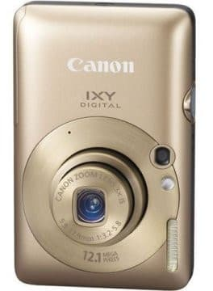
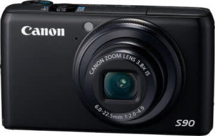
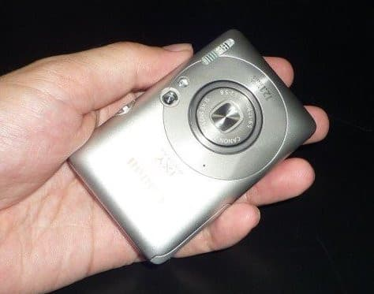
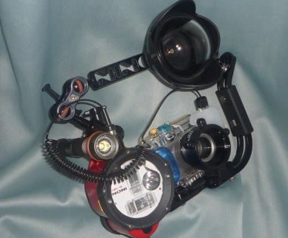
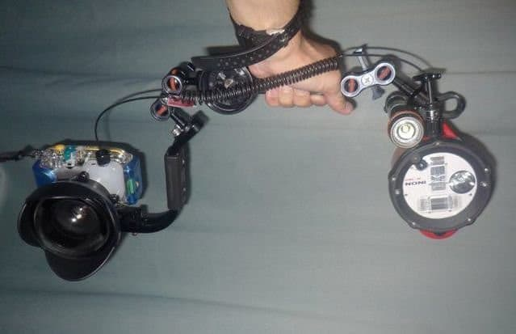
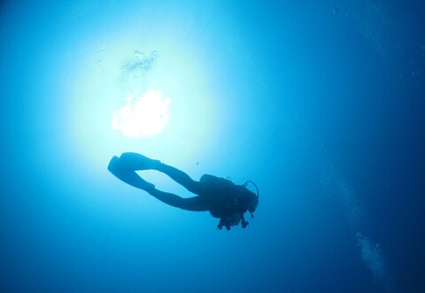
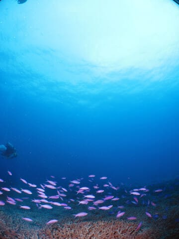
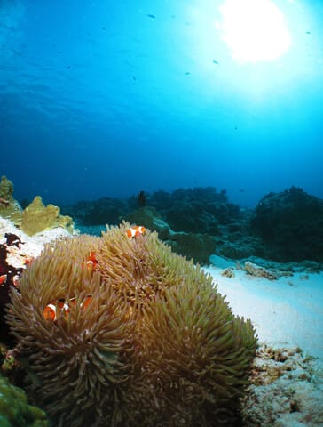

# 2010年7月，2歳の子連れで座間味でダイビング！…プロローグその2

📅 投稿日時: 2021-09-13 03:59:39

🏷️ カテゴリ: [ダイビング日記](ce3a7a8d424d112fce83ee85c81a0e344.md)

この週末も，天気があまり良くなくて

山に行きたい状況でもなく．

人の多い街中への外出は避けたいので．

結局，家から一歩も出ずに過ごした

Skier_Sです…

なんだか，ワクチンを打っても

引き続き感染予防が必要となりそうで．

来るスキーシーズンも．コロナ以前の

状況に復活できる気配が無くなりつつ

ある今日この頃(涙)

うーむ．

一昨シーズン，2020年4月に志賀高原で

やろうとしてた焼額常連＆20000m

メンバー懇親会が直前で中止になった

まま，はや1年半．

一体いつになったら，また大人数での

懇親会が開催できる状態になるん

でしょうね…(涙）

そういう意味で言えば．

ゴンドラは，感染予防の観点から

乗車定員が厳しくなるこの状況下で．

発哺クワッドをあえて今シーズン

ゴンドラにした志賀高原中央エリアの判断

は，ちょっと謎ですが…(笑)．

ってヨタ話をしたところで，

本日はダイビングネタ．

10年以上前の旅行記，プロローグその2です．

では，どうぞ～！

ーーー

ってなわけで．

さすがにそろそろ，壊れかけたデジカメの

後継機を本気で探そう…

と，カメラ探しを始めたわけですが．

いろいろ条件を探すと，以下の2種類に

絞られてきました…

激安コンパクトカメラ，IXY210

・カメラもハウジングも安い！

・絞り優先AEもマニュアル露出も無しのお手軽機．

・安いINONの水中用フィッシュアイレンズが使える！

そこそこ中級機，PowerShot S90

・カメラ，ハウジングはそこそこいいお値段

・絞り優先，マニュアルフォーカス，マニュアル露出

　フラッシュマニュアル調光など，撮影時に欲しい

　調整機能は一通りそろってる！

・INONの水中ワイコンは使えるが，フィッシュアイは

　すごい高い

フィッシュアイが使え，2万円安いカメラか

いろいろ調整して撮影できるが，フィッシュアイ無しで高いカメラか

この2種類のカメラ，どっちを買うべきか…

出発直前まで悩み続けた，Skier_Sだったのでした…

で．

安くてフィッシュアイが使えるけど，マニュアル

操作が何もできないお手軽カメラと，

マニュアル操作がバッチリできるけど，

フィッシュアイが使えなくて，お高い

カメラと．

いったい，どちらを買うべきか？？？

という究極の2択のカメラ選択で．

果たして，どちらを買ったのかというと．

安いカメラが運よく使えればラッキー

と．

結局は安いほうのカメラ，IXY210と

フィッシュアイレンズを買ったのでした～！！

果たして．

私の外付けストロボは，絞り値を入力して

光らせる外部調光ストロボなんだけど．

これがちゃんと適切に調光してくれるのか…？

でも．

この，カメラについているフィッシュアイ

レンズをみよ！！

これまでと違う，ほぼ対角線魚眼に近い

超ワイドな画角で，これまでにない写真を

撮ってやるのだ…！！

と．

次のダイビング旅行を心待ちに

していたのでした…

　

