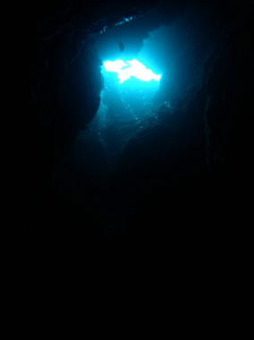

# 初の子連れダイビング旅行記＠2009年　その11　3日目2本目

📅 投稿日時: 2012-07-22 01:06:01

🏷️ カテゴリ: [ダイビング日記](ce3a7a8d424d112fce83ee85c81a0e344.md)

で．昼食後は．

娘が眠たがっていたので，母親が寝かし付け番ということで，

今度は妻がお留守番です．

午後のダイビングは「ドリームホール」というポイント．

恩名近辺でも，ベストに入る地形ポイントらしいのですが，流れが

あるのであまり入れないポイントということで…

このポイントに入れるのは結構ラッキーみたいです．

昨日も一回，このポイントまでボートでやってきたんですが，

流れが強くてポイントが変わったといういわくつきの場所．

＃でも，カレントチェックのガイドが吹っ飛んで行った，あの激流の

＃コモドに比べれば，流れが無いっていっていいくらいなんだけど…

ロープがないと潜行・浮上ができないここのゲストのレベルを見ると，

ちょいと難しいか．

とりあえず，エントリー．

エントリーすぐ，直径2mも無いほどの，深さ10mを超える竪穴に

入ります．

で，ぐんぐん落としていくと…

すると，広い空間に出ました．

頭の上の穴から光が差し込み，うっすらと明るい不思議な感じです．

その空間の横に，今度は外洋に出る2m角ほどの穴が開いており，

ここからブルーの外洋が見えてます．

その穴の周りにみっちりとハタンポが固まっていて，ブルーの

外洋にハタンポの群れがシルエットで浮かび上がっているという．

絵的には面白い穴です．

穴から外洋に出ると，砂の海底の上に立つドロップオフに出ます．

ドロップオフの上の棚に出ると，さっきまで我々がいた空間の

真上にあたり，下の地面から，ぼこぼこと泡が出てきてます．

次のチームが下の空間にいて，その排気が岩の割れ目から

出てきてるようで…

…でも，ここの棚，珊瑚があるわけでもなく，魚もそんなにいない岩場．

また，ちびクマノミなどを眺めてすごしてエグジット．

港に戻ってくると，妻と交代．

今度は当然，私が娘の面倒を見る番になります．

ということで，私にとっての今回のダイビングはすべて終了！

3日間，6本のダイビングがあっという間に終わってしまいました…

さて．

妻がもぐりに行ってる間．

娘と，プールじゃなくて海水浴にでも行ってみるかな～
