# 2010年7月，2歳の子連れで座間味でダイビング！その17…高月山展望台へ登ってみた

📅 投稿日時: 2021-10-26 01:07:37

🏷️ カテゴリ: [ダイビング日記](ce3a7a8d424d112fce83ee85c81a0e344.md)

えー．

今日のYetiは雨が降っていて，

午後から結構強く降ったようですが．

ただ今，志賀高原では雨が降って

いるようです．

…繰り返します．

志賀高原では，雨が降っています．

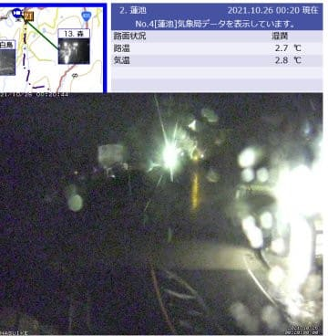

（[北信建設事務所道路気象状況ページ](http://hokushin.pref-nagano-roadcamera.jp/)より)

気温は+2.8℃とそれほど高くはないため．

うーん．

横手山頂付近は，ギリギリ雪だと

いいんだけど…

明日の朝には止みそうなんだけど，

横手山では，せっかくの人工降雪が

雨でやられちゃうか，天然雪になるか．

かなりきわどいところ．

…しかし．

冷え冷え期間が終わった本日以降は，

気温はそんなに冷えません(涙)

まず，27日(水)~29日(金)までの

850hpa気温図を見ると…

赤い0℃線は志賀よりかなり北まで

上がっちゃってます．

28日だけ，ちょっと南に下がってる

気がしますが．

志賀にかかっているのは水色の+6℃線

なので．

…さすがの横手山でも人工降雪は

厳しいレベルですね…(泣)

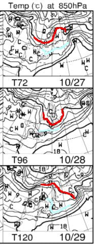

そして．

30日(土)~11月1日(月)までの850hpa

気温図は．

ぐはぁっ！！！！(涙)

…これも…ダメだ．

赤い0℃線は北海道のあたりで．

志賀高原にはずっと水色の+6℃の

線がかかってます…

これは，今後11月1日まで，人工降雪機が

動かせそうな日は無いな…(泣)

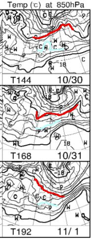

むしろ．

台風20号の動きによっては，

この予想より気温が上がって，

雨が降る可能性も…(激涙)

…うーむ．

11月1日まではダメっぽいけど．

予想期間以降の11月2日から，

いきなり狂ったように激烈な寒気が入って

横手山に1mくらい雪が積もって

くれないかな～←そんなことないから

ってなことで．

ここから本題．

スキーシーズンが始まったというのに．

ここからはダイビング日記です！

…ホントに季節感がないBlogだな…

ーーーー

ってなことで．

今回の旅行の最後のダイビングが終わり．

…あぁ…

これで全ダイビング終わりか…

と，ため息をつきながら，

ボートで港へ戻ります．

うーん．

妻と交互で潜るので．

4泊5日でも，たった5本しか潜れないのか…

ちょっと物足りないなぁ…

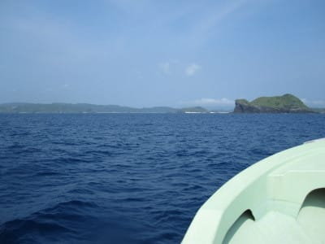

港へ戻ったら．

車で宿へ戻りますが…

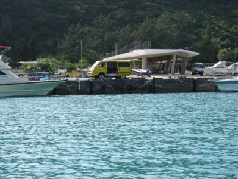

宿へ戻ると，娘は熟睡中．

でも，器材を洗っている時に

起き出してきて．

そして，夕食まで1時間ほどあったので，

宿の裏の

「高月山展望台」

へ登ってみることにしました…

結構急な長い上り坂が続き．

娘は，登り始め3分で

「疲れた．肩車して～」

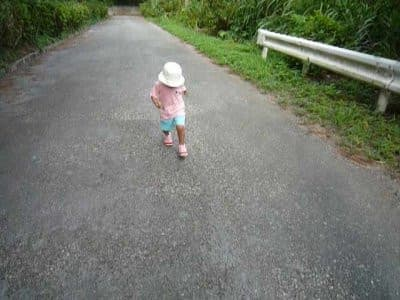

…仕方ない…

と，娘を肩車して登っていると．

すれ違う観光客にびっくりされてました…

まぁ，一人でも結構きつい上り坂で

したから，子供を肩車して登っている

のに驚いてたみたいです．

20分ほど，きついのぼりを登りきると…

やってきました，高月山！

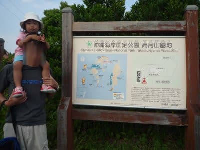

山頂の公園をさらに歩いていくと…

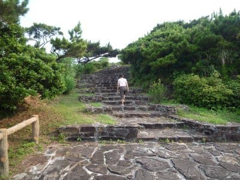

そこは，海が見える，絶景のポイント！

来てよかった～

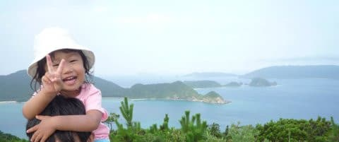

さらに展望台もあって…

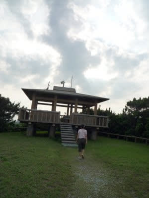

展望台から見下ろすと，座間味の町が

見下ろせます！

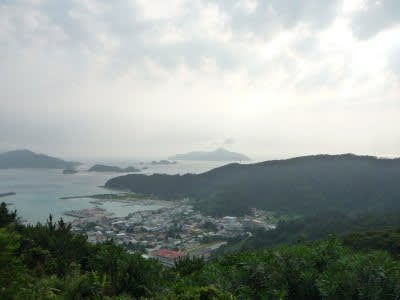

…これが座間味の市街地のほぼ全景です．

結構コンパクトな町です…

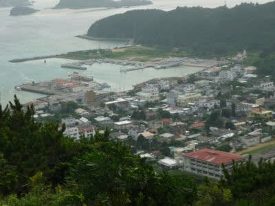

で．

反対側を見ると，慶良間の島々も見えるし．

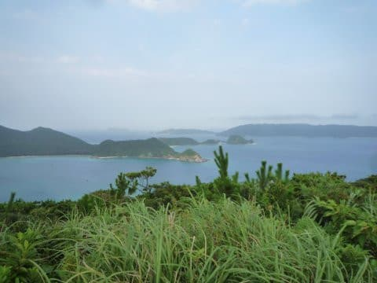

歩いて登るのはちょっと大変だったけど，

登ってくる価値はあったな！！

ってな感じで．

しばし景色を堪能したら．

再び娘を肩車しながら急坂をおりて，

宿まで帰ります…

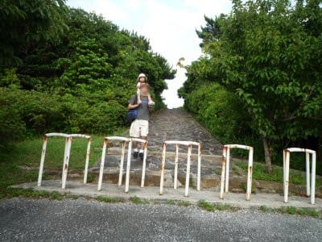

ってなことで．

高月山から下りて宿に戻ると，

ちょうど夕食タイム！

ボリュームたっぷりの夕食で，

ダイビングと高月山往復で空腹になった

胃袋に染み渡る！

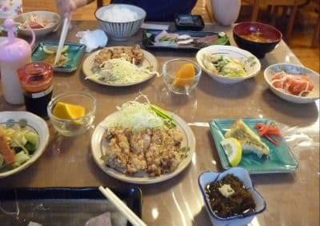

で．

ダイビングショップを兼ねているこの宿．

夕食後，食堂はダイビングのログづけ

スペースと化して．

サービスの泡盛を飲みながら，

ログづけタイム．

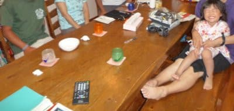

自分は明日はダイビングが無いし．

タダ酒というのもあり．

この日はログづけという名の，

ダイバーたちの楽しいおしゃべり大会が

夜遅くまで続いたのでした…
