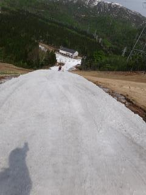
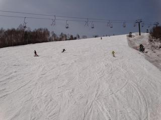
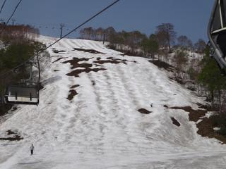
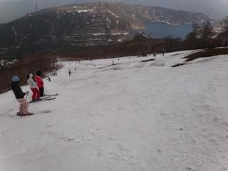
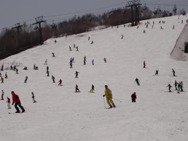
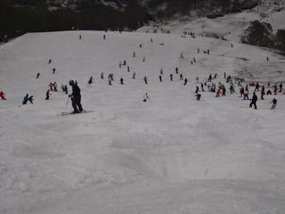
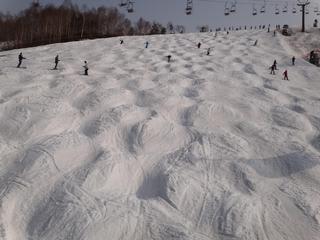
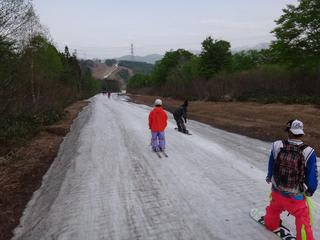

# 5月21日　土曜日のかぐらスキー場は晴れ！

📅 投稿日時: 2011-05-22 00:06:19

ということで．

予告どおりかぐらへ行ってきたわけですが．

さすがに先週より雪が減りましたねー．

暑かったです．

Tシャツとミドルジャケットじゃ暑いくらい．

トレーナか長袖Tシャツで十分，って感じ．

日差しが暑かったです…

まだ，みつまた高速→ゴンドラが滑っていけます．

朝イチは晴天で最高．

混雑具合は，先週と同じくらいですかね．

ただ，朝からかぐら高速と並行しているペアリフトが

動いていたので，リフト待ちは最長10分，

昼間は2-3分，午後は5分程度，

と，結構待ちは少なかったです．

むしろ，テクニカルコースがかなり土が出て，

ジャイアントコースもあまり長い距離を取れる

コブがなくなってきたので．

メインバーンに人が集中し，メインコースがすごい

人口密度でした…

コース幅いっぱい滑れるんですが，昼過ぎには

全面コブになっちゃいましたね．

夕方はすごかったです…

しかし．

この時期に，土がかなり出ているとはいえ，ジャイアントと

テクニカルが滑れ．

ゴンドラコースどころか，みつまたコースが廊下状態とはいえ

滑ってゴンドラまでいけるんですから．

恵まれてますね～．

今年は．
