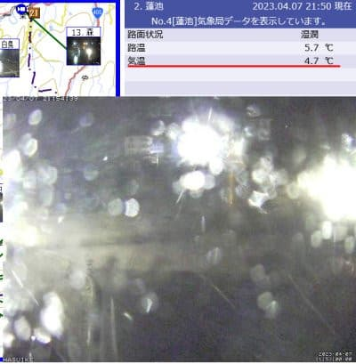

# 今週末も志賀高原で滑ってます！…が，土曜のバーンは硬め，日曜はちょっと改善するかも？道路はツルツルだと思うので注意！！

📅 投稿日時: 2023-04-08 00:05:44

えー．

只今の志賀高原．

残念ながら，

かなり激しい雨

が降っています…(泣)

（[北信建設事務所道路気象情報カメラ](http://hokushin.pref-nagano-roadcamera.jp/)より）

…それも，蓮池で気温4.7℃って，気温が高すぎる…（涙）

この雨で，ゲレンデはかなりやられそうな予感…（激泣）

ちなみに，今日雨が降り始めたのは朝10時過ぎくらいで．

そのあとはポツポツ降る程度だったみたいですが…

本日のおこみん特派員情報によると，

朝から強風でゴンドラ運休（涙）

そして，高温の強風で雪がとけて…

あさイチからシマシマが融けてなくなった感じの，

悲しい状態ですね（泣）

朝は曇り空．

10時ごろから降り始め，一日ポツポツ

降ったり止んだりだったみたいですが…

多分午後5時くらいからザーザー降りに

なったんじゃないかな…？？

ちなみに，ひどい雨が降る前から，

高温と強風でかなり雪が解けて…

高天ヶ原はなんだかメインバーンも

モーグルバーンも，かなり土が出て来て

いるように見えますね…（泣）

あぁ…

ダメだ．

4月10日にもなってないのに，

雪が少なすぎる…これはダメだ…（激涙）

で．

現在激しい雨が降っているものの．

この雨は深夜に止んで…

それから気温はぐっと冷え込みます！！

土曜朝はマイナスまで冷え込み，

その後昼に向かってさらに気温が下がり，

夕方圧雪のバーンは雨でぬれた圧雪が

冷えて固まり，カリカリになりそう…

天気は終日曇り，時折雪がぱらつく感じ．

昼間もマイナスキープの冷えた一日で，

雪は緩まないでしょう．

急斜面はカリカリアイスバーン覚悟．

そして，日曜は…

土曜の夜に2－3cm積もり，朝は－5℃以下の

冷え冷え！

硬い雪の上にうっすら雪が載って，あさイチは

滑りやすいかも…！！

朝は曇り～雪降りですが，昼ごろには

晴れていきそう…！！

ただ，午後は気温がギリギリプラスまで上がり，

日が射すとバーンは緩みそう．

まぁ，カリカリより表面がちょっと緩んだ

感じの方が滑りいいかな？

意外と日曜は，ここ数日の中ではまだマシな

コンディションになりそうな感じ…

あ，土日とも，道路は雨でぬれた路面が凍った

テュルンテュルン路面になる可能性が高いので，

ご注意を…！！

そして，今週から焼額と一の瀬は滑って行き来

出来なくなってます．

バスか車で移動しなくてはならなくなるので

ご注意を…

ちなみに，焼額の昼間のレストランは，

第1ゴンドラ下のLittle Star Maxってトルティーヤ屋さん

しかやってないです．

プリンス東館・南館のレストランはやって

いないのでこちらもご注意を…

ってなことで．

あと4時間後に出発です！

…今日は3時間以上寝られそう…

また週末，志賀高原でお会いしましょう…！

## 💬 コメント一覧

### 💬 コメント by (シルバー・ヘッド)
**タイトル**: Unknown
**投稿日**: 2023-04-08 07:26:14

本日、マッシロマッシロマッシロ、ゲレンデはうーむ、でも、スキーは滑走します。あさ、急がなくてもかな。

春スキー、楽しみましょう！では、後ほど。

### 💬 コメント by (シルバー・ヘッド)
**タイトル**: Unknown
**投稿日**: 2023-04-08 20:14:38

午後からシロシロシロとハイシーズン並みに少し全体がシロくなりました。明日は朝から楽しめそうです。

夜は志賀高原ありがとうテーマでピカピカ花火❗️

都内では味わえない素敵なひと時を過ごせました。

Sさん色々とありがとうございました。

来シーズンも宜しくお願いします。

### 💬 コメント by (Skier_S)
**タイトル**: ＞シルバー・ヘッドさま
**投稿日**: 2023-04-08 20:26:07

ガスはじき晴れましたが…

雪は最低でしたね（涙）

明日はいいコンディションになりますように…！！

