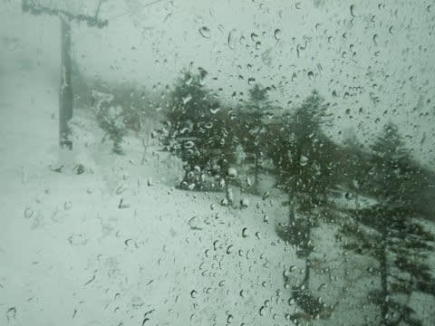

# 2022/5/1(日)，GW3日目の志賀高原スキー場は…曇りのち雨のち雪！夕方までに1-2cm積もったよ！！

📅 投稿日時: 2022-05-01 22:06:28

ってなことで．

GW3日目．

私にとっては志賀高原滞在2日目の今日．

昨日も，朝は積雪で真っ白という，この時期に

想定外の雪が積もりましたが．

…なんと．

今日も午後は雨予報が雪になりました！！

GWに，2日連続の雪ですよ！！

明日はもしかしたら朝早くは路面が

凍ってるかもしれないので，

ノーマルタイヤの人は，ちょいと遅めに

出てくることをおススメ…

ってなことで．

本日の志賀高原．

朝は完全ドライ路面で，夏タイヤでも

大丈夫なレベルでした！

…でも．

サンバレーの雪は完全に消えましたね…（涙）

そして．

今日も朝6:30からの早朝から参戦！！

早朝から，天気は曇り空でしたが…

早朝の気温は0℃と，激冷えではないけど，

この時期としてはまぁまぁの冷え込み！

ゲレンデも，早朝は見事に締まった

シマシマ！

硬いのが嫌いな人はダメだと思うけど，

硬めが好きな人にはたまらない，いい感じに

締まったハイスピードバーン！

…なんですが．

昨日の午後のザブザブ荒れ荒れ雪が

圧雪されきってないところもあり…

ごく一部，硬めが好きな人にはたまらない

硬さのまま，吹っ飛びジャンピングバーンに

なっていて，ちょっと怖かったところも…

でも．

吹っ飛びポイントの数か所さえ気にすれば，

あとは気持ちいいハイスピード大回りバーン！

そして．

8時ごろにはカリカリバーンから

ちょっと表面がしっとりして，エッジが

ガッツリ食い込む滑りいいバーンに

なっていって…

さらに今日は太陽も曇で隠れていて，

今日は気温もそんなに上がらなかったので…

午前10時過ぎまで，GWとしてはいい感じの，

そんなに緩まずガッツリ傾けるバーン

状況が続きました～！！

3連休最終日だからなのか，ゴンドラも

それほど混まず．

いやーーー．

今日は快適だよ…

GW，晴れなくていいからずっとこんな

天気ならいいのに！

…と思っていたら．

10時過ぎには，なんだかポツポツと空から

液体が降り始めてきました…（涙）

ザーザーぶりではなくパラパラ程度だったけど，

ウエアがしっとりするほどの降り（泣）

あぁ…せめて午後からなら良かったのに．

午前中から降り始めてきたか…（涙）

でも．

ずっと降り続けていたわけではなく，

降ったりやんだりだったので，

ずぶ濡れになるほどではなく．

あと，雨が降って一気に人がいなくなったので，

ゲレンデは全く荒れずフラットなままで…

バーンコンディションは意外といいよ？？

これ，意外と楽しいよ？？

と，気持ちよくグルグル回っていたら．

なんだか…

午後1時過ぎに，山頂でかなりの勢いの

雪になってきたんですが…？？？

そして，午後2時ごろになってきたら，

ふもとも雪になってきて…

5月というのに，雪が積もり始めて

来たんですが！？？

え？今日，5月なんですけど？？

今日は昼間は雨で，雪になるとしても

気温が冷える夜だと思ったのに…

まさか5月の昼間に，雪が積もって

行くとは…

さすが志賀高原！！

この時期に真っ白い積もりたての

雪が滑れるとは…！！

って感じで．

かなりの勢いで雪が積もっていく中．

みんな悪天候で帰っちゃったらしく，

誰も滑ってないガラガラゲレンデを，

今日も早朝からラストゴンドラまで．

お昼休みも取らず滑り続けたのでした…

いやー．

しかし．

昨日に引き続き．

今日も雪が積もるとは…

志賀高原恐るべし！！！

…ただ．

現在の志賀高原．もう雪は止んじゃいました…

でも，明日は冷えていいコンディションだと

思いますよ～！！

ちなみに，

2日：曇ったり晴れたり．気温は低め．

　バーン状況は朝はよさそう．

　昼間も5℃くらいまでしか上がらないので，

　曇ってればバーンはずっとよさそうだけど，

　晴れると滑りが悪い雪になるか…

3日：朝はすごい冷える．晴れそう．

　早朝はしっかり締まった晴天で

　いいかも．

　でも，晴れたら昼には緩みそう…

　曇ってくれれば，終日荒れずに

　いいコンディションになりそうなんだけど…

4，5，6日：基本晴れる．すごい気温が上がる．

　夏か？って天気．

　天気はいいけど…

　雪はざぶざぶ荒れ荒れ（涙）

　

って感じでしょうか…

冷え冷えのいいバーンを滑れるのは，

2，3日までっぽい感じです…（泣）

とりあえず．

私はまだまだ志賀高原に滞在予定です～！

## 💬 コメント一覧

### 💬 コメント by (you160)
**タイトル**: Unknown
**投稿日**: 2022-05-02 15:15:08

S様

昨日はありがとうございました。

朝一のパノラマは5月と思えないような快楽バーンを家族一同ご一緒させて頂き、

さらに次女が必殺ゴンドラスリープでリタイヤ後は、私、長女とともに、ご一緒させて頂き、

液体降りしきる悪天候だったにもかかわらず、娘はよほど楽しかったのか、まだ滑りたくて拗ねていたようでして、、、別れ際、きちんとお礼も言えず、大変失礼致しました。

帰路は、16時の渋峠ゲート閉鎖前に滑り込みセーフ、草津側から抜けましたが、関越の渋滞が酷く、途中時間を潰し、22時過ぎに帰還という感じでした。

今シーズンはあわよくば、もう1回ヤケビ、それ以降は渋峠に数回と考えていますが、

この場を借りまして、

・長女、次女にお声掛け頂きました皆様

本人たちはとても嬉しいようで、滑るモチベーションになっているようです

・長女と一緒に滑って下さった皆様

スキー場での貴重なお時間にも関わらず、一緒に滑走頂き長女はとても楽しかったようです。

たくさんの方にお声かけ頂いたので、正直なところ、全ての方を認識できるには至っていませんが、

またお会いする機会がありましたら、どうぞよろしくお願い致します。

### 💬 コメント by (ダウンヒル)
**タイトル**: Unknown
**投稿日**: 2022-05-02 17:42:36

S様お疲れ様です。

このブログを知ったことをきっかけに、雨の日が空いてる（当たり前ですけど...）とか意外に滑りやすいとか、カッパ着れば大丈夫とか...グッズとかの情報により、遠くからの遠征でリフトが動いてても雨降りで滑らず帰るなんてことも無くなり、「ヤケビ、むっちゃ楽しかったぁ!」です。雨のち雪という天候がわたくしのサヨナラスキーでしたが、オフシーズンも頭の中を志賀高原だらけの妄想スキーして備えようかと思います。S様はじめ皆様方、来シーズン、ご挨拶ならびに同行できる機会有りましたら、宜しくお願い致します。

### 💬 コメント by (ダウンヒル)
**タイトル**: Unknown
**投稿日**: 2022-05-02 18:27:08

Sさま、お借りします。

you160さまへ。

ご挨拶もせず同行いたしました、「ダウンヒル」です。

ご家族で滑りに来られ、お子さまが楽しんでくれたりモチベーションアップになっておられるようで何よりです。回数をこなすごとに上達する勢いは、早い段階で大人に匹敵するほどカッコよく速く滑れる予感が!将来はどちらも大物に...とまでならずとも、ヤケビ大ファンになって欲しいと思う次第です。来シーズンも機会有りましたら宜しくお願い致します。

### 💬 コメント by (ろーさん)
**タイトル**: Unknown
**投稿日**: 2022-05-02 20:01:06

本日2日の昼に、

1ゴン上で声がけさせていただいた者です。

お会いできて良かったです。

ステッカーをいただき、ありがとうございました。

帰りにも、クルマから大きな声で

Sさんと、お呼びしてすみませんでした。

周りの隠れSさんファンに、もみくちゃにされなかったか、

心配しています。

では、またお会いできることを、楽しみにしています。

### 💬 コメント by (かず)
**タイトル**: Unknown
**投稿日**: 2022-05-02 20:20:11

Sさんいるかな〜とGW初のヤケビに小雪のなか行って見ましたが  見かけませんでした  今シーズンまだ志賀でヤケオクしか滑っていませんよ…

### 💬 コメント by (ikkun)
**タイトル**: Unknown
**投稿日**: 2022-05-02 20:41:33

お疲れ様です❗(  -_・)?明日熊かなと(笑)ヤバいかな？ちなみに二時間程アカカンでした❗が明日モーグルの選手が来てcampとか？オリンピックに出たjkの選手も来るとか基明日？多分志賀高原で楽しみましょ❗

### 💬 コメント by (めいめい)
**タイトル**: Unknown
**投稿日**: 2022-05-02 21:10:58

めいめいこと、はなげの女房です。

スーパーキッズのnewfaceは可愛かったですね😄

Sさんがボーゲンする後を5歳のお姉ちゃんが、その後を3歳の妹ちゃんが、きちんとついて滑っているのが、とても微笑ましく羨ましくて、私も3番目について行きたいと思いました(笑)

早朝から滑る、後ろのネジで動いているようなお人形さんみたいな3歳を初めて見ました😂

成長が楽しみですねぇ！

毎年、志賀に来て下さーい！

### 💬 コメント by (Skier_S)
**タイトル**: 冷えるのは明日の朝まで
**投稿日**: 2022-05-02 21:13:26

＞you160さま

こちらこそありがとうございました～！！

夜遅くの帰宅お疲れさまでした．

娘さんたちが焼額を好きになってくれたなら，それが無上の喜びです．

また焼額に行きたい！と言ってもらえたなら良かったです…

焼額にはいい人たちがいっぱいいますので，またGW後半お待ちしています！！

＞ダウンヒルさま

昨晩はお世話になりました～！

このBlogに毒されて，ヤケビどっぷりになったなら私の思惑通りです（笑）．

また来シーズンよろしくお願いします！！

＞ろーさんさま

今日は声をかけてくださってありがとうございました．

そして，布教活動お疲れ様です（笑）．

また焼額にお越しの際は，お声がけください．

今度は一緒に滑りましょう…！

＞かずさま

あれ？

今日来てらっしゃったんですか？

私はひたすらイチゴングルグルしてました…

明日もヤケビ早朝から参戦予定です．

＞ikkunさま

明日から熊ですか…

明日の朝は冷えていいと思いますよ～！

…昼間はざぶざぶになりますが…

熊の湯も早朝やってますので，昼間より早朝をお勧めします…

### 💬 コメント by (you160)
**タイトル**: Unknown
**投稿日**: 2022-05-03 08:43:18

昨晩、gokuraku skierさんや、naoちゃんねるさんのyoutubeでヤケビの良さを復習させておきましたw

結果、本日次女の目覚めの一言が、シマシマ滑りたいという奇跡、、、作戦？成功ですw

＞ダウンヒルさま

子供たちのヤケビファン度合いUP間違いないです。

来シーズンも機会がありましたらどうぞよろしくお願いします。

### 💬 コメント by (Skier_S)
**タイトル**: 一旦帰宅
**投稿日**: 2022-05-04 01:28:39

＞めいめいさま

すごい姉妹でしたよね…

この2日間でさらに上達してました！！

私もこのペースで上達したい…

＞you160さま

シマシマ滑りたいって…すごい教育が行き届いてますね…

行き届きすぎです（笑）．

しかし，目覚めの一言がそれって，恐るべき3歳児．

ぜひぜひ，ヤケビファンに育て上げてください．

### 💬 コメント by (you160)
**タイトル**: Unknown
**投稿日**: 2022-05-16 22:25:07

Sさま

この場をお借りします。

>めいめいさま

ご返信ができていなかったことに先程気付きました。

大変申し訳ございません…

今シーズン、ステッカーの魔力？もあってか、娘も含めヤケビの魅力に取り憑かれてしまいましたw

なので、来シーズンもヤケビ行きますので、今後ともよろしくお願いします！

