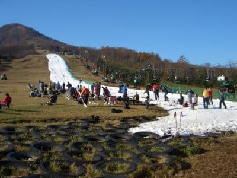

# 今は関東圏でアイスクラッシュを使ってるのはYetiと軽井沢くらいだけど，昔は鹿沢も丸沼も苗場もあってだな…

📅 投稿日時: 2021-08-16 06:00:36

🏷️ カテゴリ: [スキー雑談](c1f9d2cb7478308da16419928ea3945e9.md)

ということで．

ちょっと今日もお休みのはずなのに．

なぜか明日までの夏休みの宿題が

終わっていないという，

まるで夏休み最終日の小学生のような

状態で，とんでもない時間に更新している

今日この頃．

皆様いかがお過ごしでしょうか（時候の挨拶）

とりあえず．

こんな時間ですが．

今日もスキーネタを行ってみましょうか…

えー．

今，関東近辺のスキー場で，アイスクラッシュ

を使って10月～11月上旬に滑れるスキー場を

あげると．

まずは，イエティが10月下旬オープンで…

次に，軽井沢が11月3日にオープンと

いうのが定番．

…あとは，半屋内ながらも狭山と．

この3か所が，11月上旬までに滑れるように

なるスキー場ですね…

ただ．

かなり昔．

そう，2001年シーズン頃までは，

苗場が11月第1週にはアイスクラッシュで

オープンしてましたね…！！

高速クワッドが1本滑れたので，

このころはシーズンインは苗場で…

というパターンが多かった気が．

アイスクラッシュで高速クワッドが滑れる

なんて，今じゃ考えられないですね…

確か，だんだんスタート日が11月中旬，下旬と

遅くなっていき．

そして，2008年ごろには11月の営業を

やめたんじゃなかったかな…

そして．

そのころは．

丸沼も…

鹿沢も，アイスクラッシュが稼働していて．

どちらもペアリフト1本だけながら，

10月最終週か11月第1週にはオープン

していましたね…

確か，2010シーズンか2011シーズンのころ，

どちらもアイスクラッシュをやめて

人工降雪機で11月下旬オープンに

なっちゃったんじゃなかったかな…

2006シーズンは，10月29日に鹿沢で

滑った写真が残ってました…

今から振り返ると，

「鹿沢が10月にオープンしていた時期が

あってのぉ…」

ってな感じの，完全に昔を語る老人のような

口調になっちゃいますね…

願わくば．

また，苗場のように高速クワッドが

11月頭から滑れるようになってくれない

かな～…

…と，思うけど．

今のスキーヤー＆ボーダー人口の

減り具合から考えると．

もうそんなシアワセな時代はやって

こないんだろうなぁ…

もしかすると．

今，Yetiが10月から滑れるのも．

これから数年後に振り返ると，

すごいゼイタクな時代だった

と言われる日が来てしまうのかも…

とりあえず．

そんなことが起きないよう．

そして，スキー業界がコロナに負けずに

発展するよう，

スキー業界に貢献しないと！！←物欲選手権に負けることを正当化しようとしていないか？

## 💬 コメント一覧

### 💬 コメント by (m&t m)
**タイトル**: Unknown
**投稿日**: 2021-08-16 23:45:41

苗場のアイスクラッシャー懐かしいですね

我が師匠(エキップのアドバイザリースタッフでした)の講習があり行ってました

昔は浦安にザウス、津田沼にも吸水ポリマーの屋内スキー場、御坂にもアイスクラッシャーかありましたね

その気になればいつでもスキーできました

### 💬 コメント by (Skier_S)
**タイトル**: ＞m&t mさま
**投稿日**: 2021-08-17 01:17:30

苗場のアイスクラッシャー，良かったんですけどね…

Yetiより斜度もあったし，リフトも速かったし．

あと，ザウスは偉大でしたね…

ザウスはまた記事を書く予定です～！

### 💬 コメント by (yumi)
**タイトル**: Unknown
**投稿日**: 2021-08-17 12:20:06

Ｓさぁ～ん🥳☃️⛄

お久しぶりデス😅

今朝、ワタシがボソっと

「あ～ぁ・・・😒🙄😞

今、ザウスが有ったら 

絶対 近所にアパート借りて 

毎日 通ってたやろなぁ～🙄」

って 言ったら💬

旦那が隣で 大爆笑🤣🤣🤣

ん❗👀

ワタシ🙋何か 変なこと言った❓️🙄

### 💬 コメント by (ikkun)
**タイトル**: Unknown
**投稿日**: 2021-08-17 18:52:44

ザウス？懐かしいなあ😆 三回位行ったかな🎵 真夏に行って滑った後 外で動けなかったのを思い出します❗ステキでしたよね❤️

### 💬 コメント by (Skier_S)
**タイトル**: ザウス，今あったら…
**投稿日**: 2021-08-18 01:46:38

＞yumiさま

確かに，間違いなく毎日通ってるでしょうね（笑）．

でも，NZや月山に行くことを考えれば安く上がるかも？？

そういえば，ザウスにも「いつ行っても必ず滑ってるのを見かける人」がいましたねぇ…

＞ikkunさま

ザウスは夏に行くと不思議な感じですよね…

中の寒さと外の暑さの差がすごかった思い出が．

ザウス，また復活しないかな…

