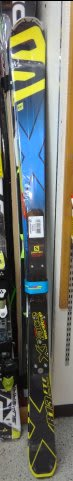

# やっぱり今シーズンも…第3回物欲選手権！

📅 投稿日時: 2014-12-26 01:58:18

🏷️ カテゴリ: [スキー雑談](c1f9d2cb7478308da16419928ea3945e9.md)

えー．

このネタ．

第1回[その1](ebea1e9e359cc665d9cc2929e08045177.md)，[その2](e9a16d9757c2d52b7254fe8a802071c63.md)

[第2回](e4eb8b62d644e240a6080cac72ad69416.md)

に続く，第3回．

やっぱり，今シーズンもこのネタです…

---

アナウンサー　「えー．本日は．

　第3回 スキーヤーの物欲を刺激する街神田に来て，

　物欲にまみれたスキーヤーが買い物をせずに

　我慢できるか選手権

　をお送りします．

　本日も，解説は板尾買蔵さんにお越しいただきました」

解説　「…」

アナウンサー　「えー．板尾さん？？」

解説　「…また，やるんですか？」

アナウンサー　「今回も，参加選手はSkier_S選手です」

解説　「…また，やるんですか…こりませんね…

　…どうせ，物欲に負けるんでしょ？」

アナウンサー　「さて．スキーヤーの物欲を刺激してやまない

　この街にやってきて，果たしてSkier_S選手は，無事

　物欲を抑えることができるのでしょうか！？」

解説　「…この街に来てる時点で，すでに負けなんですけど．

　Skier_S選手の場合は…」

アナウンサー　「今回は，娘のスキーウェアを

　買わなくてはいけないという，ちゃんとした

　理由があってこの街に来ているようです」

解説　「正当な理由でもなんでも，この街に来てる時点で負け確定ですから…

　…しかし，確か，娘さんの板とブーツは親戚のおさがりだという

　話ですが…Skier_S選手，自分はいつもすべて新品を買うのに，

　娘にはウェアしか新品を買ってあげないんですね…」

アナウンサー　「Skier_S選手，今シーズンは自分用にはすでに，

　[昨シーズンに破壊した](eac44d3489fac6d8fad65c7bfbb7a8575.md)ウェアのパンツとストックは購入済とのことです」

解説　「…自分用のものは，しっかり買ってるんですね…

　とりあえず．Skier_S選手．パンツもストックも買ったということなら，

　もう，今シーズン買わなきゃならないものは無いはずですね…」

アナウンサー　「一応，パンツもストックもアウトレットでありえないくらい

　激安のモノを買ったと，言い訳しているようですが…

　おっと．どうやら，子供用の買い物が終わったようです…」

解説　「子供用の買い物が終わった時点で，目的は果たしたわけですね．

　ここでまっすぐ帰れば命取りにならないんですがね～」

アナウンサー　「子供用具が置いてある量販店から離れて…

　いや，やっぱり危険な方に向かってますね～」

解説　「ただ，娘も連れてますから，今回はそんなにたくさん店を

　回れないだろうし…」

アナウンサー　「…あ，いつものお店に来ましたね…」

解説　「いきなり最初からいつものお店ですか…危険ですね」

アナウンサー　「Skier_S選手，[新しいATOMICブーツと，大回り用の178cmの
　VOLKLの板の相性がそんなによくない](eb3eef32d9c9fc1afdf5dc6056f052e45.md)らしく．大回りの板が，かなり

　気になっているようなんですが…」

解説　「『大回りの板なんて，買わないぞ～』とか

　言っておきながら，大回りの板に対してかなり心揺らいでいますからね．

　これは，危険ですね～」

アナウンサー　「どうやらそのようですね～．

　175cmから180cmクラスの，大回りの板を必死に眺めてますね…」

解説　「どうも，[FISCHERの大回りの板](e1c06f38330c6d9ebfff60b9c52436b7f.md)が気になっているようですね…」

アナウンサー　「おおっと，店員に金額を聞いてます！店員に，板の金額を聞きました！」

解説　「…やっぱり，『大回りの板なんて買わないぞ～』とかいう決心．

　Skier_S選手には，どだい無理なことだと思ったんですよ…」

アナウンサー　「金額が出ました！さぁ，Skier_S選手，行ってしまうのか？

　大回りの板，ついに行ってしまうのか？？」

解説　「…おおっと．ためらってます．意外と，ためらってますね．

　どうやら，Skier_S選手が思うより，かなり高い金額だったようで…」

アナウンサー　「…あー．あきらめたようです．13万近い金額は

　さすがに出せないようで…店員にお礼を言って，FISCHERの板から

　離れました．GS板のコーナーを後にしました」

解説　「娘さんもそろそろ飽きてきてるようなので，そろそろタイムリミットですね」

アナウンサー　「…Skier_S選手，意外と，今回は我慢しきれてしまうのか？」

解説　「…それだと，ネタにならない気がするんですが…」

アナウンサー　「あー．店を出ようとしています」

解説　「おや？立ち止まりましたよ？」

アナウンサー　「なんだか，興味で板のお値段を聞いてますね…」

解説　「でも，小回り板のお値段を聞いてますよ．彼は，大回りの

　板を買い替えたいと思っていますが，小回りの板については，

　ブーツと相性が最高なATOMICのBluster DEMO SXで満足しているはずですが…」

アナウンサー　「あれ？Skier_S選手，驚いてます．なんだか，驚いてます」

解説　「あー．フソウスポーツやクルーよりずっと安い値段が

　いきなり出たみたいですね．Skier_S選手の予想より

　かなり安い金額だったみたいです．

　…けど，彼の買い替える気が全くない小回りの板なんですが…」

アナウンサー　「あれ？あれ？あーーー！！！！なんということだっ！

　行っちゃいました！小回りの板をっ！小回りの板を，店員さんにお願いしてますっ！

　何ということだ～っ！！」

解説　「…本来必要な，大回りの板はガマンしたというのに…

　まさか，小回りの板を衝動的に買ってしまうとは…

　…ありえないレベルの我慢のできなさですね…」

アナウンサー　「ということで，第3回スキーヤーの物欲を刺激する街

　神田に来て，物欲にまみれたスキーヤーが買い物をせずに

　我慢できるか選手権，Skier_S選手の3連敗という，

　予想通りの結果となったところで，皆さんとお別れです．

　では，また第4回選手権にて，お会いしましょう！」

解説　「…あるんですか，第4回…」

-----

ということで．

なぜか．

買うとしても，175cmクラスの大回りの板を買うつもりだったのに．

想定外に安くなっていた，

SALOMON X-RACE X12 165cm 

という，小回り板を買ってしまったのでした…

## 💬 コメント一覧

### 💬 コメント by (れお)
**タイトル**: Unknown
**投稿日**: 2014-12-26 10:57:34

この選手権大好きです!!（笑）

ＳＸじゃないんですね!?

SX乗りにも楽しめるポテンシャルがあるってことなんでしょうか？　この先の比較レポート楽しみにしてます♪

今日から志賀９連チャンなんですか？　まさか、いくらSさんでもそんなには行かないですよね…。

### 💬 コメント by (Skier_S)
**タイトル**: れおさま
**投稿日**: 2014-12-26 21:37:01

SXじゃないんですよ．

SXは，今持ってるので十分かな…って．

はっきり言って，SXも結構強い板ですが．

この数倍強いです．乗りこなすのには

体力が要りますが．

ありえないレベルの横Gがかけられて，

高速安定性もSXより1次元上がります．

…ただ．

気楽に履ける板ではありません（汗）．

ちなみに，さすがの私も志賀9連チャンでは

ありません（＾＾；

2日+6日の，8日間です…←それ，9連チャンとほぼ一緒なのでは…

### 💬 コメント by (れお)
**タイトル**: 志賀高原8日間!!
**投稿日**: 2014-12-26 22:23:38

それ、9連チャンとほとんど一緒ですから!! 笑

SXの数倍強いんですか!?

ちょっと私には無理かも～。

志賀高原レポート、楽しみにしてます♪

### 💬 コメント by (Skier_S)
**タイトル**: れおさま
**投稿日**: 2014-12-27 23:19:36

いや～．

さすがに家族は9日連続は無理なので，

前半2日は私だけ，後半6日は家族で…

というパターンです（＾＾

X-Race履いた跡にSX履くと，SXが

すごい軽快な柔らかい板に感じますよ（笑）

かなり体力を必要とする板なので，

よっぽど過激なすべりをするのでない限り

避けたほうが賢明かも…

＃私はすごい気に入りましたが

