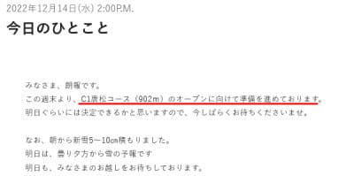
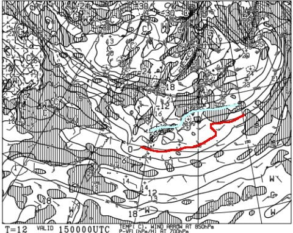
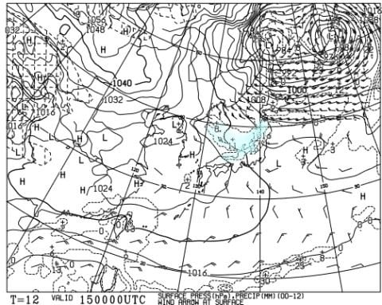
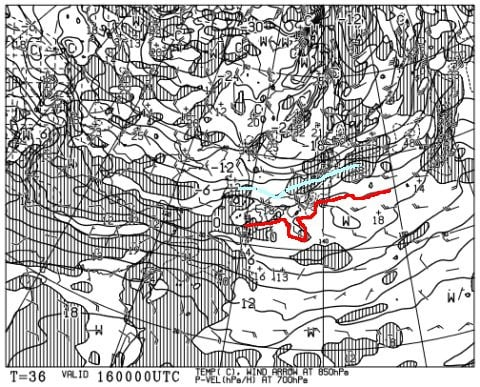
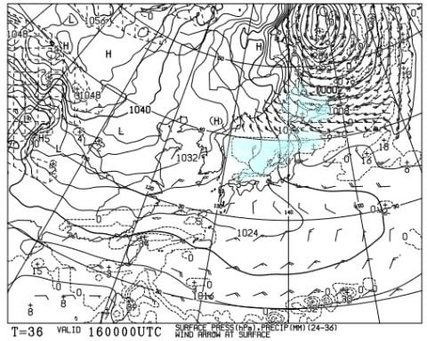
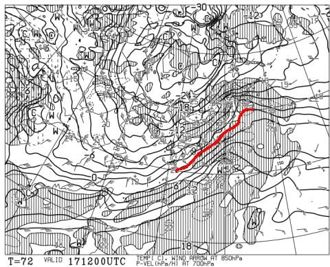
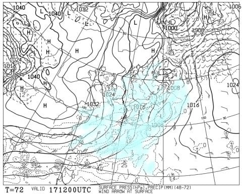
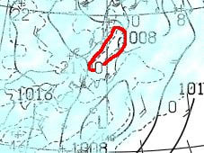
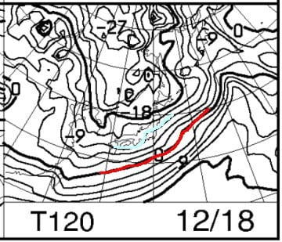
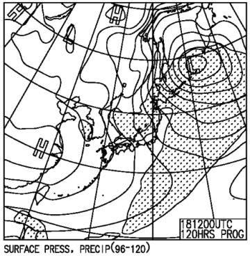

# 12月17，18日の週末の志賀高原スキー場の天気は…土曜はパラパラ雪~曇り，日曜は激冷え，朝に10cmくらい積もってるか？

📅 投稿日時: 2022-12-15 02:26:32

🏷️ カテゴリ: [スキー天気予想](c6554f5c3c106093b511a8daae23757e8.md)

えー．

この週末に，焼額は第2高速リフトの

営業予定というアナウンスが出ましたね…

…ただ，正式決定は明日のようですが…

（[焼額山スキー場ホームページ](https://www.princehotels.co.jp/ski/shiga/winter/)より）

うーん．

できればこの週末は，

第2ゴンドラが動いて欲しい

ところだったんだけど…

そこそこの冷え込みだった今日も，

志賀高原殺しの西風

のおかげで，せいぜい5~10cmの積雪

だったみたいだし（泣）

…残念．

これが北風だったら，かなりの積雪になって．

第2ゴンドラが週末に動かせたかも…

ただ．

まだわからない．

週末にどさっと積もって動く可能性も

否定はできないのだ！！！

週末にどっさり積もるのか，

天気図を見てみるのだ！！！

…ってなことで．

水曜深夜恒例の天気予想ですが．

まずは週末までに積もるか，

15日木曜の850hpa図から見ますが…

まぁ，志賀高原には水色の-6℃線が

かかる程度なので．

朝は-8℃くらいまで冷えます．

寒いです！！

地上天気図も，日本海側に水色の

降水域がかかっていて．

一見日本海側に雪が積もりそうですが…

今日から引き続き西風なので，

志賀は積もりません（涙）

そして金曜16日の850hpa図を見ると．

この日も志賀高原には水色の-6℃線が

かかるので．

この日も結構冷えそうな感じ…！！

そして，この日も地上天気図は，

日本海側に雪雲による降水域が

かかっているし．

等高線も縦縞っぽいので，

一見雪が降りそうですが…

残念ながら，この日も西風ベース（涙）

積もっても10cmくらいか…

ゴンドラ運転には全然足りない（泣）

で．

肝心な土曜，17日の850hpa図を見ると．

…この日は，赤い0℃線が志賀高原に近づき．

15，16日よりは気温が上がりそう…

でも，雨になるレベルではないのでご安心を．

そして．地上天気図は…

これも一見，日本中に降水域がかかっている

ように見えて，雪が降りそうですが…

志賀付近を拡大すると．

赤く囲った志賀高原付近から宮城県

くらいのエリアが，忘れ去られたかの

ように降水域がかかってない図に

なってます…

これは，17日も志賀は積もらなさそう（泣）

で．次は18日の日曜の850hpa図ですが…

ををを！！

これは冷えるよ！

志賀高原には水色の-9℃線がかかっていて…

これって，朝は-10℃を下回るよ！！！

そして地上天気図は…

うーん．

比較的等高線が縦縞っぽいし．

ギリギリ北西から北北西か…

これなら，18日の日曜は朝10cm，

昼まで10cmくらい積もるかな？？？

でも，ゴンドラが動くかというと．

微妙な積雪だ…

ってなことで．

まとめると．

15日(木)：終日冷える．

　日本海の海沿いは結構降るけど，

　志賀高原は終日雪がぱらつくが

　積もるのはせいぜい数cmくらい

16日(金)：この日も終日冷える．

　昼間最高―3℃くらいまでしか上がらず．

　この日も終日雪がぱらつく．

　もしかしたら昼間ちょっと積もるかも？

　でも5~10cmかな．

17日(土)：朝は-5℃程度．

　昼間は0℃近くまで気温が上がる，

　比較的暖かめの日．

　終日曇り空，時折雪がぱらつくか．

　朝までの積雪はほとんど無し．

　人工雪＆わずかに天然雪の圧雪バーン．

　気温が上がると言ってもギリギリ0℃

　前後なので雪は緩まず．

　午後は斜度の急なところは人工雪の

　ツルツルが出てきそう．

18日(日)：朝からそこそこ冷えて，

　あさイチは5~10cm積もっているか？

　終日雪が降ったり止んだり．

　時折強く降る．

　昼間も10cmくらい積もるかな…

　昼間の最高気温も-5℃を越えない

　激冷えの一日．

　午後は冷えた新雪が踏まれた雪＆

　人が多い急斜面はツルツルが顔を出す．

…ってな感じでしょうか．

雪が降るのが日曜~月曜にかけてなので．

土日は動かなかったのに月曜からゴンドラが動く

という嫌がらせのようなパターンに

なりそうな予感を感じつつも．

日曜朝までの積雪で，せめて日曜から

ゴンドラが動いてくれるといいなぁ…

と願わずにいられない，Skier_Sだったのでした…

## 💬 コメント一覧

### 💬 コメント by (ぽんちゃん)
**タイトル**: Unknown
**投稿日**: 2022-12-15 04:18:53

冬型の気圧配置って西高東低なので、西から風が吹いてくるのが原則だと思いますが、志賀高原って、どうして西風だったら雪が積もらないのですか？

地形的にダメなのですか？

### 💬 コメント by (レインボー改めブラボー75)
**タイトル**: Unknown
**投稿日**: 2022-12-15 13:18:47

木曜日の志賀高原情報

朝の上林-4℃、蓮池-7℃、晴れている。冷え込んでるためバーンは締まって快適が続きます。まだ４ロマのみだけど、初めてオリンピックが一面まっ白になり、エス様が帰ったあとの週明けに期待が増します。

２高も薄いけど真っ白ですよ。

途中でで一ノ瀬に移動した特派員によると、ファミリーは下しか滑れないけど、リフトがA線B線共に動いてくれたので、よかったとか。

もちろん同じコースをずっと滑り続ける根性のない我らは昼前の終了でした。

### 💬 コメント by (アリス)
**タイトル**: 第二ゴンドラ
**投稿日**: 2022-12-15 16:31:28

Ｓkier_S様

天候と積雪、リフト稼働予想ありがとうございます。

ブログ見ながらニヤニヤしています♪

例によって、仕事をズル休みして、12/20(火）から5日間の志賀高原初滑りの参戦です♪

Sさんの予想では２ゴン運転と予想されていますから、パノラマ、サウス、唐松は滑走できますね♪

朝一の２ゴン目指します♪

### 💬 コメント by (うえいと)
**タイトル**: Unknown
**投稿日**: 2022-12-15 18:40:43

降りませんね～

太陽が出て晴れて午前。昼くらいから曇り始めてもなかなか降らない

水分の空気が全然来てませんね～

### 💬 コメント by (地元民)
**タイトル**: Unknown
**投稿日**: 2022-12-15 22:42:11

西風⇒雪雲が北アルプスにぶつかり、超えられない。長野県内には雪雲が流れ込まない。

北東風⇒北信五岳にぶつかり、長野盆地には雪雲が流れ込まない。飯山方面は北信五岳より北に位置しているので流れ込む。

北よりの風⇒山の隙間をぬい雪雲が侵入。長野市あたりまで大雪に。

簡単にいうとこんな感じ。

### 💬 コメント by (地元民)
**タイトル**: Unknown
**投稿日**: 2022-12-15 22:46:03

訂正

北東風✕⇒北西風○

追加

北東風⇒冬型気圧配置の末期に吹く。長野県内は飯山市北部、栄村方面のみ雪雲が流れ込む。飯山市内は流れ込まない。

### 💬 コメント by (地元民)
**タイトル**: Unknown
**投稿日**: 2022-12-15 22:48:27

↓ぼんちゃんさんの質問への回答でした。

### 💬 コメント by (レインボー改めブラボー75)
**タイトル**: Unknown
**投稿日**: 2022-12-15 23:18:15

地元民さま

ありがとうございます。私のようなノー味噌には、ありがたい助言です。今後ともよろしくお願いいたします

### 💬 コメント by (Skier_S)
**タイトル**: 18日は激冷え！
**投稿日**: 2022-12-16 03:03:02

＞ぼんちゃんさま

詳しくは地元民さまが解説してくれてますが．

https://blog.goo.ne.jp/tsakamot2001/e/582b34b8472718e1fcfeb4388cfe5512

の記事にもちょっと解説してます．

ちなみに西高東低の縦縞等圧線だと，風は北西から北北西．

等圧線がちょっとでも北西ー南東の向きに傾くと西風になります

＞ブラボー75さま

これからしばらくは冷え込みが続くので，雪はそんなに降らないまでも

ゲレンデコンディションはそんなに悪くないと思います…

＞うえいとさま

いや…どうも西風なので，志賀は降らないですね…（涙）

なぜか西日本側に寒気が降りてきて，もう少し東側に寒気が寄ってくれると

北風になるんですが…

＞地元民さま

詳細な解説ありがとうございます．

さすが地元の方，お詳しくいらっしゃる…

### 💬 コメント by (Skier_S)
**タイトル**: ＞アリスさま
**投稿日**: 2022-12-16 03:06:32

アリスさんへのコメントが抜けてました…

12月20日からですか！

20日は冷えて晴れて雪も良くて，最高だと思います．

21日は晴れそうですが…気温が上がって，夜から降り始めます．

降り始めは雨かも…

22日は風向きによって晴れるか雪が降るか…おそらくそんなに積もらないけど雪がぱらつく感じでしょうか．

18，19日に雪が積もっていいコンディションだと思います！

うらやましい…

