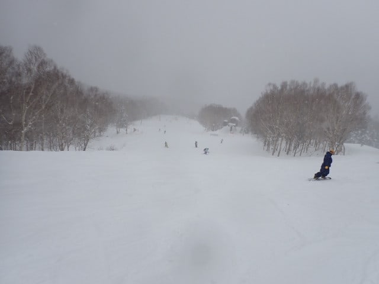

# 2024/12/31(火)，大晦日の志賀高原焼額山スキー場は…朝は締まった最高シマシマ！午後は雪が積もり荒れていったよ

📅 投稿日時: 2024-12-31 21:43:26

🏷️ カテゴリ: [2025スキー滑走日記](cacd3fbf84d4a679ee61a5894c3f95e14.md)

ということで．

大晦日の本日も志賀高原で滑ってました～！

大晦日の本日．

天気が曇り空だったこともあり，

朝イチのゴンドラ待ちはすっきり晴天の

昨日の半分も人がいない感じで，

今日は混まなさそうな予感…

朝イチのゴンドラで山頂に上がると．

山頂もやっぱり曇り空…

昨晩からの積雪はほぼ0でした…．

で，朝の気温は-6℃の予想に対し

-7℃と，1℃差でほぼ正解！

ここ数日に比べれば気温は高め

ですが，日が射してないのでかなり

寒く感じ…

久しぶりに朝まで積雪がない夜だったので，

雪はいい感じに締まった，久々の

ハイスピードシマシマバーン！！

ぐほーーー！

すごいハイスピードで思いっきり

傾ける，この快感…っ！！

朝のうちはゲレンデの人も少なく…

日が射してないのが惜しいけど，

いい感じに締まってスピードが乗る

冷え冷えシマシマのガラガラバーンを

思う存分かっ飛ばせるシアワセ…！！

昨日の柔らかシマシマもトップシーズン

らしくていいけど，やっぱり締まった

バーンもスピードが出てイイね！！！

昨日より人が少なかったので，

朝の1時間はシアワセガラガラ冷え冷え

バーンを滑れましたが…

やはり9時半を過ぎてくると，さすが

年末年始休みだけあって，人が徐々に

増え始め…

10時前には，一ノ瀬から流れてくる人が

最初に流れ込む，第2高速が混み始め…

10時過ぎには，ゴンドラもちょっと待ち

時間がでてきました…

でも，第2ゴンドラは5分以上待った

ようですが，第1ゴンドラはゲートから

ちょっとはみ出るくらいで，相乗りレーンを

使えば搬器数台待ちで乗れましたよ！

まぁ，この程度の混雑で，雪質が

冷え冷えの締まった雪だから，まだ

楽しめるよな…と思っていたら．

昼頃から降ると予想していた雪の降り

始めがちょっと早くなり，10時過ぎには

早くもかなりの勢いで降り始めて

来ました…(泣）

人口密度が上がり始めてくる時間に，

かなり雪が降ってきて，視界が悪く

なってくるのは結構つらいのですが…（泣）

雪は時折結構な勢いで降り，

コース上に新雪が積もっていく

レベルだったので…

せっかく朝のうちはいい感じで

締まっていたバーンも，新雪が乗って

だんだんボコボコになっていき．

さらに視界も悪く，人口密度も昨日より

低めとはいえ，そこそこの人が滑って

いたので…

一昨日と似た状況で，昼頃からは

また厳しい状況になっていきました（泣）

標高が低いところはまだ視界がいいけど．

標高が高いところはガスっぽくて

見にくいんですけど（涙）

まぁ，コースの途中から下半分は

ガスもなく視界も晴れるのですが．

曇りなので凸凹は見にくく，

午後はモサモサ雪が蹴散らされた

ちょいと手ごわいバーンに

なっていきます…（泣）

ただ．天気が悪くなってきたからか，

昼頃からはゴンドラもかなりガラガラに

なり…

リフトの待ちもほぼない状態で．

とても大晦日と思えないガラガラ具合

だったので，その点は良かったかな…

しかし．

最高気温でも-6℃と，朝からほとんど

変わらない冷え冷えで．

さらにいい感じで雪が降りつづけ，

前も見にくいし．

その上，午後には圧雪バーンでも

この程度の積雪が積もったので…

バーンはそこそこボコボコになって

行きましたが…

人がそこまで多くなかったので，

コブコブになるほどひどく

なかったのがまだ救いだったかな…

ってなことで．

夕方は荒れ気味バーン＆雪降りの悪視界

＆寒さというトリプルパンチのおかげで，

人があまりいなくなったゲレンデを，

野生の勘とバランス感覚で滑り続け，

今日もいつも通り16時のラストリフトまで

滑り続けたのでした…

という感じで．

今年も大みそかまで滑り続けましたが．

明日の元日は，朝まで雪がちらつきそう

ですけど，昼前には止んで．

午後は日が射すかも…！

そして，2日は晴れの予想でしたが．

高気圧が思ったより発達し無さそうで，

曇り空の一日になりそうで．

もしかしたら雪もぱらつくかも…

とりあえず．今年もお世話になりました…

また，2025年も元日から志賀高原を

滑り倒していますので．

2025年もよろしくお願いします～！！

## 💬 コメント一覧

### 💬 コメント by (けんけん)
**タイトル**: Unknown
**投稿日**: 2025-01-01 10:24:52

あけましておめでとうございます🥳

ファーストトラック行けなくてオリンピック食われてたけど

バレー最高でした！

### 💬 コメント by (Skier_S)
**タイトル**: ＞けんけんさま
**投稿日**: 2025-01-01 22:20:31

あけましておめでとうございます！

バレー良かったですか…！

私は今日は完全圧雪狙いだったので，バレーはまだ行ってませんが

3日あたりはまた積もりそうなので，バレーねらい目かも…

