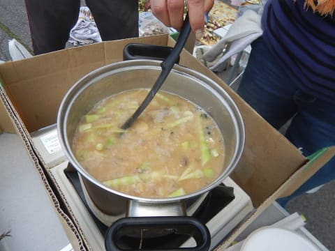

# ということで，この週末は志賀高原へタケノコ狩りに行ってみた

📅 投稿日時: 2017-06-27 04:25:10

ということで．

昨日は娘と一緒に夜10時前に寝てしまい…

さらに，夜中に起きて，記事を書きかけた

ものの．

最後まで書き上げる気力がなく，

布団の中に倒れてしまったという…

＃なんだか，夜中に書きかけた記事が

＃さらされていた気がするけど．

＃きっと，気のせいだ．

＃誰もそんなものは見ていないはず…

ってな感じで．

遅くなりましたが．

土曜日のレポートをば…

えー．

みなさん，おわかりかと思いますが．

この日は，志賀高原へタケノコ狩りに

行ってきました～！←それも日帰りで行くか！？？

…タケノコって言っても．

みなさんご存知かと思いますが．

普通の竹のタケノコではなく．

「ネマガリダケ」と呼ばれる笹のタケノコで．

いや，これが美味いんですね～…

とりあえず．

やってきたのは，志賀高原ダイヤモンドスキー場．

日帰りというのに，朝4時前に出発で．

ゲレンデ到着時間はいつものスキーと同じく

8:20ごろ…

で，朝のダイヤモンドスキー場のゲレンデを，

とっとこ登ります…

うーむ．

いつものゲレンデを見ると．

滑りたくなるけど…

今日は滑りに来たわけでは無いので，

グッとがまん．←そもそも雪がないから滑れないってば

なんだか，タケノコを採りに行く道の

途中に，すでにタケノコが生えてますが…

…ちょっと細いな．

さらにとっとこ歩いて．

本日のタケノコ採りポイントまでやってきました！

「え？ここに入っていくの？」

って感じの，こーゆーリアルな笹薮の中に．

ガサガサと分け入って入っていきます…

ええ．

身長より高い笹薮の中．

どっちから来たのかも分からなくなる

ような中．

笹をかき分けかき分け進んでいくと…

こんな感じで生えていますよ，

タケノコちゃんが…！！！

このタケノコが大好物という，

小学生としては渋い嗜好をもっている

わが娘．

自分の大好物がにょきにょき生えている

わけですから．

それはもう大喜びなわけで．

採れる限りとってやる！

という感じで，狂喜乱舞しながら

タケノコを採りまくってます…

いや．

でも．

このタケノコ，こんな感じで，

結構見つけにくくて．

見つけると，「あった～！」と

嬉しくなるので．

ついつい一生懸命探して，

嬉しそうに採ってしまいます…

志賀高原，例年なら6月上旬～半ばが

タケノコ狩りのピークなんですが．

今年は6月最終週の，この週末が

ちょうどピークでしたね～．

雪が多かった分，例年より2-3週間

遅れた感じですか…

ってことで．

大量にタケノコを採ったあとは，

またゲレンデを歩いて，車へ戻りますが．

そう．

タケノコ狩りは，これで終わらない．

ふはははは．

メインイベントはこれからなのだっ！！！

まずは，収穫したタケノコを広げまして…

人海戦術により，タケノコの皮を剥き，

適当な大きさに切り分けます…

この，皮を剥くのが大変な作業（涙）．

皮を剥くと，こういう状態になります…

皮を剥くと，1/3くらいの量になっちゃう感じで．

すごく大量に採ってきたのに，

皮を剥き終わった後のタケノコは，

ほんのわずかの量になっちゃいます…（泣）．

苦労した皮むき作業により，

皮を剥き終わったタケノコ．

これからおいしいタケノコ汁になって

いただきましょうか…！！

生でも食べられるくらい柔らかい，

新鮮な採れたてタケノコなので，

軽く火を通した後は，

信州みそを投入し…

そして，こいつ．

タケノコ汁に絶対欠かせない，サバの水煮！！

豪快に投入します．

という感じでできあがった，おいしそうな

タケノコ汁！

ふははははは！

いただきま～すっ！！！

…美味い．

美味いのだ！

採れたてタケノコ汁は，最高に美味いのだ！

…それも，志賀高原の自然の中で食べると，

さらにうまさが倍増するのだ！！

…しかし．

サバとタケノコのマッチングを考えた人は，

天才としか言いようがない…

なんでタケノコとサバを合わせようと

考え着いたのか…

で．

タケノコの一部は，皮を剥かずに

焼きタケノコに…！

この焼きタケノコ．

実にホクホクとした歯触りで．

甘くておいしいっ！！

あぁ…

採れたてのタケノコで，

タケノコ汁と焼きタケノコ…

…なんてゼイタクなんでしょう…

って感じで．

タケノコを採ってその場で食べるという，

超ゼイタクな幸せを味わった，この一日

いやーー．

冬の志賀高原もいいけど．

初夏の志賀高原もいいねぇ～！！

と，思ったSkier_Sだったのでした…

ということで．

この日のプロデュースをしてくださった，

[Gokuraku Skier](http://red.ap.teacup.com/gokurakuskier/728.html)さん，ありがとうございました～！！！

## 💬 コメント一覧

### 💬 コメント by (かず)
**タイトル**: 展示会次の日もガラガラ引きに行きました
**投稿日**: 2017-06-27 13:26:01

この前聞いた方　首からぶら下げてる名刺見たらヤケビの方でした　プリンスのガラガラ相性よくて八海山と軽井沢のリフト券当たりました　さすがに狙ってたヤケビ宿泊券は無理でしたけど

### 💬 コメント by (Goku)
**タイトル**: Unknown
**投稿日**: 2017-06-27 19:59:29

土曜日は遠い所お疲れさまでした～。

それにしても予定の１０分前に着くとはさすがとしか言いようがありません（笑）

しかし今年はいっぱい採れましたね！（去年がすこし寂しかった・・・）

焼もタケノコ汁もお腹いっぱい食べれて私も大満足でした。

で、ジンギスカンも気に入っていただけたようで何よりです♪

何だかこの行事、毎年恒例になりそうですね。

### 💬 コメント by (michi)
**タイトル**: Unknown
**投稿日**: 2017-06-27 22:02:03

根曲がり竹、最高ですよね。

長野県でも北部で良く食べられるんですが、自分も毎年食べないと気が済みません（笑）

でも最近は自分で取りに行かず買って食べてます。

うちの息子も大好きですよ。渋い嗜好ですかね（爆）

### 💬 コメント by (しんちゃん)
**タイトル**: うまそ～
**投稿日**: 2017-06-27 22:18:47

焼きもタケノコ汁もうまそうですね～！

ジンギスカンはＧＷにＧｏｋｕ様におよばれさせていただきました。ご紹介通りイオン中野店で買って帰りました。お家で食べるジンギスカンもなかなかでしたよ。

初夏の高原ランチ、いいですねぇ。

来年参加を考えようかな(^^ゞ

### 💬 コメント by (Skier_S)
**タイトル**: タケノコ狩り，毎年恒例にしたい…
**投稿日**: 2017-06-28 02:17:35

＞かずさま

あ，リフト券当たったんですね！

いいなぁ…

私もヤケビ宿泊券とかもらいたいです…

＞Gokuさま

土曜はホントにお世話になりました！

今年はタケノコ豊作で，いっぱい採れて満足です～！！

ジンギスカンもかなりのインパクトでした．

次に長野に行ったときは絶対に買いです（笑）．

…もう，この行事．

ぜひ毎年恒例でお願いします～！！！！

＞michiさま

いやー．

ホントに，根曲り竹最高ですよ！

そちらも息子さんが大好きなんですね…

どちらかというと，焼きタケノコとか

酒と合わせたくなる感じで，

大人の味だとおもいますが…（笑）

＞しんちゃんさま

美味しかったですよ～！

自分で採ったものだし，

志賀高原の自然の中で採りたてをたべるってのが

さらにおいしさを10倍増しにしてくれます．

来年は一緒にできるといいですね～．

### 💬 コメント by (やえどん)
**タイトル**: 熊も好物
**投稿日**: 2017-06-29 19:05:16

熊も好物ですので、くれぐれも御注意ください。

東北地方では、熊と遭遇して怪我人が多数出ています。

亡くなった方も。

### 💬 コメント by (Skier_S)
**タイトル**: やえどんさま
**投稿日**: 2017-06-30 00:51:19

そうなんですよ．

クマの大好物らしいですね…

とりあえず，単独で山に入るのは避けて，

なるべく大勢の人がいるところで

採った方が良いようで…

幸い，長野県ではタケノコ狩りでクマに

襲われたニュースは聞きませんが，

気を付けないと．

クマはやっぱり怖いですよね～．

しかし，タケノコに嵌った人は，

熊は怖くてもタケノコは食べたい…という．

フグを食べるような心境かもしれません…

