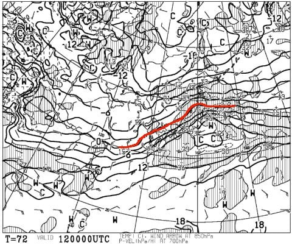

# 2018/12/9(日)の志賀高原焼額山スキー場の状況速報…積雪わずか2cm（涙）．土曜より混んで，バーンはガリガリ(泣）

📅 投稿日時: 2018-12-10 01:02:25

🏷️ カテゴリ: [2019スキー滑走日記](c3e4496fc0fb7f9c17ff21214a35b1ace.md)

というわけで．

本日も焼額を滑ってきたわけですが．

いつも通り，本日の帰宅は夜遅く．

片づけやらなにやらやっていると

こんな時間…（涙）

だもんで．

日曜深夜恒例，速報モードにて．

えー．

まず．

朝ですが．

昨晩から，わずか2cmほど積雪があり．

それと昨晩の人工雪の追加で．

積雪は10cmほど増えたようですね…

昨日は20cmだった積雪．

今日は30cmになってます．

気温も-8℃と，かなりの冷え込み！

このわずかな積雪のおかげで，

一見ゲレンデは真っ白になっていて…

あさイチはうっすら新雪のゲレンデ

状況でしたけど．

でも，わずか2cmほどの積雪．

すぐにはがれてしまい…

あっという間にブッシュやら浮石が

ゲレンデにお出ましです（涙）

そして．

オープンから1時間経った，朝9時半には…

リフト待ちが10分を超えているんですが（泣）

そのおかげで，ゲレンデの人口密度も

高いのですが（涙）

そして，大勢で雪が削られたゲレンデは，

ところどころ下地の氷が顔を出し，

ツルツルになってます…（泣）

天然雪もわずかだったので．

昨日からコース幅はほとんど広がっておらず．

相変わらず廊下状のゲレンデに，大量の

人があふれてるんですが…（残念）

天気は予想通り，

激冷えの終日雪がぱらつく感じ．

リフトに乗ってると，冷凍人間に

なるほどの寒さ．

ぱらつく雪も積もるほどではなく．

ゲレンデ改善には全く役立たず（涙）

うーむ．

リフト待ち時間は昨日の倍近く．

そして，コース幅も広がらず，

バーンは硬いまま…

大変残念なことに．

今日もそんなに楽しくなかったです（激烈な涙）

そして．

今週水曜，12日は…

うむ？？

0度線は志賀より北で…

で，降水域が志賀に掛かってるん

ですが…！！？？

これは…

考えたくない事実だけど…

12月中旬の志賀高原で．

かなりの雨が降るということですかっ！？？？

何ということだ…（涙）

…取り合えず．

今シーズンも．

例の踊りを全力で踊り続けなくては

ならないシーズンのようです…（止まらぬ涙）

## 💬 コメント一覧

### 💬 コメント by (はなげ親分)
**タイトル**: 申し訳ありません‼️
**投稿日**: 2018-12-10 16:55:13

三重苦に負け、こっそり早退をしてしまいましたm(__)m

銀のお札を貼っているのに・・・

あの踊り、カミさん共々全身全霊一心不乱に踊ります！

### 💬 コメント by (もりや)
**タイトル**: Unknown
**投稿日**: 2018-12-10 20:02:49

2日間お世話になりました！毎週お会いするメンバーも勢ぞろいで賑やかで楽しかったです。それにしても子供達の滑走速度が速い事速い事(泣)私のレベルでは追いつかない中、息子がゴールドメンバーの方々と一緒に会話しながら滑走できた事が凄く楽しかったみたいです。それと今日一人で羽根を伸ばし野沢温泉スキー場Openとの事で行って来ましたが、200メートルのコースがイヤになり、ヤケビへ移動し11時半〜ラスリフまで滑っちゃいました。コース幅も広がりガリガリも無く凄く滑りやすかったです。また今週日曜日ヤケビでお会いしましょう！

### 💬 コメント by (Goku)
**タイトル**: リタイヤ続出
**投稿日**: 2018-12-10 20:23:52

昨日はお疲れ様でした～♪

ヤケビは先週の雨でよくコースが維持できたと感心してます。

さすが焼額山スタッフ！

それにしても、昨日はあまりの辛さにリタイヤ続出でしたね。

来週は気持ちよく滑れるとイイですね。

### 💬 コメント by (MZMM)
**タイトル**: Unknown
**投稿日**: 2018-12-10 21:38:52

シーズンになると楽しくハラハラ読ませていただいています。少し違った記事から:

12月7日の新聞で、Nike Adidas と並ぶ、スポーツ用品世界最大手のフィンランドのAmer を、中国のANTA安踏体育用品が正式に50億€の買収交渉に入ったとのこと。AmerはATOMIC, SALOMON, テニスのWILSON などのブランド傘下に持つ。

車の話題、『ボルボ「XC40」が2年連続でイヤーカーに選ばれた。昨年の勝者を振り返るとボルボ「XC60」だった。』このVolvoを中国の中型ファミリーカー吉利GEELY AUTOが2010年に買収。

身近な話題と思い、それで？ 浮きコメかもσ(^_^;)

ヨーロッパのスキー場はとっくに天然雪は積もらないと聞いている (^^;;

### 💬 コメント by (Skier_S)
**タイトル**: 今週末にちょっと期待…
**投稿日**: 2018-12-11 04:32:19

＞はなげ親分さま

早退は許しません！

ちゃんと最後のリフトまで滑ってください！

…嘘です．

この日は私もリフト終了20分前に切り上げました．

朝礼メンバーで，ラストまで滑っていた人は

いませんでした…

＞もりやさま

こちらこそ，2日間お世話になりました！

娘も楽しすぎたようで，毎週志賀で滑りたいと

言っています．

しかし，子供たちホントにあのバーンコンディションで

よくあのスピードで滑りますね…

月曜はヤケビのコンディション良かったんですね．

あさイチから焼額だったら良かったですね(笑)．

また今週もよろしくお願いします！

＞Gokuさま

日曜は，20分のインターバル時間と

4ロマでの8分間宙づりの冷凍人間製造機が

辛すぎましたね…（涙）．

この週末はちょっと期待できます（今シーズン従来比）

ゴンドラは厳しいでしょうけど…

おそらく2高は動きます！

＞MZMMさま

えええ！

アメアスポーツ，中国資本に買われるんですか！？？

うーーむ．

中国資本恐るべし…

そして，日本も近いうちに天然雪でスキーができなくなるのかも！？？

そんなことになったら恐ろしいですね（涙）

### 💬 コメント by (MZMM)
**タイトル**: Unknown
**投稿日**: 2018-12-11 18:59:19

蛇足です、全くの蛇足 :

" 人工雪製造は10億ドル規模のグローバル産業になった。今やオーストリアのスキー場の半分近くでは、雪製造装置(スノーキャノン)が人工雪をまき散らしている。これには、1平方メートル当たり約470リットルの水が必要になる。アルプス山脈全体では、人口170万人の都市ウィーンよりも多くの水を使う。これは、単位面積当たりにして、典型的な小麦畑の水使用量に匹敵する。

だが、従来の人工雪製造では、ヨーロッパの池や湖からどれだけ水を持ってきても、アルプス山脈のスキー経済を維持することはできない。その維持には、氷点下の温度と70パーセント未満の湿度、最小限の風という、完璧な条件が必要とされるが、少なくともピッツタールでは、もっとも必要とされるときにこの条件がそろうことは、もはやめったにない。（『地球を「売り物」にする人たち』100ページ）

... 淡水化や人工雪製造機が救いうるのは豊かな地域だけであり、世界の残りは悲惨な運命を免れえないのだ。（同112-113ページ）"

（ https://diamond.jp/articles/-/87966    2016.3.16『地球を「売り物」にする人たち』100ページ）

狼少年ではないが、こう云うイスラエルの淡水化エンジニアも。

水なら八ヶ岳や信濃大町の山麓では真冬でも滔々と、伏流水があふれている。富士パラなど苦労しないかも。

18/12/11の別コメ「週末今シーズン初滑りです、ブログ拝見してワクワクしてきました... 」ならいいですね 👌👍👏👏👏

### 💬 コメント by (マルハバ)
**タイトル**: アメア中国資本に買われる・・
**投稿日**: 2018-12-11 22:09:09

昨年、Sさん御用達のいつもの店スタッフから

「某有名スキーメーカーが本国で危ない」なんてウワサ話を聞いたんですが・・

このところネットオークションで数年前のモデルが業者から「新品」で頻繁に出品されています

（実は私も落札した・・日本の正規代理店のシール付）

これは代理店がクレーム処理用の在庫品を一掃したんじゃなかろうか？

今回のアメアの話を聞くと、こちらのメーカーもなにかありそうな気配が・・（汗）

### 💬 コメント by (Skier_S)
**タイトル**: コメント回答遅れてすみません
**投稿日**: 2018-12-12 23:38:47

＞MZMMさま

人工降雪機は，水と電力を食いますからね…

まぁ，日本は淡水には苦労しておらず，飲料レベルでなくていいのなら

水の心配は少なそうですし，ゲレンデに撒いた雪も

いずれ解けて，また川に戻っていくものですから．

クリティカルなのは電力かも…

電気代がすごいので，札束をゲレンデに敷き詰めているようなもんだ

と言われることもありますが…

それが高温の雨で解けた日には，もう…

スキー場には毎年天然雪がたっぷり積もってほしいところです（涙）

＞マルハバさま

…ヨーロッパもスキー人口が減っているようなので．

世界中でスキー業界自体がヤバいのかもしれません．

ここ数十年，フリースタイルやファットスキーを除くと，

