# 2022/5/7(土)の志賀高原焼額山スキー場は…晴天ガラガラ，雪解けが一気に進んだけど，板は昨日よりは滑ったかな…

📅 投稿日時: 2022-05-07 22:39:11

🏷️ カテゴリ: [2022スキー滑走日記](cc9cb73e4320f6a97af6fccc37587a61a.md)

ということで．

GWの10連休も，残り2日となった本日．

志賀高原中央エリアはもう営業が終わり，

残るは奥志賀・横手・熊・ヤケビのみと

なりましたが…

今日も焼額で滑ってました～！！

で．

今日は朝6:30の早朝営業から滑り始め

ましたが…

今日は営業開始の5分前からゲートが

オープンしたらしく．ちょっと出遅れました（涙）

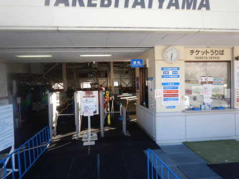

そして．

今日は6:30からすでに山頂の気温が

+5℃(涙)

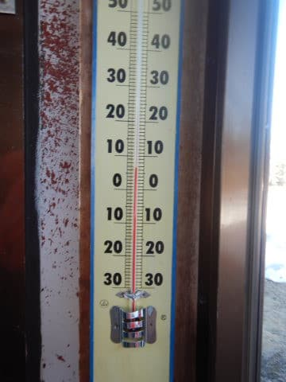

でも，朝イチはかなりガチガチに固まった

斜面で，1本目はいい感じ！！

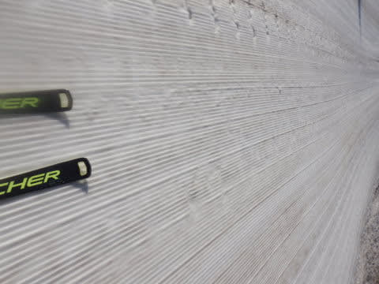

…ただ．

2本目になると，気温が高く日差しも強いので．

もうGSコースの日当たりがいいところは

かなり緩み気味…(涙）

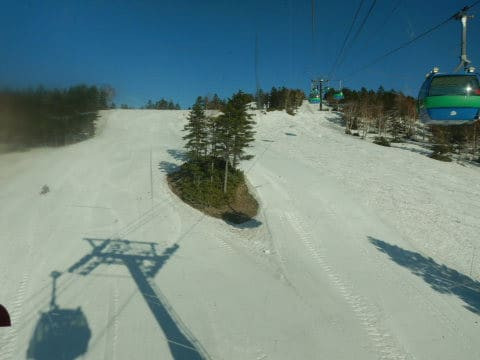

でも，今日は土曜日なのに思ったより

人が多くなくて．

いつもなら人が多めの早朝から

ゴンドラ待ちはほぼ待ちなし状態！

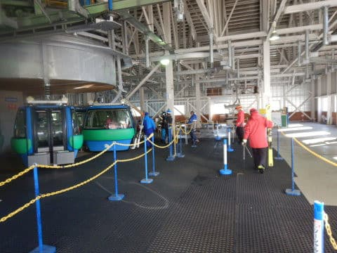

そして，8:30にはパノラマコースがオープン！

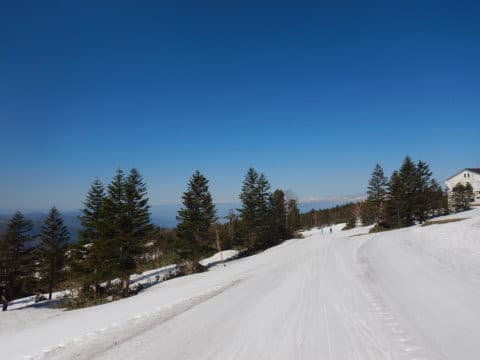

パノラマコースのシマシマをまたまた

堪能！！

…だけど．

オープン時から雪は緩んでいて．

1-2本はシマシマで良かったけど，

それ以降はちょいと滑りが悪かったのが

残念．

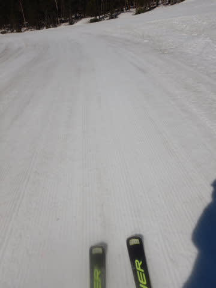

だもんで．

連絡路をひたすら漕がなくてはならない

パノラマコースは避けて，

今日はGSコースばっかり滑りましたが…

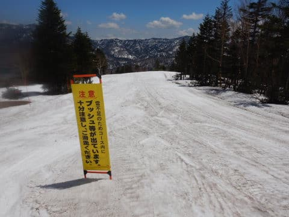

今日はGSコースも強烈な高温＆日差しで

雪がガンガン解けていき．

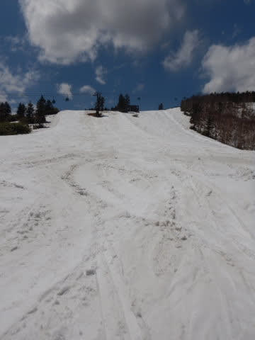

ゴンドラ連絡コース，途中に土が

出てきたところも…(涙)

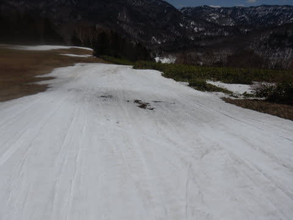

この部分，昼頃には一気に穴が広がり…

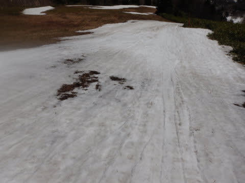

午後にはほぼ切れかけてました(涙)

この3枚．とても同じ部分が1日でこれだけ

解けたと思えないほど雪が消えました…（激涙）

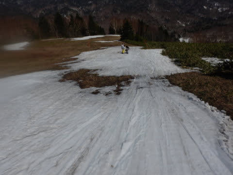

ここ以外にも，雪解けはかなり進み…

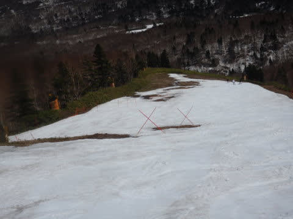

完全に穴が開いてなくても，薄くなった

ところは数多く．

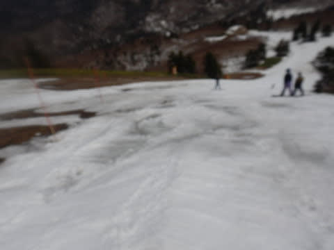

今日1日で，GSコースはかなり雪が

激烈に減りました（泣）

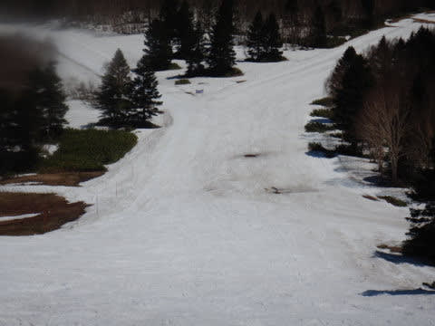

そして．

ほぼ切れかけてたゴンドラ連絡コース部分は，

営業終了時には完全に切れちゃってました（涙）

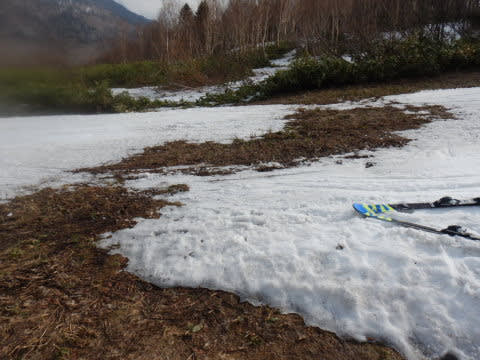

まぁ，ここは迂回コースを通れば

通らなくても済むんですが．

GSコースのメイン部分も，営業終了時は

かなりやばい感じになってきてました（泣）

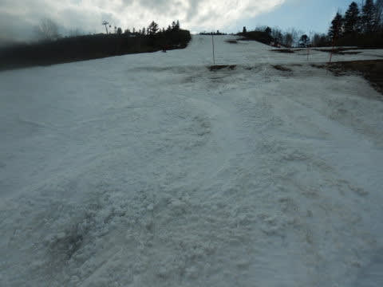

でも．

GSコースも，ヤバい一部分以外はまだ

コースいっぱい雪が残っていたので．

雪寄せすれば，まだ明日まで営業できそうだな…

と思っていたんですが．

焼額のホームページを見ると．

どうやら明日は，GSコースの営業を

諦めたようです…（泣）

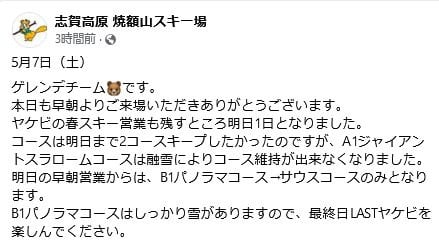

（焼額山スキー場公式Facebookより）

でも，今日は土が出てきたけど．

昨日のストップ雪に比べれば滑りがかなり

よかったので．

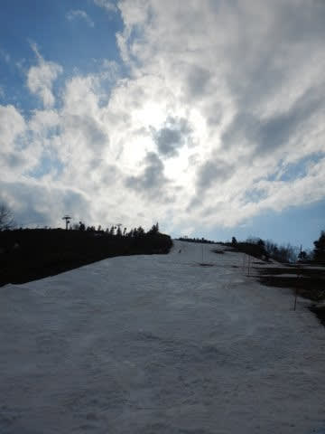

今日は早めに上がろうと思っていたのに，

結局ラストの15:45まで滑り続けて

しまったのでした…←完全に想定の範囲内

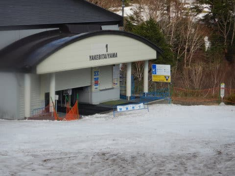

ってなことで．

長らく通った焼額も明日がラストデー．

残念ながらGSコースは今日で終わりましたが．

明日もラストヤケビを滑ってます～！

## 💬 コメント一覧

### 💬 コメント by (you160)
**タイトル**: Unknown
**投稿日**: 2022-05-08 10:53:40

Sさま

4/3に、初めてお会いしてから1ヶ月ですが、娘たちはすっかりSさまに懐きましたね！

今まで、次女優先で面倒見ざるを得ず、長女は自由に滑らせていましたが、皆さまからのお褒めの言葉によるモチベーション増大＆Sさまの絶妙なスピードでのリードなど、この1ヶ月の上達は、想像を大きく超えるもので、私自身も勉強になりました。

ヤケビは5/8でクローズとなり「花より団子よりスキー」の我が家？にとっては寂しい限りですが、残り少ない雪を求めて、もう少しだけ渋峠で鍛錬予定です。

また、この場を借りまして、、、

>今シーズンお声かけ頂きましたみなさま

娘たちは来シーズンも同じウェアの予定なので、みかけたら是非お声掛けください！

来シーズンの志賀高原スタートは12/3、4を予定しています。来シーズンもどうぞよろしくお願い致します！

Sさまも、スキー、仕事ともに程々に？ご自愛ください。

### 💬 コメント by (Skier_S)
**タイトル**: ＞you160さま
**投稿日**: 2022-05-09 01:44:05

土曜もお世話になりました～！

さすがに雪の良いトップシーズンは私もガンガン滑っちゃうことが多いのですが，

この時期ならでは，じっくり一緒に滑ることができました…

お子さんお二人が喜んでくれて，スキーと焼額が好きになって

もらえたのなら，ありがたい限りです．

また来シーズン，焼額で一緒に滑りましょう！

そして，来週以降の渋峠でも，おそらくヤケビメンバーが滑っているかも…

