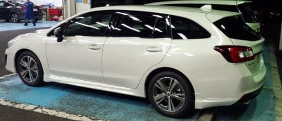
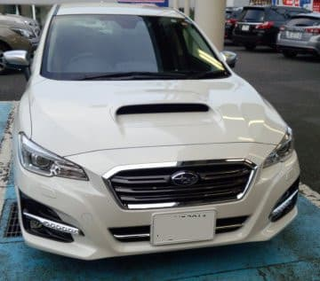
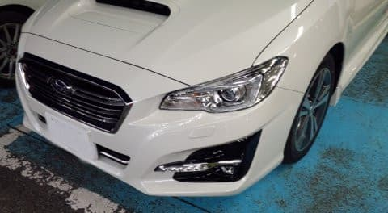

# スバル・LEVORG D型登場！…さっそくD型レヴォーグ1.6 GTに試乗してきたよ

📅 投稿日時: 2017-09-18 05:20:19

🏷️ カテゴリ: [車試乗](c07dec5709d34bd74e1f6cb9c8291061b.md)

ということで．

スバルのLEVORG．

この8月に定例の年次更改を済ませた，D型の

デリバリーが始まりましたが．

ディーラーに試乗車が届いたようなので，

さっそく試乗に行ってきました…

今回，試乗車があったのが，1.6 GTと2.0 STI．

両方とも試乗してきたので，今回は1.6GTの試乗レポートをば…

今回のD型の変更点は，

・静粛性向上

・マルチインフォメーションディスプレイ大型化，

・大型ナビ対応

・その他内装の細かな改良

・フロントマスク変更

　　-ウインカーがライトに内蔵．

　　-バンパー，グリルデザイン変更

・ステアリング連動ヘッドライト

・アイサイトツーリングアシスト搭載

　　-アイサイトの設定速度が130km超

　　-0kmからのステアリングアシスト

・サスペンションセッティング大幅見直し

・リアシートの4:2:4分割

…などなど，かなり多数の変更が入りましたが

C→D型は，他社で言えば「マイナーチェンジ」に

当たる感じなので．

通常の年次更改よりも大きな範囲で手が入ってますね…

じっくり見ると，顔はそこそこ変わった感じ．

ただ，LEVORGオーナー以外には間違い探し

レベルの違いかな…

エンジンはメカ的には全く変わってないようで…

ただ，1.6Lの燃調プログラムに多少変更が入ったみたいですね．

（高負荷時の燃料増量抑制）

…インタークーラー周りを変更したとか，

ピストン・シリンダ周りの冷却に手を

入れてないのに…高ブースト時も

なるたけ燃料増量せず，ストイキに近いところで

燃やすようです．

レギュラーガソリン仕様なのに，かなり

厳しいことをやってますね…

さらに．1.6L車は，

バネレートを下げて，ノミナル車高を1cm高め，

さらに，バンプ＆リバウンド側の双方のストロークを

伸ばして，乗り心地をソフトにしたらしいけど．

さて．結構手が加わったLEVORG．

その実力や，如何に？？

と，さっそく，1.6 GTに試乗してみました．

まず，乗り込んでみて．

内装は…

普段のLEVORG乗りでないので，

細かな差はわかりませんが．

ナビが8インチ化，インフォメーションディスプレイも

横に大型化して．

これだけでも，C型までのオーナーは

ちょっと悔しくなるかも…

あと，本革シートでなくても，一番安いGTグレード以外，

シートヒーターが標準になったようですね．

GTグレードも，コールドウェザーパック

（ワイパー＆ミラーのヒーター等）をオプションに

着けると，もれなくシートヒーターがセットでつくようで…

そして．

一番印象に残ったのが．

「セーフティープラス」のオプションで着く，

ディスプレイ化したバックミラー．

普通のミラーとディスプレイと，自由に

切り替えられるのですが…

ディスプレイに切り替えると．

暗いところでも，明るくはっきり写る！！

ミラーに切り替えると，バックミラーがいかに

暗かったか分かる！

これは衝撃的…

シートポジションを動かしてもミラーの位置の

調整の必要がないし．

これ，かなりいいかも…！

あと，リヤシートの4:2:4分割はいいかな．

って感じで．

内装には，こまごまと手が入りましたが．

今回のマイナーチェンジの目玉，アイサイト

ツーリングアシスト．

今回の試乗では，試せませんでした…（かなり残念）

で．

実際に走り出してみると…

をを…

静粛性は確かに上がって，

ちょっと静かになったかな…

そして…乗り心地も，ソフトになったよ…！

それも，かなりソフトに！

でも，そのソフトさ．

バネレートダウンというより．

かなりいろんなところにブッシュ容量が

増えたのでは…？

という感じのソフトさ．

段差の乗り継ぎは，これまでのLEVORGとは

全く違う，柔らかさ．

良く言えば，路面の段差，継ぎ目などを感じず．

悪く言えば，路面のインフォメーションが隠されて

分かりにくくなった，ともいえるか…

全体的に，高い周波数の振動はよくカットされているけど…

ダンピングしっかり効いているというよりも．

高い周波数の入力をブッシュか何かの要素で

完全にフィルタリングして，

ダンパー＆スプリングはゆったり遅めの周波数で

だけ動いている…

という感じ．

簡単にいうと．ばねとダンバーが動くサスと，

ボディの間に，ゴムが1枚入ってるような感じ．

個人的な思い込みだけど．サブフレームマウントサスで，

サブフレーム～ボディの結合にたっぷりと

コンプライアンスをもたせた，一昔前の

トヨタ車のエッセンスを感じさせるなぁ…

で．そのブッシュの容量の大きさが効いているのか．

フロントロワアームのボディ側取り付けマウント

がピロボール→ゴムブッシュ化されたのが

効いているのか．

ステアリングを切った際に，タイヤが動き出してから

上物が動き出すまでに，ちょっとラグがある感じ．

いろんなブッシュなどの低剛性の部分が

たわんでから動き始めるような，かすかな

遅れがあるように感じてしまいます…

ステアリングを指一本切った時の

動き出しが，すっと動き出すというより．

タメがあってから動き出す感じ．

いい意味でのクイックさは無く．

ゆったりとした動き出しに感じるんですが…

だもんで．

ステアリングセンター付近の反応が，

ちょっとダルに感じる…

…これまでの機敏なLEVORGのイメージで行くと，

あれ？

ちょっと違う？

普通のファミリーカーっぽい…

って思うかも．

うーむ．

思い込みかなぁ…

で．

エンジンは基本的に変わってないので．

1.6Lは，動き出しからスピードが乗るまでは

低いギア比で必ず2000回転オーバーまで引っ張り．

ブーストが上がってから，ギア比がぐっとハイギアに

なるプログラミング．

町中では，スピードが乗ってからはせいぜい

1000～1200回転の低い回転数で走れます．

スピードが乗ってしまえば，快適．

町中で普通に走る分には，必要十分以上のトルク感．

一旦回転数（というか，ブースト）が上がれば，

かなりのトルクで車を引っ張ってくれます．．

スピードが乗ってしまえば，すごい低いエンジン

回転数で静かに車を引っ張っていくので，

1.6Lと思えないトルク感なんだけど．

…スタートから20kmくらいまでの，ブーストが

上がるまでの段付き加速．

これがD型でも解消されていないのが，

ちょっと惜しい．

という感じで．

D型LEVORGの1.6 GTグレードは．

ちょっとゆったりした，OUTBACKに近い乗り味に

なっちゃったけど．

ステアリングや路面状況に反応する機敏さは要らないから，

ゆったりした乗り心地を…

ってなら，このGTグレードがいいんじゃないかな．

ってことで．

足回りは，かなり普通の乗用車っぽい乗り味になった，

今回の1.6GTでした．

うーむ．GT-Sはどうなったんだろう…

## 💬 コメント一覧

### 💬 コメント by (まいる)
**タイトル**: 久々
**投稿日**: 2017-09-18 09:57:13

ご無沙汰してます

レヴォーグのレビューに反応してのコメです。

Ｄ型、まだ試乗できずですが、かなりよくなってるなぁというところです。

来月にはアウトバックのＤ型がでますねー

### 💬 コメント by (Goku)
**タイトル**: 気になってます
**投稿日**: 2017-09-18 16:58:26

私はフォレスターがフルモデルチェンジするまで様子見になりそうですが、D型LEVORGも気になっています。

ひとつ上のSスタイルだと18インチ、GT-Sだと更にビル足なので乗り心地もかなり変わってきそうですね。

あと、4：2：4分割のリヤシートはエクストレイルでもかなり重宝していますよ。

### 💬 コメント by (しんちゃん)
**タイトル**: 進化
**投稿日**: 2017-09-18 23:39:25

レボーグ、進化してるんですね。

あまりトヨタ車っぽくならないでほしい気もします。

### 💬 コメント by (Skier_S)
**タイトル**: コメント回答遅れました…
**投稿日**: 2017-09-19 23:39:02

すみません．この時期いろいろ忙しく，コメント回答遅れました…

＞まいるさま

お久しぶりです～！

D型，素のGTはかなり穏やかな車になった感じです．

まだツーリングアシストを試してないので，

D型の真価は試せていない感じです…

Legacyにはツーリングアシストがつかないようですね．

＞Gokuさま

フォレスターのフルモデルチェンジも気になるところ．

1.6のGT-Sも，GT同様バネレートを落としてきたようで

かなり穏やかな足回りになったのでは…

と思っています．

ちなみに，STIはCもDも足回りは変わっていない

感じを受けました．

＞しんちゃんさま

LEVORGは，A→Dにむかい，着実に

毎年足回りの締め付けが緩む方向に

向かっています．

D型は驚くほど突き上げ感の無い車に

なっていました…

毎年着実に進化してくるあたりがスバルっぽいですよね．

