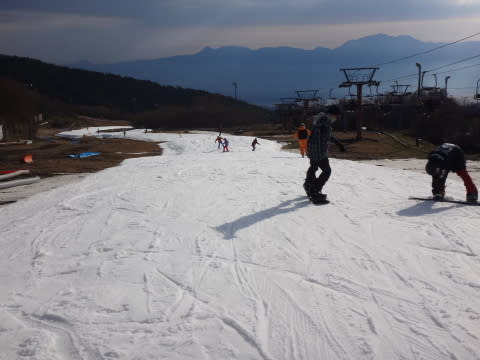
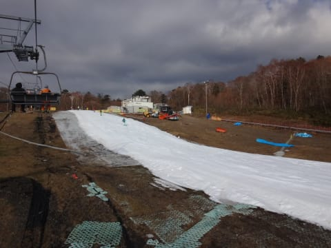
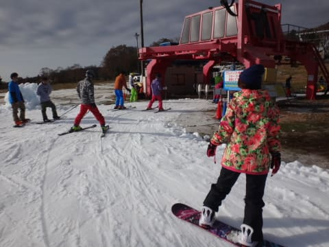
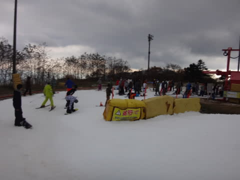
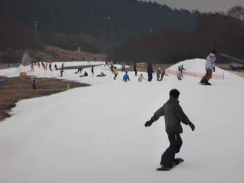
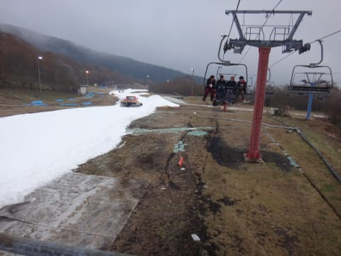
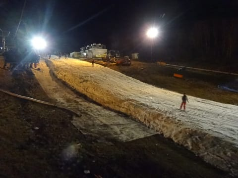

# 2016シーズンのスタートから3週間，11月7日土曜日のイエティ速報モード

📅 投稿日時: 2015-11-07 23:38:58

🏷️ カテゴリ: [2016スキー滑走日記](c70c67ed5248e9432b899dcd5747048bb.md)

ということで．

予告通り，本日日帰りで行ってきました．

…4週連続の，Yetiへ．←アホだな

今日は．

なぜか帰宅が遅かったので，速報モードで…

えー．

今日の朝は，晴れ！

日差しの中，オープン1本目を滑れましたよ～！

朝イチはガラガラ，日差しのなか滑れる

気持ちいい状況で…

朝10時近くまで，リフトも待ちなし！

この日は，午後になってもリフト待ちは少なく…

終日こんな感じ．

クワッドと並行にかかっているペアは全く動かず．

それでも，リフト待ちは3分超えなかった感じで．

いやいやいやいや．

なんでこんな空いてるの？？

まぁ，午後はコース上はちょいと人が増えたけど…

でも，リフト待ちが無いし，全然許せます．

あー．

天気は，午前10時には予想通り曇りだし，

繰り返します．

予想通り，曇りとなり．

それ以降は終日曇日が射さない一日でしたが．

おかげで，雪はそれほど粘つくことはなく．

まぁまぁの雪でした．

コース幅は，先週よりちょっと広がったかな～．

ってことで．

コース整備の午後4時を迎えたわけですが…

あれ？

なぜだ？

なぜ，ナイターゲレンデに？？

ということで．

今日は夜まで滑っていたので，

帰宅が遅くなりました…

しかし．

このスキー場．

今日は昼間よりナイターの方が，リフト待ち時間が

倍くらいに伸びた感じなんですけど…

ナイターの方が混みますね～．

でも．

ナイターは雪がむちゃくちゃ滑って，気持ちよかったですよ！

ってことで．

今日は帰宅が遅かったので，速報バージョンでした…

また明日，詳細レポートします！

＃いや，これで十分詳細では？？

## 💬 コメント一覧

### 💬 コメント by (komu)
**タイトル**: お疲れ様でした
**投稿日**: 2015-11-08 00:36:34

確か、仕事でお帰りになりましたよね…

ナイターでお見かけしたのは幻か生霊か…

こちらはラストまで滑ってしまいました。

### 💬 コメント by (ヒロちゃん)
**タイトル**: 御礼
**投稿日**: 2015-11-08 01:50:22

ナイター良かったですね。いつもなら、20時過ぎには、空くのに、今日は、最後まで、リフト待ちで（涙）でした。S様、やはり、滑り早くて、技術真似られずでした。また、よろしくお願いします^_^

### 💬 コメント by (Skier_S)
**タイトル**: お疲れ様でした…
**投稿日**: 2015-11-08 23:48:54

＞komuさま

いや…

確か，4時に仕事のため上がったはずなんですが…

そのあとは，まだ滑りたかった，という怨念が

ゲレンデに残って滑っていたのかと（笑）．

＞ひろちゃんさま

ナイター，むちゃくちゃ板が滑ってよかったですね～．

だもんで，思わずかっ飛ばしてしまいました（＾＾；

でも，最後までリフト待ちあったんですね…

あの後すきだしてきた，とか言われたら暴れる

所でした（笑）．

