# 2016年8月　子連れ座間味ダイビング旅行記　その8…2日目の3本目

📅 投稿日時: 2016-10-27 03:52:06

ということで．

今日もまた，とんでもない時間に帰ってきた

Skier_Sです（涙）．

今日はまたまたダイビング日記です．

では，どうぞ～！

----

ってな感じで．

3本目のダイビング，スタートしたわけですが…

うむ！？？

なんと，スズメダイやハナダイ系の魚の

密度の高いことっ！！

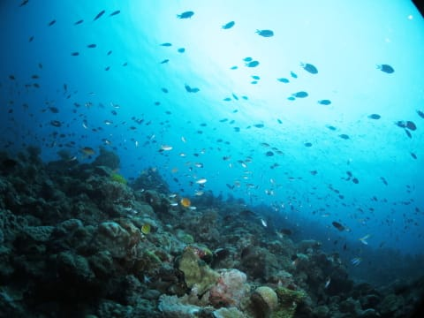

このポイント…

どこに行っても，こんな感じで

小さなハナダイやハナゴイが群れ群れで…

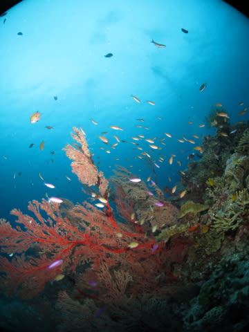

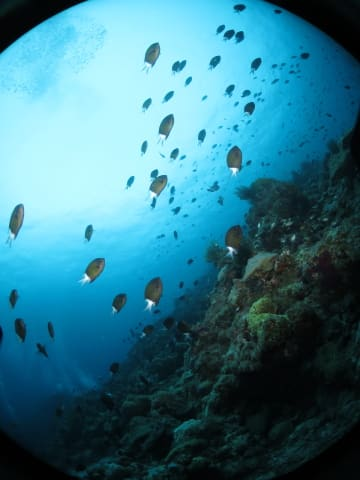

そして，イソバナにもいろんな若魚が

ついてます…

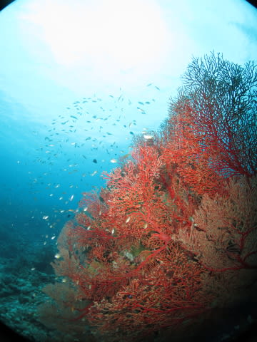

うん．

結構きれいなポイントですね…！

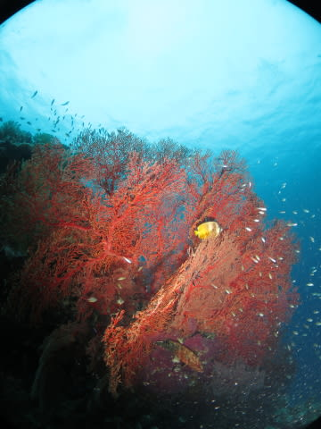

とりあえず，サンゴもきれいだし．

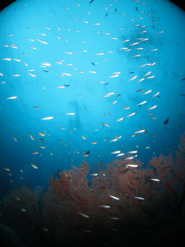

クマザサハナムロかな…？

の，若魚の群れも通り過ぎるし…

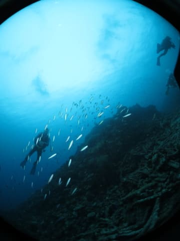

その他にも．

真っ黒ボディーをオレンジの

縁取りで飾っている，

アカククリの幼魚や…

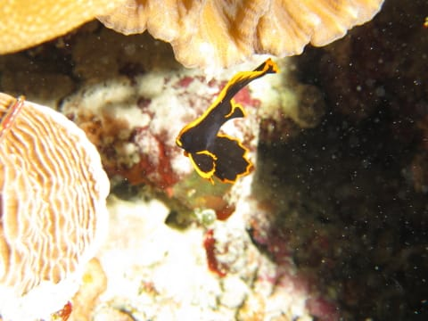

…この指先にいるような，

超ミニサイズのクマノミちゃん．

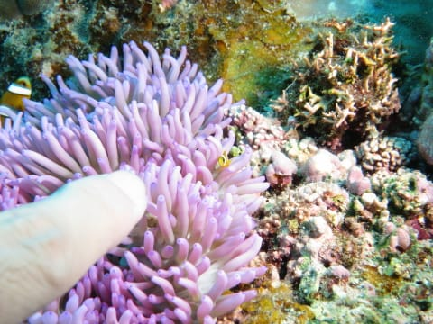

…拡大すると，こんな感じで．

指先と比較すると，そのミニミニ度合いが分かろうというもの…

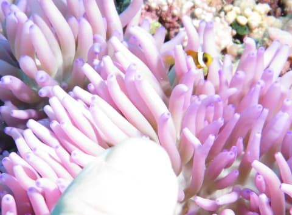

いや，小さい！

ってことで．

若魚や幼魚が多かった，このポイント．

50分間のダイブタイムを終えて，

エグジットです…

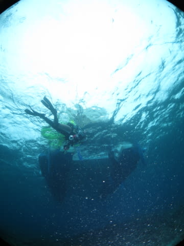

そして．

本日のすべてのダイビングを終えたボートは，

港へ戻りますが…

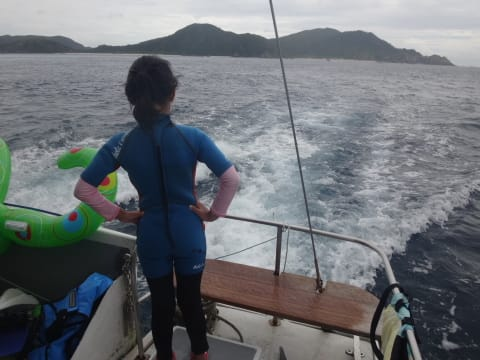

やっぱりお前，なんだか偉そうだな～．．．
