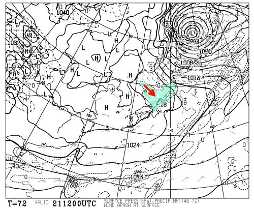
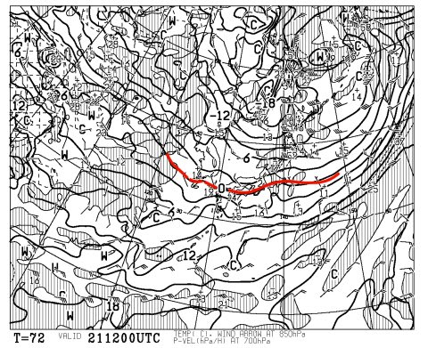

# 19日に熊の湯がオープンするようだけど

📅 投稿日時: 2011-11-19 01:02:00

🏷️ カテゴリ: [スキー天気予想](c6554f5c3c106093b511a8daae23757e8.md)

明日土曜日，志賀高原の熊の湯がオープンすることになったみたいですね．

しかし，明日19日は…

土砂降りですね．

[気象庁予報部の短期予報解説](http://img.n-kishou.co.jp/image4/lfax/tkaisetu_201111181540.pdf)では…

西・東日本では太平洋側を中心に雷を伴った非常に激しい雨が降り、局地

的に1 時間80mm を超える猛烈な雨となって、大雨となるおそれがある

…うーーむ（汗）．

さらに山間は強風になるかも．

ちなみに，志賀高原の山頂でもおそらく気温は+10度近いでしょう．

うーーむむむむむ．む．

ということで，19日の土曜は，スキー場にとっては壊滅的な天気の予感…

しかし．

予定より低気圧の通過が早めになりそうで．

20日は，低気圧が東に抜けて冬型の気圧配置になるので，

太平洋側は意外と天気が回復しそう．

…Yeti，日曜日はもしかすると日が射すかも？？

で．

20日，日曜の夕方から21日にかけては，待望の雪ですね．

特に，21日はしっかり降りそうな感じ…

これは[専門天気図](http://n-kishou.com/ee/index.html)のFXFE502に示されている21日午後9時の地上予想ですが．

こんな感じで．青く塗った部分が降水量があるエリア．

矢印で書いた部分，冬型に典型的な日本海からの吹き出しの雲が出てますね～

さらに…

850hpa面，すなわち高度概ね1500m程度のところの0度線(雪と雨の境界）が

日本の南側にあるので．

信州は完全に雪ですな．

ちなみに．

来週は，23日の祭日を除いて概ね冷えそう．

来週，スキー場に雪が積もることを期待．

ということで．

私は明日はスキーはお休み．

日曜に出かけます…

…やっぱりYetiかなぁ．

5週連続はそろそろ飽きてきた…
