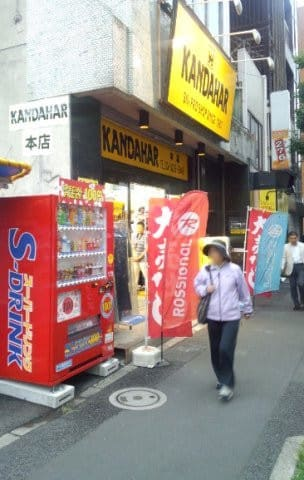

# ついに開催，第7回物欲選手権！その2

📅 投稿日時: 2017-11-16 02:33:51

ってことで．

昨日の物欲選手権，続きです…

（前回の記事は[こちら](e38b4d4ca6ea3af24cebf3838ab8c791d.md)）

---

アナウンサー「ということで，今回も開催中の

　第7回 スキーヤーの物欲を刺激する街神田に来て，

　物欲にまみれたスキーヤーが買い物をせずに

　我慢できるか選手権　　

　ですが．

　Skier_S選手，まずはASPENに寄りましたね…」

解説「スキーパンツを買ってしまうのか

　どうかが，まずは見ものになりますね…」

アナウンサー　「かなり真剣にスキーパンツを

　見比べてますよ」

解説　「彼はズボンはいろいろこだわりがありますから．

　かなり必死に条件に合うものを探しているようですね」

アナウンサー　「おおっと．いくつか手に取りました…」

解説　「試着していますね～．

　ここは，スキーパンツを行ってしまうのか…？」

アナウンサー　「でも，穴の開いたズボンを買い替えるならば，

　物欲に負けてもしかたない気がするんですが…」

解説　「手に取って眺めています．

　真剣に考えていますね～」

アナウンサー　「ここはやはり行ってしまうのでしょうか…！」

解説　「…おおっと．

　戻しました．ズボンをすべて戻しましたね…

　この時期，型落ちが意外と高いことにちょっと

　失望しているみたいです」

　

アナウンサー　「あ，ここはズボンを買わずに，　

　ASPENを出ました．

　買いませんでした！

　…珍しいことに，自制心が働いたのでしょうか…？」

解説　「いや…単に気に入ったものがなかっただけでしょう」

　そして…次は，フソウスポーツに立ち寄りましたよ？」

アナウンサー　「おっと．ここでは一直線にスキー板売り場に

　向かいました！

　ATOMICのS9i PROを見ていますよ…！

　これは危険ですね～」

解説　「どうやら今シーズンモデルのS9iは，

　フレックスが弱めのTLビンディングだったので，

　それほど気に入らなかったようですが．

　VARビンディングがつくS9i PROが，Skier_S選手の

　狙いの板のようですから…」

アナウンサー　「おっと．

　でも，値段を確認すると，あっさり店を出ましたよ？」

解説　「ビンディング込みで13万を超える値段を出されて，

　ちょっと引いているようです…」

アナウンサー　「高い値段を示されて，

　Skier_S選手もさすがに購入意欲が失われたのでしょうか？？」

解説　「いや…ただ単に，参考価格を調べただけかもしれません」

アナウンサー「あ，どうやらそのようです．

　そのあと，ICI石井スポーツやスポーツクルーに同じ板の値段を

　聞いてます」

解説　「まぁ，Skier_S選手のいつものパターンですね」

アナウンサー　「そして，いつもの店にやってきましたね…」

解説　「そうですね…

　いつものお店ですね…

　やはり，ここが勝負の場所になるようですね」

アナウンサー　「おっと．ここで，Skier_S選手．

　古い板を車から降ろしています．

　ヘタリまくって，エッジが剥離した'16SXを車から降ろして，

　持ち込みましたよ…？」

解説　「このお店で買ったこの板が，無償交換や保証の

　対象になるか確認する…というのが，Skier_S選手が

　神田に来た一つの目的ですからね」

アナウンサー　「無償交換になって新しい板がもらえるなら，

　板を買わずに済んで，Skier_S的にはラッキーということに

　なりますね」

解説　「そうですね…無償交換や何らかの補償対象に

　なるかどうか，店員がATOMICに連絡しているようですが…」

アナウンサー　「さて．

　エッジが剥離した板，

　無償交換対象になって，板を買わずに済むのか？

　あるいは，『使いすぎだから交換不可』ということに

　なるのか…？」

解説　「なんだか後者の可能性も否定できないところが，

　Skier_Sならありえますね…」

（ということで，[その3](e1964ba91aa7855224b31d139e5419962.md)へ続く）

## 💬 コメント一覧

### 💬 コメント by (サトシ父)
**タイトル**: 私も負けました
**投稿日**: 2017-11-16 06:37:30

いつもの店で身長が１０センチ伸びた息子の板買っちゃいました。(もちろん一年落ち)店員さんにはジュニア板なので今シーズンしか使えないと言われましたけど。自分のはその場はがまんできたのに１週間後にブーツ、２週間に板買っちゃいました。完全に敗北です。

### 💬 コメント by (Skier_S)
**タイトル**: サトシ父さま
**投稿日**: 2017-11-16 19:02:50

あら…

Skier_Sもびっくりの大敗でしたね．

やはり，スキー屋に行くと理性を失う人が

多いですね…

このBlogの読者には(笑)

新しい板＆ブーツ，デビュー楽しみですね！

