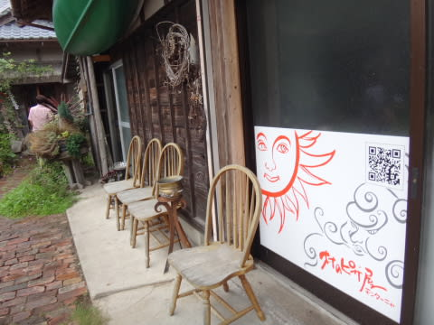
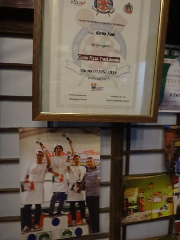
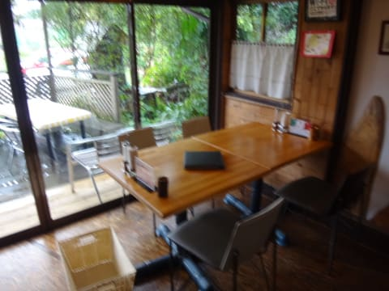
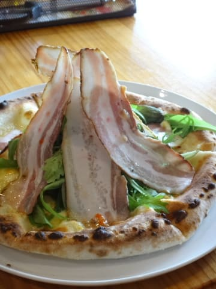
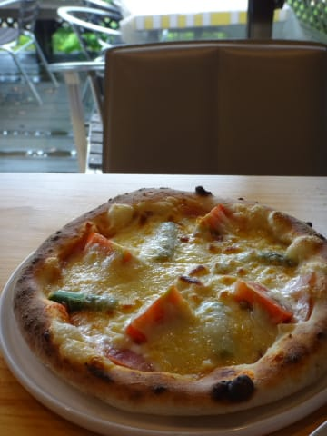
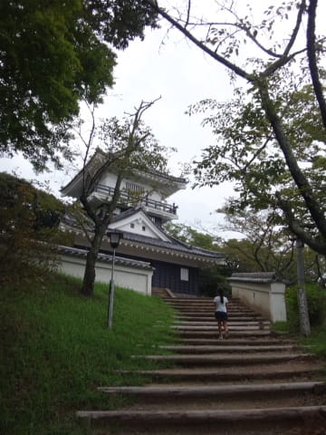
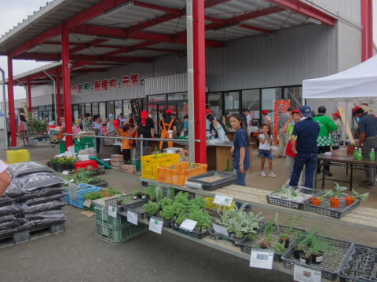
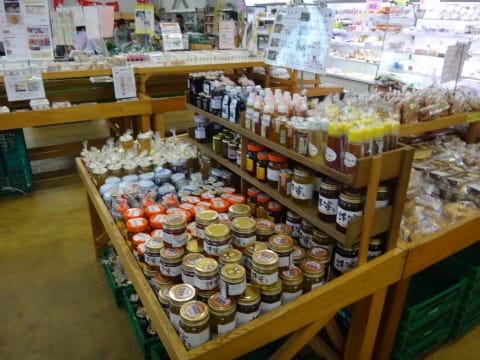

# ファミリーキャンプとやらをやってみた，…千葉県ACフルーツ村　その7（ファイナル）

📅 投稿日時: 2015-09-29 01:10:59

🏷️ カテゴリ: [登山・旅行](c1d637a11a25b457ac978d197adbdafc5.md)

えー．

早くもそろそろ10月になり．

Yetiでは，もう[リフト搬器の取り付けが始まって](https://www.facebook.com/YetiSnowtown/photos/a.528061393949908.1073741827.158928194196565/875854679170576/?type=3&theater)．

10月になったら，オープン日が公開されるようですが．

…[狭山が10月23日オープン](http://www.sayama-ski.jp/)だから．

Yetiはその一週間前，10月17日オープンでしょうねぇ…

となると…

なんと．

あと，2週間ちょいで，シーズンインじゃないかっ！！

そろそろ，スキー道具を準備し始めねばっ！！！

と，周りの人に話しても

「何を季節外れなことをいってるんじゃい？」

と言われそうなので．

誰にも言わずじっと我慢している今日この頃．

いかがお過ごしでしょうか．

って話題のあとは．

意外と長期連載になってしまった，ファミリーキャンプネタの

ファイナルです…

----

ということで．

キャンプ場を後にしたSkier_S一家．

チェックアウトは12時．

これから，お昼ご飯を食べないと…

ってことで．

やってきたのは，キャンプ場から車で20分ほどのところにある，

「[村のピザ屋・カンパーニャ](http://muranopizzaya.com/)」

結構有名な店らしいのですね～．

ものすごい不便なわかりにくい場所の，

すごい細い道の先にあり．

見た目はとてもピザ屋には見えず…

一瞬，「間違えたのかな？」

と思うようなたたずまいのお店ですが…

お昼時間だったのもあり，20～30分待ちと，

かなり混んでます．

なんだか，スタッフはイタリアの大会で入賞したりする人

らしく．

そして，お店の内装も，古民家を改造した，

味わい深い作り．

そして，出てくるピザは…

まずは，自家製ベーコンのピザ．

見た目がすごい…なんじゃ，こりゃ．

そして，

マルゲリータ．

マルゲリータって，トマトソースだと思ってたけど．

ここのは，フルーツトマトがたっぷり乗ってるよっ！

で，食べてみると…

…

…

う，美味い～っ！！

いや．

イタリアに行って，ナポリのピザを食べて以来．

ナポリのピザは世界一だと思い，

日本でもナポリ風のピザのおいしい店を探したけど．

…ローマ風のパリパリピザのおいしい店はあっても，

ナポリ風のモチモチ，分厚い生地のおいしいピザ屋が無くて．

「あぁ，ナポリにピザとパスタ食べに行きたい～」

と，思っていたところ．

まさか．

まさか，こんなところで．

ナポリで食べたピザに匹敵する，超本格ナポリピザが

食べられるとはっ！！！

満足～っ！！

そして．

満足お昼ご飯の後は．

久留里城を見に行ったり…

（天守閣からの眺め）

ピザ屋さんの「カンパーニャ」で教えてもらった，

「[味来囲](http://www.ja-kimitu.or.jp/safe_farm_products/direct_sale_market/mirai_obitu.html)」へ寄ってみたり…

…ここで，カンパーニャのマルゲリータに乗っているのと

同じフルーツトマトが購入できたり，

その他いろいろ，珍しい食材が購入できて．

いや．

千葉県，奥が深い…

…って感じで．

キャンプもすごく楽しかったけど．

「ばんや」の海鮮から，「カンパーニャ」のピザ，「味来囲」での地元食材まで．

満足度の極めて高い，おいしいものめぐりもできて．

…その上に，キャンプ場でのカヤックに工作体験．

そして，夜のBBQに星空観察と．

なんだか，実に中身の濃～い，

すごく充実した1泊2日だったのでした…

うむ．

今年はもうスキーシーズンが始まっちゃうので無理だけど．←シーズンイン，早すぎるから

来年もキャンプに行くぞ！
