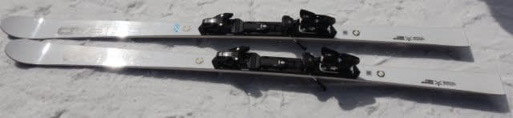
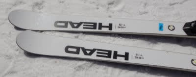
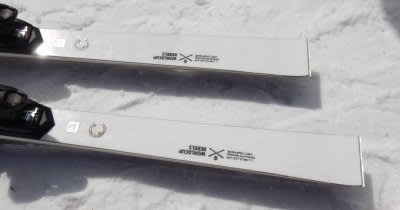
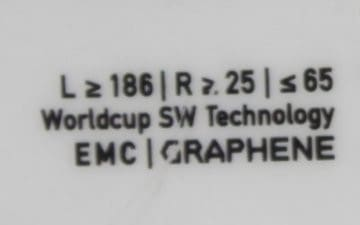
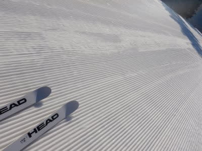
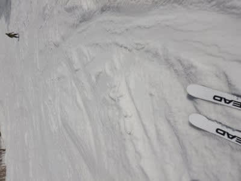

# 2022シーズンモデルのスキー板，試乗レポートその24…HEAD e-GS RD

📅 投稿日時: 2021-07-23 02:46:52

🏷️ カテゴリ: [スキー板試乗](c0bd8048615710cee890e403a36cc9a2b.md)

えー．

昨日は深夜12時までWeb会議が続き．

その後，夜ご飯も食べずに倒れたように

寝てしまったので，

Blog更新できませんでした…

で．今日は

昼過ぎまで13時間以上寝てました

うむ．

これだけ寝られるのは自分でも驚きですな．

そして．24時間以上食事を摂ってないという…

せっかく標準体重まで戻したのに，

また順調に減量中です(涙)．

しかし．

4連休なので，初日は山にでも行こうかと

思っていたけど…

計画はいきなり崩れたし．

この4連休，なんだか山の天気が悪そうで．

あまり出かけられなさそう…（涙）

ってなことで．

今日はそろそろ終わりが近づいている

2022シーズンスキー板の試乗レポート．

今回もヘッド編です．

では，どうぞ～！

○HEAD Worldcup REBELS e-GS RD 186cm

非FIS GS競技用

[前回は同じe-GS RDでも，「PRO」が
ついている方](e7ce78fd6da2778d043fac8eeda8c62b8.md)でしたが，今回は

PRO無しの方．

これも，2021シーズンからの継続モデル

のようです．

ちなみに，来シーズンのe-GS RDは，

WCR14プレート付きと優し目のWCR TEAM

プレート付きの2種類が出るようですが…

今回試乗したのは，しっかりしたWCR14

プレート付きの方です．

滑ってみたところ…

しなる！

PROの183cmより，長さがわずかに長い

からか，あるいはフレックス自体が

柔らかいのか…

かなり優しくしなる板で，良く

たわみます！

谷回りで捉えて，踏んで行けば

張りがある中でもすっと柔らかい感じで

たわみが出て行き，たわみに沿って

回っていきます．

たわみの出し方で回転弧が選べて，

たわませていけばR=25というよりも

小さく回れる感じ！

たわみが出しやすいので，予想外に

低速でも取り扱いやすく．

さらに，荒れた斜面でもその柔らかさで

荒れた雪の上を優しく乗り越えていく

ような感じで．

意外にも，荒れた斜面でも全然いけるよ！！

かといって，整地やスピードを出した時

物足りないかというとそうではなく．

整地でスピードを出していくと，

しっかりした張りを感じ，ガッチリ

グリップしていきます．

板の柔らかさでテールやトップが逃げる

なんてことは無く，しっかりたわむのに，

トップとテールがしっかり効いて

グリップしていく感じで，

整地の高速耐性も問題ありません…

しっかりしなってガッチリグリップ

するけど，板への圧の溜まりはそんなに

強くないのか，返りはそんなに強くも

早くもなく，大回りのゆったりした

リズムで自然に切り替えができます．

グリップの強い，張りの強い板に

ありがちな，吹っ飛ばされるような

強い返りは無く，リスクなく切替が

できます．

…繰り返しますが，フレックスが弱くて

返りが弱いんじゃなく，私のトップ

スピードでもまだまだ余裕を感じる

かなりしっかりした張り＆グリップが

ある中で，ゆったり返ってくる感じ．

そのせいもあり，低速から取り扱い

やすく．

荒れた斜面でも問題なく滑れて．

高速でのグリップも十分という…

大回りベースのオールラウンド

ゲレンデ板としては，十分行けるんじゃ

ないかな…？？

この板，結構気に入りました．

かなり気に入ったので．

この板を2日間借りっぱなしで

滑り続けていたのですが…

あさイチのガチガチ早朝整地バーンから，

夕方の荒れ荒れバーンまで．

この板1セットで行けますね！

荒れたバーンでも気持ちよく

滑れたのが驚きでした…

来シーズン継続モデルのため，残念ながら

お値段が下がらなかったので，

FISCHERのRC4 RCを来シーズンの

大回りベースの普段履きとして

選びましたが．

お値段が安かったら，この板買ってたと

思う…

## 💬 コメント一覧

### 💬 コメント by (なんちゃってレーサー)
**タイトル**: そうそう
**投稿日**: 2021-07-23 10:19:48

私の板のサイズ違いですね。

この板、乗り味が優しいので、普段ばきにも十分使えます。

特性はR27でもR30でも同じです。

人が多いところでは板をずらしたり、スイングしたりして滑らざるを得ませんが、そういう動きも、ショートターン系の板より体力は使いますが技術的にはやりやすかったりします。

(ショートターン系の板はすぐにカービングターンになってしまいますからね)

良いブーツにすると、コブさえなければ、一日中こういう板でも良いかという気がしてきます。

### 💬 コメント by (Skier_S)
**タイトル**: ＞なんちゃってレーサ―さま
**投稿日**: 2021-07-23 21:30:50

ですよね～…

この板，普段履きに行けますよね…

しかし，R25ならまだしも，R30 でも行けますか！

4月下旬の荒れた雪でも，夕方まで問題なく履いてられたので，

オールラウンド性は素晴らしいと思いました…！

### 💬 コメント by (ikkun)
**タイトル**: Unknown
**投稿日**: 2021-07-24 07:43:35

おはようございます❗ なんと？若さの証ですよ   そんなに眠れません 色々ありすぎて(笑)笑えない

### 💬 コメント by (Skier_S)
**タイトル**: ＞ikkunさま
**投稿日**: 2021-07-24 20:12:55

私は仕事が忙しくて平日寝られない時は，休日に20時間くらい

寝たことがあります…

