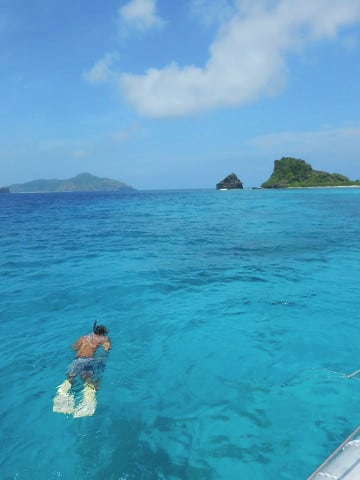

# 2017年8月，小学生の子連れで座間味でダイビング…プロローグ

📅 投稿日時: 2017-10-18 02:36:48

えー．

雪がほぼ全部解けてしまい，一旦クローズしたYetiですが．

明日から，営業再開するようです～！！！

（[Yetiホームページ](http://www.yeti-resort.com/)より）

…でも．

明日，18日はいいのだけど．

明後日19日以降，またずーーーーっと雨が続くんですが…

特に，22，23日は，台風の影響ですごい高温の雨に

なりそうなんですが（涙）．

…この時期に台風とは…（泣）．

なにも，早期オープンした年に限って，

高温の直後の連続降雨，そして台風と

ぶっ続けの試練にさらされなくてもいいのに…

だもんで．

オープンしたはいいけど．

22，23日の雨で，イエティはまたクローズに

なるのでは…

と，心配している今日この頃．

皆様，いかがお過ごしでしょうか．

ということで．

2018シーズンは始まってるんですけど．

雪解けのためスキーは一旦中断しているので．

また，ダイビング日記です…

そう．ようやっと今年行った，座間味旅行記の

スタートです！！←この時期スタートって…連載途中でスキーシーズンが佳境になり，来年まで連載が中断するパターンのような気が…

----

…今年の夏休みの計画を立てるにあたって．

今年も例年通り，沖縄に行くぞっ！！

…と，思ったわけで．

それも，宿がお高めの本島より．

1泊2食6000円台と，お安い民宿で

過ごせる座間味島が良いなぁ…

だとすると．

泊まりは個人的に座間味でリーズナブル度が

ぶっちぎりナンバーワンと思っている，

「ペンション星砂」さんだよなぁ…

座間味に行ったら，ダイビングショップは当然，

子供の面倒をしっかり見てくれる

「ザマミセーリング」さんだよな…

…ということで．

「ペンション星砂」さん泊りで

ダイビングショップは「ザマミセーリング」

という，いつもの鉄板組み合わせでの

プランになったわけですが…

いや．

実は，今年．

ザマミセーリングさんの再訪を選んだのには，

その他にも，大きな理由があったのだ．

そう．

それは…

娘に体験ダイビングをさせてみる

ということ．

幼稚園のころから，

「ダイビングで海に潜ってみたい～！！！」

と言い続けてきた娘．

そんな娘も．

なんと！

あと2か月で10歳となり．

ダイビングの「ジュニアオープンウォーター」の

Cカードが取得できる年齢になるじゃあ

ありませんか！！！

もうすぐCカードが取れるんだし．

その前に一回，ダイビングを体験させてみよう…

ということで．

行き慣れたザマミセーリングさんなら．

うちの娘がどのくらい泳いだり潜ったり

できるかを良く知ってるし．

さらに，ザマミセーリングさんは．

体験ダイビング組とファンダイビング組が

同じ船で一緒に出かけるパターンなので．

娘の体験ダイビングについて行った両親が，

体験ダイビングの初心者向けポイントで

しか潜れない…

ということもないし．

そして．

このショップなら，子供の扱いに異常なほど

慣れているので．

娘を体験ダイビングさせるなら，

ザマミセーリングさんが安心だな…

といった思いからも．

この夏休みは，

ザマミで娘に体験ダイビングをさせるんだ！！！

と，思っていたわけですが．

しかし．

座間味では超人気のペンション星砂さん．

夏休み期間の週末の予約は，年明け早々には埋まってしまう…

というウワサがあるくらいなので．

「大丈夫かなぁ…」と思いつつ，

GWを過ぎて予約の電話をかけると，

「8月は8，9，10の3泊なら空いてますよ．

それ以外は平日も全部満室で…」

…をを．

さすが人気の宿…！

でも，8，9，10日は空いてるんだ！

ちょうど11日は山の日で休みだし，

3日休めば，現地3泊，那覇1泊の4泊5日で

行けるということだな…

ここは何が何でも，この日程で休みを取って

いくしかあるまい！！！

…と．

仕事のことは全く考えることなく，宿を抑え．

それからいろんな書類に紛れこませて，

3日間の夏休みの申請をこそっと出して

みたところ…

…うむ．

…無事，どさくさに紛れて

休暇の申請は通ったようだな…

ということで．

休みまでに仕事を終わらせるべく，旅行前は

半分死んでたけど．

無事行けることになった，座間味旅行．

むふふふふ．

今回の座間味旅行で．

娘が生まれた時からの，一つの念願だった．

「娘にダイビングをさせる」

計画．

ついに．

ついに，実行なのだっ！！！！

