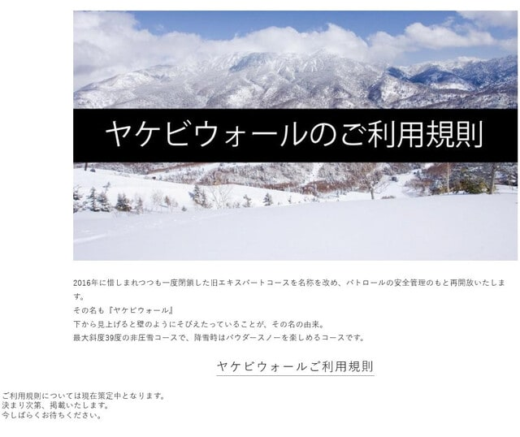
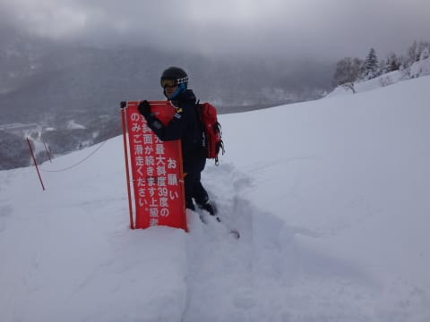
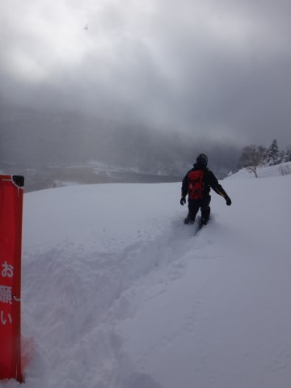
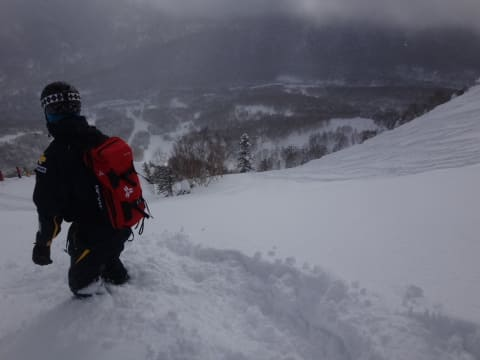
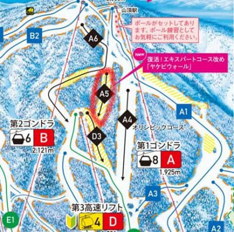

# なに？焼額山スキー場の新雪天国だったエキスパートコース，今シーズン復活するの！？？

📅 投稿日時: 2021-12-01 02:46:52

えー．

本日，野沢温泉スキー場がオープンしましたが．

某特派員からの写真によると，

やはり平日だったので，それほど混んでおらず…

天気も晴天で良かったみたいです！

ただ…

野沢の圧雪，えらい荒いですね…

あさイチでこれって，ちょっとすごい

感じ…

そして，こちらはおこみん特派員．

本日，横手第2リフトが天然雪100％で

オープン！

コース幅いっぱい滑れたようで…

（この写真は第1リフトだけど）

こちらも北アルプスがすっきり見えるほどの

いい天気で，楽しめたようです…！

そして．

現在の志賀高原ですが…

昼間の晴天からはうって変わって，

蓮池の気温は+4.1℃と異常に高く，

雨がぱらついている様子…(涙）

でも．

このあと，朝から雪になり…

12/1は一日中降り続きそう！

志賀では西風なのでそれほど積もらなさ

そうだけど．

また白馬・新潟方面はそこそこ積もるかも？

この時期としては湿った重い雪なので，

いい感じの下地になっていきそうな予感…！

…ってなことで，本題へ．

本日，焼額山スキー場のホームページを見た時に…

…

うむ？

ヤケビウォール？？

なんだそりゃ…？？

（[焼額山スキー場ホームページ](https://www.princehotels.co.jp/ski/shiga/informations/yakebiwallusagerules/)より，以下同じ）

これは…

なんだと！？？

2016年にクローズした焼額のエキスパート

コース，復活だと！？？？

なんだか，今後利用ルールが定められて，

それに従う必要があるようですね…

でも，まさか昨シーズンまで，木が

育ち放題に放棄されていたコースを，

再整備してオープンするとは…！！！

ちなみに，新しくヤケビウォールと名を

変えるらしい，旧エキスパートコース．

今シーズンの最新の焼額のマップで，

どこかと確認すると…

赤矢印のここですね．

（[焼額山スキー場ホームページ，コースマップ](https://www.princehotels.co.jp/ski/shiga/winter/coursemap/)より）

2018シーズンのコースマップを見ると．

矢印部分のエキスパートコースは，

無かったことにされてます…

このコース．

2015シーズンまでは[こんな感じ](e7d1bfa7622b946edc204de77eb5008ec.md)で．

パトロールさんがOKを出した時のみ，

オリンピックコースの横から入れて…

そして，しばらくラッセルしてかき分けていくと…

新雪パフパフがいっぱい積もった，

ウハウハ急斜面の上に出ます！！

あとは自由落下してパウダーを食らうのみ！

思う存分パウダーを食らうのみ！！

…ってなシアワセコースが，

2016シーズン以降，マップから落ちてしまい

すごい悲しんだのですが…

お客さんが減っているこの時期に，廃止したコースを

復活させるなんて…焼額，すごい！！！

それも，よく見ると…

以前はオリンピックコースの横から入った

このエキスパートコース．

今回は，SGSコースに入ってしばらくの

右コーナーの当たりからエントリーに

なっているので…

どうやら，廃止前よりコースが長くなってる

ようです…！

もう．

本当に素晴らしい！！

すばらしいぞ，焼額っ！！！

…

…この勢いで，次は第1高速リフトも

復活だぁ…っ！！！

…

…ってはならないだろうな（涙）

## 💬 コメント一覧

### 💬 コメント by (かず)
**タイトル**: Unknown
**投稿日**: 2021-12-01 11:46:11

ヤケビ奥志賀非圧雪少ないですからね…ということは  オリンピック今年も圧雪かもしれないですね  あそこの入口フラットすぎて朝から入れません…整備されてるといいですけど

### 💬 コメント by (レインボー74)
**タイトル**: Unknown
**投稿日**: 2021-12-01 15:00:49

水曜日の熊の湯情報

朝の湯田中は無情の雨。山に登れど登れど雨雨。八代亜紀さん、恨むよ！(ファンなんですけど)

7分遅れで乗ったのに、私がまだ３人目。雨のうちはまだよかったけれど、すぐにミゾレに。ゴーグルにへばり着いて視界は最悪。だけど、流石の流石の志賀高原。昨日の視界良好な野沢よりも、圧雪が丁寧なので見えなくても安心してとばせます。

しばらくすると、やけに顔が痛い。あられ混じりだ。ゴーグルをふき取るので、手袋がベタベタ。気温は低くないのに指が冷たい。

だけど、10時半を過ぎると薄日が。

たのしかったけど、運動量は徐々に増やすべきと、昼は降雨休場の隊員と関英ドライブインもつ定食。

明日はファミリーかなあ？

### 💬 コメント by (かず)
**タイトル**: Unknown
**投稿日**: 2021-12-01 15:34:46

たびたびすいません…長野に移住して毎日滑ってるWオレンジ夫婦覚えてますか？昨日野沢滑っててスノーナビに載ったみたいです 笑  若杉さんも話したことありますよ！

### 💬 コメント by (Skier_S)
**タイトル**: 12月4日に積もりそう！
**投稿日**: 2021-12-02 03:05:27

＞かずさま

オリンピックも夕方圧雪で残してくれるといいんですが…

春先は夕方圧雪だと，表面がガチガチになって危ないんで，

昨シーズンは朝圧雪になってましたが…

＞レインボー74さま

リフトが動くころには雪だと思っていたんですが…

でも，ずっと雨じゃなく，すぐ雪になって良かったですね．

10時半には晴れてきたというのが予想外…

かなり西風が強かったみたいですね．

### 💬 コメント by (ikkun)
**タイトル**: Unknown
**投稿日**: 2021-12-04 09:59:41

やはり……集客が見込めるからこそでは？ 少ないゲレンデは「売り」たいのも当たり前かもしれませんね(・・;)  一昨年の春スキー以来行ってないですが(笑)

### 💬 コメント by (Skier_S)
**タイトル**: ＞ikkunさま
**投稿日**: 2021-12-04 23:49:22

これから新雪パウダーは大きな売りになると思うので，

エキスパートコース復活はうれしいニュースです~！！

