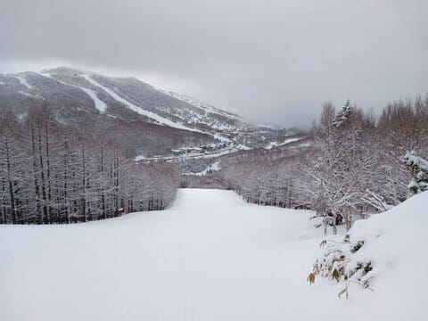
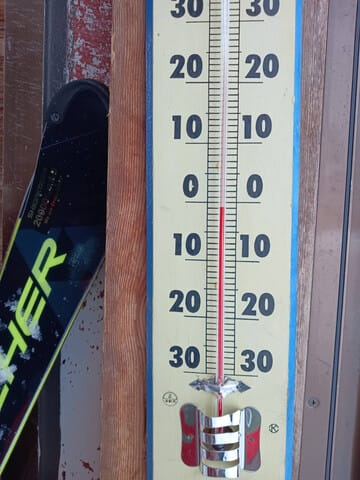
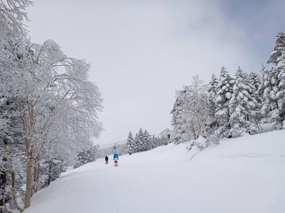
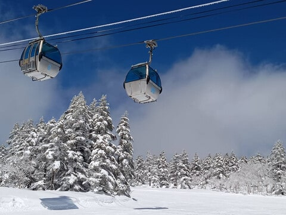
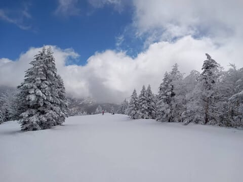
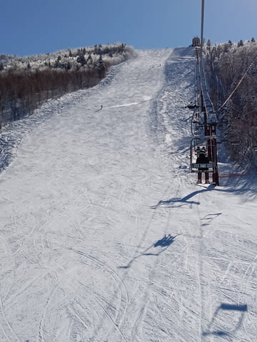
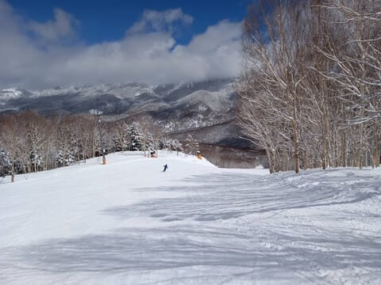

# 3月30，31日の週末の志賀高原スキー場の天気は…土日とも晴れ！金曜は雨で，土日は気温がかなり上がりそうなので雪はザブザブになりそう（涙）

📅 投稿日時: 2024-03-28 03:03:37

ということで．

本日も志賀高原から特派員報告が

送られてきましたが…

本日27日(水)の志賀高原は．

朝は積雪15㎝ほどだったみたいで…

うーん．

もう少し積もるかと思ったんだけどな…

朝のうちは曇り空で，

気温はマイナスだったこともあり．

火曜の雨の後の雪が積もって…

積もったのは結構重めの雪ながらも，

結構いい感じのバーンコンディションに

なっていたようです…！

そして，午後には予想通り，

青空が顔を出し始め…

日差しで雪はしっとりとした

感じになったみたいですが．

奥志賀のエキスパートコースとかは

結構いいコンディションだったみたいだし．

焼額も人が少なくかなりガラガラで，

最後までフラットバーンを楽しめた

みたいです…！

うーん．

3月末と考えれば，かなりいいコンディション

だったみたいですね…．

で．

これから週末にかけても，このようないい

コンディションが続いてほしい…

と，全身全霊で願うわけですが．

残念ながら，この週末にかけて

気温がかなり上がりそうで…

今週末は，完全な春の雪になりそうな

気配（涙）

まぁ，3月も末だから，仕方ないんですけど…

ってなことで，これからの志賀高原の

天気予想をするわけですが．

今日はまた深夜でちょいと疲れているので．

天気図解説抜きで，予想だけ書いてみます…

（みんな天気図解説なんて見てない

　だろうから，いつも天気図解説無しの

　こっちのほうが喜ばれるのでは…？

　という気もするんだけど…）

28日（木）：朝のうち晴れるかも．けど，

　昼前から曇り．

　あさイチの気温はマイナスだけど，　

　昼間はプラス気温へ．

　あさイチはところどころコロコロが

　あるかもしれないけど，この日は

　プラス気温ながらも雪もざぶざぶに

　ならず，春にしてはいいコンディション．

29日（金）：たぶん前日28日の夜から

　空から液体が降りはじめ…

　明け方からかなり激しく降る．

　朝から気温は+3℃程度と高い．

　午前中時折強く降り，気温も+10℃

　近くまで上がる．

　昼頃に止んで，午後は晴れていきそう．

　雪質は水を吸ったどっしり重い

　雪になる（泣）

30日（土）：朝から晴れ．終日晴れ．

　あさイチから気温はプラス．

　朝のバーンは昨日の雨で融けた

　ザラメ雪が固まった，しっかりした

　感じのバーンでスタートするけど，

　日差しと高温で雪はすぐ緩む．

　昼間も+8℃くらいまで上がり，

　厚さを感じるほど．

　ただ，午前中は緩んだ中でも

　下地がしっかりしているので

　楽しく滑れるかも．

　午後はザブザブの春の雪になり，

　午後はバーンも荒れ気味になる

31日（日）：この日も終日晴れ．

　気温は土曜と同じく，朝から

　プラス気温で，昼間は+5℃以上まで

　上がる．

　あさイチは締まっていたバーンも

　すぐ緩む．

　日差しが弱い西斜面はしばらくは

　しっかりしたバーン状況だろうけど，

　日差しが当たる南から東斜面は

　早々に緩んでざぶざぶになっていく

という感じでしょうか…

うーん．

今週末は，気温が無茶苦茶上がって，

そして，暑いくらいの日差しが差し込む，

いかにも春スキー

といった，のどかな週末になりそうです．

いや…

晴れなくていいから，

雪が降ってほしい…

## 💬 コメント一覧

### 💬 コメント by (かず)
**タイトル**: Unknown
**投稿日**: 2024-03-28 09:06:50

3月パウダーの疲れで今週はお休みです  何年かのブーツの悩みがインソールにありそうで調べてたらSさん行きつけのショップがでてきました！  BMZって使ってますか？

### 💬 コメント by (モイストシルバー)
**タイトル**: Unknown
**投稿日**: 2024-03-28 22:21:02

今日も焼額山と奥志賀滑ってきました。Sさんの予想通り、気温はさほど上がらず、朝は降雪が無かった分、エキスパートやオリンピックはフラットなシマシマバーンを楽しむことができました。まだ雪がたっぷりあるので、4月も行きたいと思います

### 💬 コメント by (Skier_S)
**タイトル**: 今週末は黄砂がひどくならないでほしい…
**投稿日**: 2024-03-29 01:48:54

＞かずさま

BMZですか…使ってないです…

私はエキップさんのフォーミングインソールですが，BMZではないと思います．

＞モイストシルバーさま

今日も滑ってらしたんですね…！

コンディションは良かったんですね…

もう一日遅かったら雨にやられていたので，いいタイミングでしたね．

4月はかなりの高温になりそうですが，また志賀高原へお越しください…！

