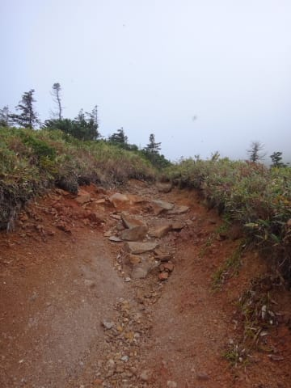
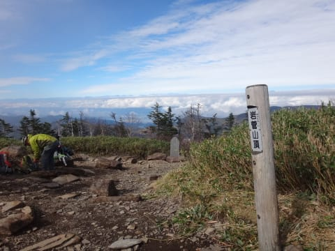

# 焼額の向かい側に見える，あの岩菅山に登ってきた　その2

📅 投稿日時: 2016-10-14 02:26:49

昨日は睡眠時間2時間という，

いろいろ末期的状況だったので（笑）．

一日飛ばしてしまいましたが．

今日は，岩菅山登山のお話の続きです…

では，どうぞ～！

---

ということで．

駐車場から歩くこと，約1時間20分.

おそらく，結構なハイペースで

「ノッキリ」までやってきたわけですが．

ここで，10分ほど休憩して．

残り山頂までの体力を蓄えます…

うーむ．

山頂までのコースタイムは，残り30分なんだけど．

標高差の残り半分は，ここから先で登るようで…

ここから，かなりの急坂になるわけだな…

ってことで．

ノッキリから出発して，すぐに．

岩菅山頂につながる，尾根筋に出て．

登山道も，うっそうとした木々に囲まれた

感じから，こういう開けた感じに変わって

きたので…

ようやく，周りの景色が見えるように

なってきました…！

…が．

しかし．

やはり．

山頂は，完全にガスの中に隠れてます（涙）．

うーーーむ．

このままだと，山頂からの景色は

望めないのか…！？？

とりあえず．

「ガスよ，晴れろ～っ！！！」

と，念じながら．

かなり急な尾根筋の道を登ります…

道は，だんだん急さを増していき．

あう．

本格的な山歩きですな．

ところどころ手を使ってよじ登らないと

行けない急さになってきて．

息も上がるので，数10m歩いてはひと休み…

という感じに．

そして，標高が上がっていくと．

ついに，登山道にもガスが…（涙）

…やっぱり，ダメか…

と，思ったその時！

おや？？

おおおおお～！！？

ガスが，晴れてきた！

そして…

晴れたっ！！！

すっきり晴れた！

山頂のガスが，晴れたよっ！！！！

ここまでくれば，山頂まであとわずか…

…そして．

駐車場を出発して，約2時間．

＃コースタイム2時間40分なので，

＃かなり速めのペース

やってきました．

ついに，

ついに山頂に到着っ！

それも，山頂部分がちょうどガスから

晴れるという絶妙なタイミングでの登頂！！

…これは．

そう．私はきっと．

神に祝福されているに違いないっ！！！←違う．強烈に違う．絶対違う．間違いなく違う．

山頂は，見事に雲の上．

向こうに見えている，傾いた山頂は

横手山ですね…

山頂には，こんな祠があって…

そして．

運良く晴れたので．

横に長く連なる北アルプスが，

見事に見えます！！

いや，すばらしぃ！！！

ついさっきまでガスってたのに．

こんなにきれいに景色が見えるなんて…

…そして．

そして．

見えるのか？

焼額は，見えるのか…？？

見えた～っ！！

…はるか遠くにぽつんと見えるのは，妙高山かな？

手前に大きく見えるのが，焼額．

ちょっと木々に隠れているけど．

いつも滑っているゲレンデから，

毎日のように眺めていて気になっていた，岩菅山．

いま，その山頂に立って．

その山頂から，焼額を見ることができたよ…

（続く）
