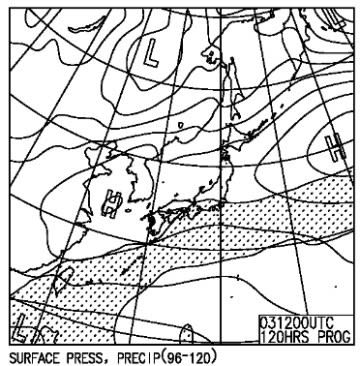

# 4月2，3日の週末の志賀高原の天気は…2日は冷え冷え晴れ！3日はそこそこ冷えた曇り．バーンは硬そう…

📅 投稿日時: 2022-03-31 01:49:29

🏷️ カテゴリ: [スキー天気予想](c6554f5c3c106093b511a8daae23757e8.md)

ってなことで．

年度末というクリティカルな状況が

続いているわけですが…

…最近，このクリティカルなおかげで

複数のWeb会議に同時に出なくては

ならないという状況が続いていて．

さすがに[某事故](ea36abb9156f174c40926239424386aa6.md)以来，3つの会議に同時に

出ることはさすがに控えてるけど…

でも，二つの会議に同時に出ると．

どちらかの会議から名前を呼ばれても，

何を質問されていたのか全く聞いておらず，

一体何を答えればよいか分からない

というシチュエーションが頻発するわけ

ですね(涙)．

でも．

そんな時，少しも慌てず．

「今の質問，どういうことかもう少し詳しく

　お願いできますか？」

「ちょっと回線状態が悪いのか，良く聞き

　取れなかったので　もう一回お願いします」

「その質問，どういう背景で出てきたか

　教えてもらえますか？」

といった切り返しで，もう一度質問を

聞き返すという技を身に着けてきた

今日この頃．

皆様いかがお過ごしでしょうか．(時候の挨拶)

とりあえず，今日も志賀高原特派員から

写真が送られてきましたが…

うぎゃーー！！

今日もシマシマ！

そして，シマシマ晴天という，

見事なスキー日和だったようです…

ただ，朝から奥志賀の麓の気温は

+5℃を超えていたようで，

気温はかなり高かったらしく．

さらに日差しが強かったのもあって，

昼前にもう雪がかなり緩んじゃった

ようですが…

でも，板の滑りはそれほど悪くなかった

ようなので．

まぁ，晴天の絶好の春スキー日和

だったのかな…

ってなことで．

我が家の周りの桜も咲き誇り．

ゲレンデにも春の妖気陽気が漂ってますが．

果たしてこの週末の志賀高原

ザブザブ雪になるのか？

あるいは冷えるのか？

降るのか，晴れるのか？

…いつも通り天気図を読み解いてみましょう…

まず，31日の木曜の850hpa図ですが．

うーん．

朝は赤い0℃線は東北まで上がって，

志賀高原には水色の+6℃線が…(涙)

かなり気温が上がりそう．

そして，地上天気図を見ると．

何とかぎりぎり志賀高原に降水域が

かかってない感じ…

おそらく午前中は曇り空．

午後は冷えそうなので，昼過ぎから

雪がぱらつくかも？

そして，4月1日の金曜の850hpa図を見ると．

うおおおおお！

この日は冷える！！

志賀に近づいている水色の線，これ，

-9℃線ですよ！！

真冬の冷え込みですよ！！

でも．

地上天気図を見ると…

うーん．降水域はギリギリ

志賀にかかってそうなので．

朝は薄っすら数cm雪が積もってるかも？

これが積もってれば朝はいい感じ．

積もって無ければ，ガチガチカリカリ

バーンかな…

そして，肝心な2日(土)の850hpa図を見ると．

この日も志賀高原には水色の-6℃線がかかるので…

冷えますよ！朝は-8℃くらい，

早朝営業時には-10℃くらいまで

冷え込んでるかも？？

そして，地上天気図を見ると…

本州は高気圧に覆われて，降水域が

志賀には全くかかってないので．

…ゲレンデはカチカチに固まった

かなり硬めのバーンになりそう…

夕方に向けて，ツルツルに磨かれていくかな…

で，3日の日曜の850hpa気温を見ると．

この日はギリギリ赤い0℃線が志賀に

かかるかどうかという程度．

そして，地上天気図では，東西の

高気圧に挟まれた形なので…

降水域は志賀にかかってないけど，

晴れにはならず曇りそう．

まぁ，この日も積雪が無いので

バーンは硬いかな．

ってなことで，まとめると．

31日(木)：朝はプラス気温．朝は雪は緩み気味．

　朝は曇りだけど，午後に向かって気温も冷え

　バーンが硬くなっていき，雪がぱらつく．

4月1日(金)：朝は-10℃近い，真冬の冷え込み！

　朝までにうっすら雪が積もってそう．

　昼間も気温は-3℃くらいまでしか上がらず

　冷え冷え．

　天気は朝方は曇り，午後は日が射すように

　なるかも…？

　あさイチは積もった雪でいい感じのバーンに

　なりそうだけど，午後は急斜面はバーンが

　ツルツルになっていきそう．

　

2日(土)：朝は-7℃程度，早朝営業開始時は

　-9℃くらい？

　この日も気温は終日マイナスキープ．

　晴れ時々曇り．

　昼間は日当たりがいいバーンは

　日差しで緩むところもあるけど，

　基本的には終日かなり硬いバーンをキープ．

　急斜面はエッジを研いだ板が良さそう…

3日(日)：朝はそこそこ冷えてバーンはガチガチ．

　天気は終日曇り．

　昼間はプラス気温まで行きそうだけど，

　日差しがなさそうなのでバーンは硬めを

　キープ．

　急斜面はカリカリバーンになっていきそう…

…ってな感じでしょうか．

うーん．

残念ながら，1，2日と冷えてくれそうなんだけど，

積雪はほとんどなさそうなので．

この土日はかなり硬いバーンに仕上がって

そうな予感…

## 💬 コメント一覧

### 💬 コメント by (かず)
**タイトル**: Unknown
**投稿日**: 2022-03-31 12:43:08

金曜から行きます  ずっとカチカチですよね…まあ今までほぼパウダーばかりだったのでのんびりスイッチで滑ってBLなんてのも最高です  笑

### 💬 コメント by (レインボー74)
**タイトル**: Unknown
**投稿日**: 2022-03-31 14:42:06

木曜日の志賀高原情報

朝の上林+7℃　蓮池+4℃。

今日もイチゴンと二高のみ。奥志賀方面はひどいガス。GS、オリンピックもひどいので、ひたすらパノラマ→カラマツ→イチゴン回し。ほぼほぼ見えない。とてもよい横滑りの練習ができました。

ファミリーから来た友人も、「見えなくて怖かった」

11時頃に突如みぞれが。喜んで下ると雨に。

でも、それでガスが薄くなっていきました。

見えないので、ゲレンデから人が消え、ゴンドラはウハウハの飛び乗り状態。おまけに気温が下がって雪が緩まず、人がいないので最高雪質を楽しめました。(視界以外はベスト)

昼食は豪華にグランフェニックスの予定でしたが、ガスで断念。銀嶺でラーメンをいただきました。美味しくて汁まで完食。

午後にヤケビで滑った友人は、飛び乗りと無人のゲレンデに、喜びすぎて鼻血を流したとか？

明日は冷えそうですね。志賀に来るなら、今でしょ！

### 💬 コメント by (Skier_S)
**タイトル**: 明日は良さそう
**投稿日**: 2022-04-01 01:50:52

＞かずさま

金曜はパウダーとはいかないけど，この時期としてはコンディション良さそうです！

寒いのでご注意！

＞レインボー74さま

午後はゲレンデはみぞれじゃなく雪だったんでしょうか…？

明日は雪も良く，気温も冷えるのに昼ごろから晴れそうで，

いいコンディションだと思いますよ～！

### 💬 コメント by (愛読者)
**タイトル**: Unknown
**投稿日**: 2022-04-01 11:59:27

愛読者wです

いつも適切な情報ありがとうございます

今日が今シーズン滑り納めなのですが、奧志賀・焼額山ともベストコンディションで天国です！

朝は小雪がちらついてましたが、昼から晴れて快適そのもの

ただ、風は結構強く、午後の営業がちょっと心配、といった感じです〜

### 💬 コメント by (Skier_S)
**タイトル**: ＞愛読者さま
**投稿日**: 2022-04-01 23:44:35

いつもご愛読ありがとうございます～！！

今日が滑り収めですか…

いい日に滑り収めでしたね！

一応，風があったけど最後までゴンドラ動いたみたいですね．

シーズンが終わっても，引き続きご愛読のほどを！

