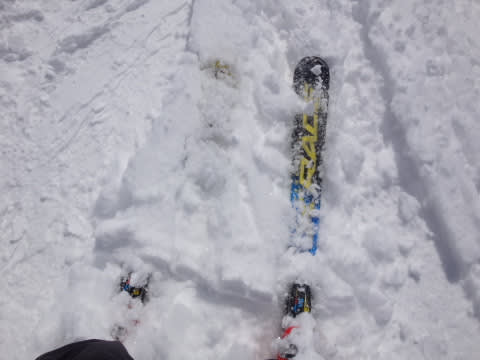
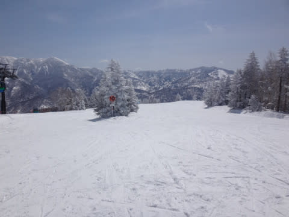
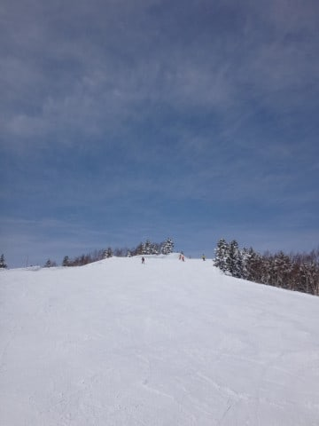
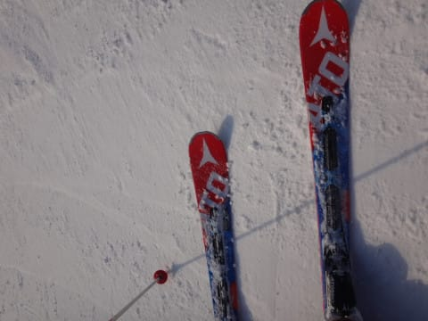

# 3月25日（土）の志賀高原は…晴天！まだまだトップシーズンと勘違いできるコンディションだったよ！！

📅 投稿日時: 2017-03-26 00:00:19

🏷️ カテゴリ: [2017スキー滑走日記](c7d777cecfc91bdf0fa464ad62c6d49ab.md)

ということで．

本日も志賀高原を滑りまくってきたわけですが．

いやーーー．

いい一日でした！

まず．

朝．

なんと．もう3月末というのに，高速が

チェーン規制…っ！！

規制は信州中野からだったので．

信州中野で降りる自分には関係なかったのですが．

…でも．

この時期にチェーン規制がかかるのは珍しい…

で．

志賀高原への登り道路は…

やっぱり，登れなくなって途中で

息絶えている車が多数（ちーん）．

道路は完全雪道です…

明日朝も，ところどころツルツルかもしれないので．

志賀高原に来る方はご注意を！

そして，いつも通りの焼額にやってくると…

ふむ．

山頂の気温は-7℃．

思ったより冷えませんでしたが…

でも，この時期としては十分な冷え込み！

朝イチのわずかの間，山頂はうっすら雲がかかっていたものの，

その後はすっきり晴天！

で．

ゲレンデは…

うひょひょひょひょ！！

シマシマだぁっ！！

…「やわらかい圧雪」と予想しましたが．

ちょっと雪が柔らかすぎて，

板が潜って減速するのがちと惜しいけど…

でも，朝イチ晴天ぴかぴか圧雪バーン！！

こんな感じで，3本ほど，

シマシマのGSコースをおいしくおいしく

いただきました～！

その次は，

新雪が残るオリンピックコースへ行くのだっ！

新雪はブーツパフ．

この時期としては奇跡的なほど軽い新雪！

うはははは！

シマシマバーンのあとは，

ちょっと蹴散らされた後だったけど．

美味しい新雪の乗ったバーン．

気持ちよく大回りでいただいたのだ！！！

…しかし．

ホントにあと数日で4月なの？？

東京では桜も咲いているというのに．

こんないい天気で…

だのに，こんなにいい雪で滑れるなんてっ！！

あぁ…

シアワセ…

そして．

本日．

朝10時ごろに，驚きのニュースが…！！

ええええぇっ？

なんだと！？？

第2高速リフト，故障で運休？？

唐松コースと白樺コースが滑れないとな！？？？

うーん．ちとショック…

でも．

第2高速が動かないということは．

一の瀬からこちらに滑り込むためのリフトが止まっている

というわけで…

いつも大量に一の瀬から流れ込む人が来ず．

うはははは！

焼額はガラガラの貸し切りバーンなのだ！

晴天でこんないい雪のゲレンデなのに．

誰も滑ってないのだ！！

だもんで．

コースも昼を過ぎてもガラガラ，

超フラットバーンだし…

人が少ないSGSコースなんて，

午後になってもシマシマが残ってるし…

＃とても午後1時半の写真と思えない…

こんな晴天で．

こんな雪が良くて．

人が少なくて．

フラットバーンで．

…これ以上何を望もうというのだろうか！？？？

ってシアワセバーン！

当然，ゴンドラ待ちも完全0！！

ああ…シアワセ．

シアワセだよ…

＃午後2時半でもこんな感じ…

まぁ，午後になると．

ちょいと雪はダマダマな感じに固まったところも

あったけど…

でも．

景色は真冬の景色だし．

北側のバーンは夕方までこんな感じだし．

えーーっと．

今日は確か3月末ですよね？？？

2月の間違いじゃないですよね？？？

3月末の晴天で，日差しで雪が緩まないなんて…っ！！

なんてすばらしい！！

…さすがに，夕方になると．

急斜面はちょいと荒れ始めてはきましたが…

でも．

急斜面以外は全然フラットで．

この時期としてはありえない雪質をキープしたまま，

ゴンドラストップまで滑り倒したのでした…

いやーー．

良かった．

ホントに3月末と思えない一日だったよ…

…と，

焼額の4:15まで滑った後．

…はい．

一の瀬は5時まで営業してますね～．

ということで，一の瀬ファミリーへ瞬間移動！

ファミリークワッドを降りた後，

ゲレンデに出るまでにこんな雪の壁ができている

ところが，今年の雪の多さを物語ってますね…

で．

一の瀬ファミリーの正面バーンは…

えええ？？

すごいコブコブ（涙）

焼額は超フラットだったのに…

コブ溝部分は，ちょいと硬めの下地が

出てます（ちょっと泣）

でも．

5時終了まで，しっかり滑りました～！！

さらにさらに．

夕食後はダイヤナイター参戦！！

＃自分で書いていて，「もしかすると自分ってバカ？」という気になって来た

シマシマアゲイン！

またもシマシマを，いただきま～す！！

いや最高．

ちょっと柔らかすぎてスピードが出ないけど…

向かい風でスピードが乗りにくいものの

でも，それはぜいたくというもの．

この時期にこんないい雪のシマシマバーンが滑れるんですから！

キツネさんも様子を眺めに来たナイター．

この日も，しっかりナイター終了，9時まで．

トップシーズンとそん色ない，冷え冷えナイターを楽

しんだのでした…

しかし．ナイターもとても3月末と思えないいい雪だった…

今日で志賀高原のナイター，今シーズンの営業終了とは…

もったいない！！

PS.明日は午前中は曇り，昼ごろから雪…と書きましたが．

　もしかしたら，朝から雪がぱらつくかも…

## 💬 コメント一覧

### 💬 コメント by (なちちゃん)
**タイトル**: 羨ましい
**投稿日**: 2017-03-26 06:24:58

私も行けばよかったっす

今日も楽しんでくださいね

### 💬 コメント by (まいる)
**タイトル**: リフトが
**投稿日**: 2017-03-26 09:19:41

Sさん、お疲れさまです

昨日はリフトのせいで焼額に行けず・・

今日は雪降ってますねー

焼額でよていどおり半日です

### 💬 コメント by (takac)
**タイトル**: 延長？
**投稿日**: 2017-03-26 09:27:51

ホントに今シーズンは恵まれてますね。昨シーズンの鬱憤が晴れたのではないでしょうか。焼額も少し延長するようですね。

### 💬 コメント by (めいめい)
**タイトル**: Unknown
**投稿日**: 2017-03-26 09:32:44

お疲れ様でした。

シマシマアゲイン！　ウケましたｗ

先週お会いした3名で土曜はブランシュでしたが、同様に一日中素晴らしいコンディションでこの時期としてはまさに奇跡・・・シアワセ、でしたね。

さて、来週末は最後の志賀高原予定です。試乗会参加ですが、試乗そこそこで動き回ると思います。お会いできるといいですね！

### 💬 コメント by (Skier_S)
**タイトル**: 今日もトップシーズン並みのコンディション！
**投稿日**: 2017-03-27 04:00:54

＞なちちゃんさま

コメントありがとうございます～！

いや～．

今日も良かったです…

楽しんできました！

＞まいるさま

私も，家族で一日焼額第1ゴンドラ滑ってましたが…

おあいできませんでしたね．

またの機会にお会いしましょう！

＞takacさま

いやーーー．

恵まれてます．

今シーズンは，まだ「ザ・春の雪」というのに

当たっていなので．

まだ冬が続いている錯覚に陥ってます（笑）．

焼額が1週延びてくれるのは嬉しいのですが…

GWまで営業してほしいところです…（涙）．

＞めいめいさま

ブランシュも良かったのですね…．

来週の試乗会は私も参加しますので，

またお会いできると思います！

焼額第1ゴンドラファイナル営業の週末

なので，試乗と1ゴン滑走のバランスを

どうしようか悩み中ですが（＾＾；

### 💬 コメント by (まうちゅう)
**タイトル**: キツネ！
**投稿日**: 2017-03-27 20:34:20

キツネに会えるナイターって素敵ですね！

志賀高原では日中にサル、かもしか、うさぎ、くま、オコジョに出会ったことはありますが、

意外にキツネはまだ出会ったことがないです。

### 💬 コメント by (Skier_S)
**タイトル**: まうちゅうさま
**投稿日**: 2017-03-28 06:57:10

私も志賀高原では初めてキツネを見ました！

北海道では，かなりの頻度でキタキツネをみたことがあるのですが…

しかし，私はゲレンデで熊には会ったことはありません…

クマって，スキー時期は冬眠してるのかと

思ってたのですが…

春先に起きてきたクマでしょうか？

あんまりゲレンデで見かけたくないですね（笑）

