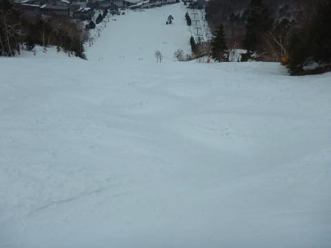

# 2019/4/21(日)の志賀高原，速報モード…天気予想が外れ，終日曇り．そのおかげで雪はひどく緩まず，午後までフラットバーンをかっ飛ばせたよ！

📅 投稿日時: 2019-04-22 02:42:18

🏷️ カテゴリ: [2019スキー滑走日記](c3e4496fc0fb7f9c17ff21214a35b1ace.md)

本日．

車に乗りあった人たちを家まで送って，

さらに洗車だけでなく，

オイル交換までやってきてしまい…

帰宅は，深夜1時近く（涙）

それから荷物を片づけたりいろいろすると．

うーむ．

もうこんな時間ではないか（泣）

だもんで．

早朝から滑っていた人間にとって．

そろそろ眠たくて死にそうな時間なので．

今日も日曜恒例の，速報モードにて…

えー．

まず．

今日も6:30の早朝からスタートですが…

うむ．

朝から曇り空ですね．

…だれだ？

日曜は終日晴れるって言ったいい加減な

やつは！←だから，自分でしょ

とりあえず，早朝のお約束，

朝イチのシマシマはいただき！

緩くもなく，ガチガチでもない，

ちょうどいい柔らかさの春雪で，

…これは4月として良いコンディション！

…で．

終日曇り空ということは．

強い日差しで雪がドボドボに

緩まないということで．

早朝営業が終わるまで，ちょうどいい

柔らかさをキープしたまま！

この時期は，曇り空の方がいいかも！？？

昼間はさすがに気温が上がり，

雪が緩んできたので，

多くの人が滑っていた

一の瀬は荒れてましたが．

焼額は朝からずっと，むちゃくちゃ

人が少なくて．

見渡す限り，ゲレンデに誰もいない

状態が続いたので…

なんと．

焼額は営業終了時間まで．

大回りでかっ飛ばせる

コンディションが続きました～！

素晴らしい…

ガラガラで飛ばしたい放題って，

すばらしい…

そして．

昨シーズンは今の時期のGSコースは

こんなだったけど…

（去年4月21日の写真）

同じところを比べると．

今年はまだまだ雪がありますよ～！

このGWも．

まだまだ楽しめそうです！

## 💬 コメント一覧

### 💬 コメント by (かず)
**タイトル**: Unknown
**投稿日**: 2019-04-22 10:41:17

日曜のヤケビ板走りました？土曜が快適すぎて苦戦しました　汚れを取って色々試したかったデス　この時期行くの初めてでしたけど汚れ対策しないと何やっても1本でダメな気がします　準備して来週も試したいような雨も気になる…

### 💬 コメント by (Skier_S)
**タイトル**: ＞かずさま
**投稿日**: 2019-04-23 03:23:06

日曜のヤケビ，少し滑りが悪いかな？

と思うところはありましたが．

張り付くほどの雪ではなく，結構板は滑りました…

トップシーズンに比べれば滑りは悪いですが，

この時期としては結構マシだったかと思いますよ～！

### 💬 コメント by (ほっぽ)
**タイトル**: オイル交換
**投稿日**: 2019-04-23 06:51:59

Ｓさん

さりげなく書かれていますが、ラストまで滑り倒して

帰宅する途中でオイル交換できるお店があることに驚いています。

って、見てる所が違うでしょうか。(^^;

でも、毎週末志賀高原、平日は深夜帰宅、であれば

どこかの週末でオイル交換するしかありませんよね。

### 💬 コメント by (Skier_S)
**タイトル**: >ほっぽさま
**投稿日**: 2019-04-24 02:13:45

オイル交換ですが，家のそばのGSが24時間オイル交換

可能です．

真夜中でも受け付けてくれるので，助かってます…

