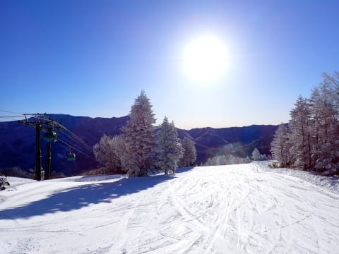
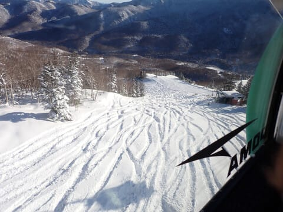
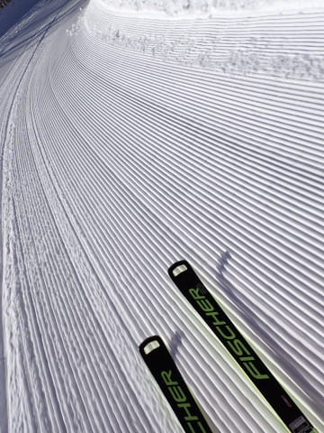
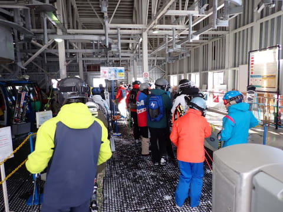
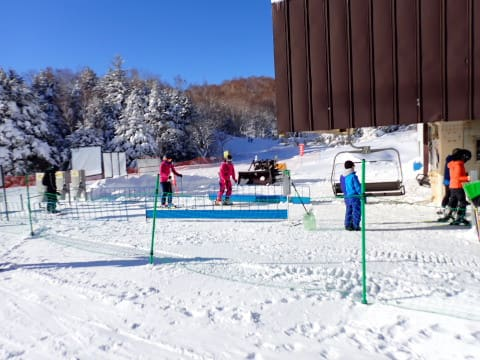
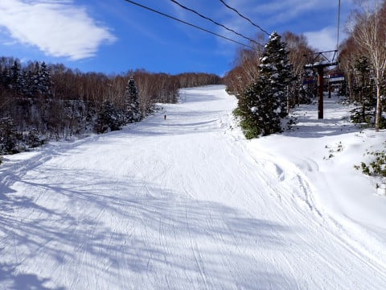
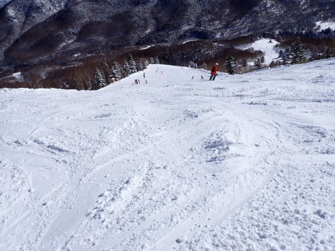
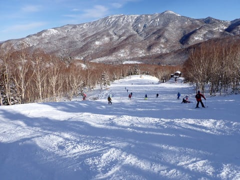

# 2024/1/14(日)の志賀高原焼額山スキー場，速報レポート！…終日晴れ，雪も積もりようやくトップシーズンらしいゲレンデに！でもガラガラだったよ

📅 投稿日時: 2024-01-15 02:50:35

ということで．

今日もいつも通り，日曜のラストリフトまで

滑り，その後夕食やら買い物やら洗車やらに

立ち寄って帰宅すると，深夜0時を回って

いるんですが…(涙）

そして，片付けやら何やらをやっていると

もう深夜2時（泣）

昨日も2時間半睡眠で志賀に行って

営業開始からラストまで滑った後，

夜中12時までみんなで飲んで，

リフト営業開始に間に合うよう，

7時前に起きたので，まったく

睡眠不足が解消されてないんですが…

早く寝ないと…

ってなことで．今日ももう遅いので，

いつも通り本日の志賀高原スキー場，

速報モードにてレポート！

今日は予想通りのすっきり晴れの一日！

朝は放射冷却で-10℃を下回る冷え冷え

でした！

昨晩からの積雪は，30㎝程度でしょうか…

非圧雪コースは，脛パフ程度の新雪！！

で．あさイチの圧雪バーンは…

昨日積もった柔らかい雪が冷えて圧雪された，

トップシーズンらしい柔らか冷え冷え

シマシマバーンだあぁぁぁぁぁっ！！

こんないい天気＆コンディションなのに，

正月＆3連休後の週末だからか，

それほど混まず…

第1ゴンドラが最大でゲートぎりぎりまで

並ぶかどうか．

普段はゲート内．

午後はほぼ飛び乗り状態だったんですが…

こんなガラガラでいいんですか？？？

第2，第3高速リフトもほぼ待ち無しで

乗れたし．

ゲレンデも全体的に人が少なく…

午後はタイミングによっては貸し切り

バーン状態で，好きなライン取り放題！

…こんな貸し切りバーンが滑れちゃって，

いいんですか！？

…ただ．

昨日雪が積もったばかりで，圧雪しても

雪が柔らかかったので，昼頃になると

結構雪が凸凹してきちゃったのだけ，

ちょっと惜しかった…

夕方になると，一部は結構コブに

なっちゃったところもあったけど…

でも，雪は柔らかいし．

天気も良く，凸凹はよく見えたので．

結構楽しく滑れました～！

ってなことで．

午後のゲレンデがちょっと荒れ気味だったの

だけは惜しいけど．

終日晴天で，日差しがあったので寒さは

感じなかったし．

雪も柔らかいトップシーズン雪だし．

リフト待ちも少なくガラガラだったし．

絶好のスキー日和の一日でした～！

昨晩からの雪か降ったおかげで，ようやく

ブナコース

ミドルコース

がオープンし．

土曜は

オリンピックコース

SGSコース

がオープンしたのもあり．

これで，まだオープンしていないのは，

状況が良いときのみオープンの

ヤケビウォール・ヤケビバレイを別とすれば，

奥志賀高原連絡コース

のみとなりました…

今晩から15，16日にかけて，さらに雪が

積もりそうなので，来週末は全面オープン

して，コースの雪不足も解消するかな？？

## 💬 コメント一覧

### 💬 コメント by (レインボー76)
**タイトル**: Unknown
**投稿日**: 2024-01-15 15:25:29

月曜日の志賀高原情報

朝の上林-2℃、蓮池-7℃。強風で雪が舞っている。

まずはダイヤから唐松へ。全てサラ場。圧雪の上に新雪5センチ。快適この上ありません。来てよかった。

3高もフラットでサラ場いっぱい。GSはちょっと疲れる雪。白樺は快適そのもの。

会いたい人にも会えたし、満足の一日でした。久々の西館ステーキにも大満足。

問題は明日の強風だけです。西舘フーディーか休場か、悩ましや。

### 💬 コメント by (Skier_S)
**タイトル**: ＞レインボー76さま
**投稿日**: 2024-01-16 02:42:17

明日までには，30~40㎝くらい積もるかも？？

明日，風は強そうですが，焼額のゴンドラはぎりぎり動いてくれないかな～…

ゴンドラが動けば，寒い雪降りの一日なのでゴンドラ一択ですよね(笑)．

### 💬 コメント by (富山県民)
**タイトル**: Unknown
**投稿日**: 2024-01-17 11:32:14

お久しぶりです。

自分も1月14日にスキーに行きました。

久しぶりに週末晴れました。

自分は1月14日には妙高杉ノ原スキー場に行きました。

午前は妙高とは思えないくらいに軽いパウダースノーで天気は快晴でした。

来週末は低気圧の接近により2日とも天気が悪そうです。

早割は八方尾根と野沢温泉の2枚だけになりました。

### 💬 コメント by (Skier_S)
**タイトル**: ＞富山県民さま
**投稿日**: 2024-01-18 00:15:37

妙高杉ノ原ですか…！

土曜～日曜にかけて，結構雪が積もったみたいですね．

今週末は南岸低気圧がやってきそうです…

ヘタすると標高が低いスキー場は雨っぽくなる可能性が．

志賀は大丈夫ですが…

また志賀にもお越しください！

