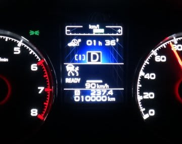

# レガシィ1万km突破…そして来年からツーリングワゴン廃止!?

📅 投稿日時: 2013-11-01 02:18:27

えー．

この3連休の天気は…

うーむ．2，3日は晴れそうですが．

3日目の4日は，雨になる可能性が高いな～．

この週末は軽井沢もオープンするけど．

確実に晴れている日に滑りたいなら土曜に行っておくべきですね～．

＃でも，雨の4日が一番混まないだろうけど…

さてさて．

[6月上旬に納車](e8b1f8d28832665558dcfcba9e098597f.md)された我が[BRレガシィE型](eb1b0e385b422753c3e3aad5a58c12234.md)．

この10月下旬，さりげなく1万kmを突破してました…

…購入から約4ヶ月半で1万km，ですか．

年間3万5千km走る我が家にとって，ちょっと遅めのペースですね～．

とりあえず．

1万km走ってみると．

購入当時の足は，ダンパーが動かず，ブッシュで振動吸収している

感じがありましたが．

最近では，あたりがついてきたのか，ダンパーの渋りがなくなり．

また，ブッシュも適度になじんできたのか．

最初のころより，きれいにダンパーが動いている感じ…

ブッシュのブルブル感もなくなり，乗り心地が良くなってきた気が…

で．

これまでの平均燃費，約12km/l．

ゴー・ストップの多い街中を走る通勤にも使っている割に，

結構いい方かと．

あと…雪道でどんな動きするかな～，って試すつもりで．

ぐりぐり横Gをかけて走ってみましたが．

いやーーー．

いいですね～．

この車．

これまでのRB2オデッセイでは，横Gが大きくなってスキール音が

出始めると．

ヘビーなフロントがずるずるずるずると外に逃げていく感じで．

そこからアクセルを入れても，さらにどうしようもなくアウトに

膨らんでいく一方だったけど．

このBRレガシィだと．スキール音が出始める領域になってきても．

フロントのスリップアングルが大きくなってきたな～，ってのと

同時に，リヤが同じくらい外に出て行くので．

ラインはアウトに膨らむけど，ヨー角速度は保ったまま曲がっていきます．

そこからアクセルを入れても，きれいにフロントとリヤが揃って流れて

行きます．

おおお～！ちゃんとリアにも結構トルク配分されてるじゃないか！

って感じで．

これがホントの4WDの動きなんだなぁ…

アクセルオンで，頭がコース外側に振られて，アウトに向かって直進して

行く恐怖を感じることなく，安心してクリップからアクセル踏んでいけます．

なんて楽なの…

ってことで．

この車．

雪道速いに違いない…

今から，雪道が楽しみですね～．

って，感動したところなのに．

レガシィツーリングワゴン．

BRを持って，[その歴史に終止符を打つ](http://news.goo.ne.jp/article/yomiuri/business/20131031-567-OYT1T00214.html)みたいですね．

レガシィ，米国メインターゲットにして大型化しすぎて．

日本では不評だったということで．

インプレッサベースのワゴンを作る…

ってうわさは聞いてたけど．

今回の[レヴォーグ](http://www.subaru.jp/levorg/sp/)発売で．

来年モデルチェンジのレガシィからは，ツーリングワゴンがなくなるとは！

…アウトバックは残るみたいですが．

うーん．

でも．レヴォーグ．

エンジンは1.6Lと2.0LのDITか…

ターボを2種類揃えるって，走り重視っぽいですね～．

## 💬 コメント一覧

### 💬 コメント by (megalith)
**タイトル**: Unknown
**投稿日**: 2013-11-03 09:00:08

ご無沙汰しています。

順調に走行距離が伸びていますね。（笑）

自分も現在走行距離が月2,300kmほど乗っているのであっという間に1万キロを超えそうです。(っていうか、なんで月2000km越えになるほど乗ってるんだ？(^_^;))

ついに次期ツーリングワゴンの後継車のインフォがありましたね。

まぁ噂どうりインプ・スポーツをベースに全長を伸ばしたものになりそうなんですが。

まぁB4、OUTBACKはそのままでTWは消滅して別ブランドになるというのは既定路線でしたからねぇ。

もともとBR系はアメリカではB4とOUTBACKのみの販売でしたし。

ただ、レヴォーグの羨ましい点は新型アイサイト(Ver3？)が搭載される可能性が高いことでしょうか。

これは、我々が一番望んでいたアノ機能が高速道路限定ですがついに実現します。

詳しくはこちらをど～ぞ。(^_^;)

富士重工ニュースリリース

http://www.fhi.co.jp/news/13_10_12/13_10_02_92140.html

Car Watch

http://car.watch.impress.co.jp/docs/news/20131002_617822.html

### 💬 コメント by (Skier_S)
**タイトル**: そうなんですよ…
**投稿日**: 2013-11-03 16:28:28

そうなんですよ．

ついにレーン保持機能がつくみたいで…

これが着けば，Eyesightは無敵ですよね！

でも，やはりTWがなくなるのはちと寂しい気がします．

そちらも4ヶ月で1万kmペースですね！

6ヶ月点検で，何km走ってるんじゃ状態になりますか…

うちのBRちゃんは好調ですよ～

