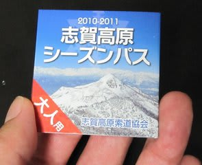
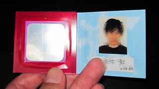

# スキーシーズンの必須アイテム購入

📅 投稿日時: 2010-11-16 01:24:28

🏷️ カテゴリ: [スキー雑談](c1f9d2cb7478308da16419928ea3945e9.md)

私にとってスキーシーズンに必須のアイテム．

志賀高原のシーズン券をGetしました．

昨シーズンまで，志賀・八方・野沢の3山共通シーズン券しかなく，

非常にお値段がお高かったのですが．

今シーズン，志賀専用シーズン券がやっと発売になり，

3山共通券より1万5000円安く買えるようになりました…

八方やら野沢にほとんど行かない私にとっては，うれしい変更ですね～

さらに．

志賀高原専用券となったことで，

ICチケットが直接送られてくる形になりました．

上の写真のチケットは二つ折りになっていて，開くとこんな感じです．

昨年までの3山共通券では，スキー場にいくたびにリフト券売り場に行って，

カードとチケットを出してICチケットに変えてもらわなくては

ならず，不便だったのですが．

これで，

「シーズン券持ってるのに，何でリフト券売り場に並ばにゃ

ならんのだ」

って思っていた不満点も解消．

ということで．

今シーズンも志賀に行くぞー！
