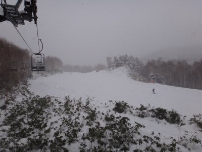

# 12月17日の志賀高原…焼額の状況は？

📅 投稿日時: 2011-12-17 22:42:13

🏷️ カテゴリ: [2012スキー滑走日記](cca3a0e9524e0203150f790b1fc3c71ad.md)

えー．

今朝．

志賀高原に上ってくる道路は完全圧雪です．

信州中野インター降りてから雪道です．

これは，志賀高原期待できるかな…

と思ったところ．

まぁ，朝の段階で20ｃｍくらいの積雪ですか．

ゲレンデ状況は一気に改善，エリア拡大…ってほどではないです．

今日新たにオープンしたのは，ダイヤモンドと奥志賀，あと横手山．

焼額ゴンドラや一の瀬クワッドは動いてません．

山の神もまだ．

でも，焼額ゴンドラと山の神は試運転していたので，明日から

動くでしょう．

一の瀬クワッドも，天狗コースだけながら明日から動く，

という話もあります．

しかし．

オープンしているゲレンデは，20ｃｍ程度の天然雪が乗っており，

今シーズン初めての柔らかな雪でのスキー！！

いやー．

スキーって，こんなに雪に食い込むんだっけ？

こんなに雪ってやわらかいもんだっけ？

っていうヨロコビが…

午前中は結構シンシンと降っていたんですが．

もっと積もってほしいところですが，

[昨日の予想通り](eda760342763e35a8c2d23e8b6e4d77bb.md)昼ごろには雪もやみ，それ以降夜中までまったく

積雪なし(涙)

でも，おかげで柔らかな天然雪の上，日差しの下滑れるという

グッドコンディション！！

焼額はリフト待ちもまったくなく，ゲレンデの人口密度は

多少高めなもの，楽しめました．

今晩，積雪がないのは残念だけど…

焼額ゴンドラが動き出すようなので期待．

…でも，人工雪打ってないコース，ちゃんと滑れる

積雪量なのかな？
