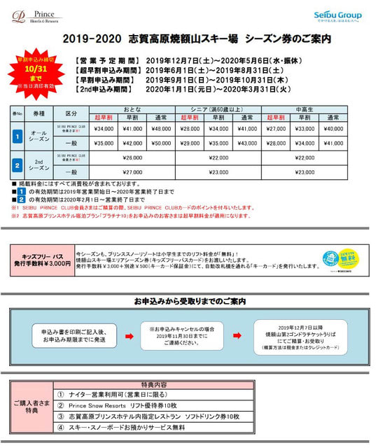
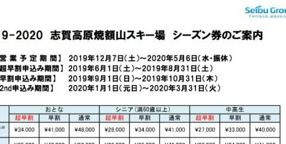
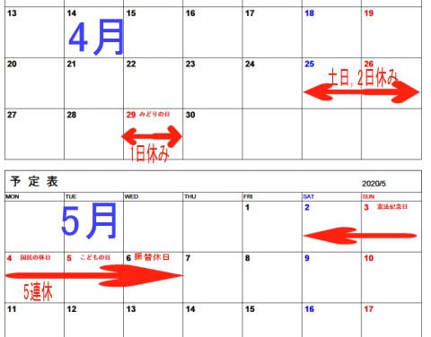
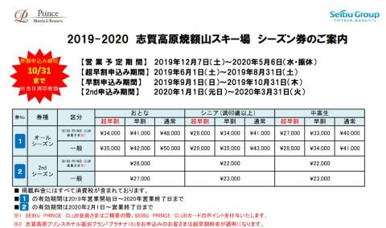
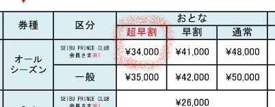
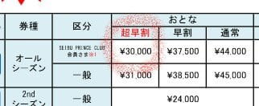
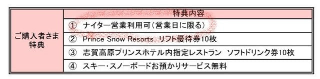
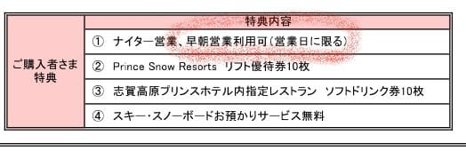

# まだ2019シーズンが終わってないのだけど，焼額の2020シーズン券情報が早くも出てきたよ…

📅 投稿日時: 2019-06-15 01:33:26

🏷️ カテゴリ: [スキー雑談](c1f9d2cb7478308da16419928ea3945e9.md)

ということで．

ええ．

まだ2019シーズンが終わっていないのに．

…大事な所なので，もう一度繰り返しますが．

まだ2019シーズンは終わってないのに

早くも，焼額山のHPには，焼額山限定2020シーズン券の

情報が掲載されてますね…

（焼額山HP,[2019-2020 焼額山スキー場 シーズン券のご案内・申込書のページ](http://www2.princehotels.co.jp/ski/shiga/files/2019-2020_season_ticket.pdf)より．他も同ページより引用）

いや．

まだ2019シーズンが終わってないので．

来シーズンの話をすると，鬼が全力で笑いそうですが．

とりあえず，詳細を見てみると…

うむ？？？

うむむむむっ！！？？

をを！

また来シーズンも，しっかりGWまでやってくれるようですね！！！

今シーズン，春営業復活2シーズン目にして．

GWまで雪がたっぷり残ってくれたので．

来シーズン，3シーズン目も春営業継続

です！！（ぱちぱちぱち）

で．営業は5/6までですか…5/10までやってくれないんですね（涙）

そうそう．

来シーズンのGW，いつが休みになるか良く知らない

人も多いと思いますが．

…私も良く分からなかったので調べてみると．

こんな感じで．

29日にぽつんと1日休みがあり，

その後5/2～5/6までが5連休です．

従来は4連休のところ，振替休日のルールが

変わったので，6日の水曜が振替休日となります…

ってな感じで．

来年は10連休でもなければ，

3連休もありません（涙）

29日の水曜日，真ん中にぽつんと取り残された

休日が寂しい…

ってな感じで．

話を戻すと．

とりあえず，焼額山は，来シーズンも春営業を

やってくれるようで一安心…

と，ここまではいいニュースなんだけど．

さらに読み進めてみると…

うむむむ！？？？

この価格表をよく見ると…

なんだ，これはっ！！？？

全面的に値上げじゃないかっ！！！

超早割は，34,000円に値上がりしてるっ！！

いや，2019シーズンの価格表がこんな感じで，

超早割が30,000円だったことを考えると…

10%以上の値上げですね（涙）

（焼額HP,[2018-2019シーズン券案内ページ](www2.princehotels.co.jp/ski/shiga/files/2018-2019_season_ticket.pdf)より）

うーーーむ．

これは魅力がちょっと減ったなぁ…

と，さらに読み進めると．

もうご存知の方も多いと思いますが．

うむむっ！！？？？

え？

ナイター営業は使えるのはいいけど…

早朝は？？

早朝は使えないの！？？？

念のため，2019シーズンのシーズン券案内の

同じところを見てみると．

いや，ちゃんと早朝営業利用可と

書かれてますね…

（焼額HP,[2018-2019シーズン券案内ページ](www2.princehotels.co.jp/ski/shiga/files/2018-2019_season_ticket.pdf)より）

…

…いや．

焼額のシーズン券．

早朝とナイターにも使えるのが魅力で．

今シーズンもかなりの回数，焼額の早朝やら

ナイターやらを滑ってしまったので．

来シーズンは，

志賀高原全山共通のシーズン券と，

焼額限定シーズン券の，

同じスキー場のシーズン券2枚持ち

をやった方が，お得になるかも…！？？

と，思っていたけど．

…早朝営業に使えないなら，焼額の

シーズン券を買う必要，全くなし！

いやーー．

来シーズン，志賀高原全山共通のシーズン券と，

焼額限定シーズン券の，

同じスキー場のシーズン券2枚持ちという，

馬鹿としか言えない素晴らしく忠誠心が高い

ことをやっちゃうのか…どうしようかと

悩んでたけど．

これで悩まずに済むなぁ…良かった！！←そういう問題なのか？？

…しかし．

ひとつの可能性として．

来シーズン，焼額は早朝営業をやらない

から，ここに早朝営業利用可能と書かれていない…

という可能性が，わずかに存在することに．

あえて気づかないふりをしていたい，Skier_Sなのだった…

## 💬 コメント一覧

### 💬 コメント by (naoちゃんねる)
**タイトル**: Unknown
**投稿日**: 2019-06-15 22:29:48

これは愕然としました(;´д｀)

ヤケビ限定シーズン券購入予定ですが、早朝が対象外になってしまうのですね…

それなら全山シーズン券でもいいかなぁ…でも娘の分と合わせると…orz

早朝が無くなるのは…考えたく無いですねぇ😣

まだ2018－19シーズンなのに(一部の終わった人…じゃなくて素晴らしい人には)来シーズンの事が気が気でなりません。

### 💬 コメント by (Skier_S)
**タイトル**: ＞naoちゃんねるさま
**投稿日**: 2019-06-16 08:16:01

早朝券，10回行くと2万円ですから（涙）

結構デカいですよね…

でも，シーズン券買って早朝2万円払っても5.4万で済みますし．

来年も子供は早朝もただなら，ヤケビシーズン券の方が

よいのかも…

