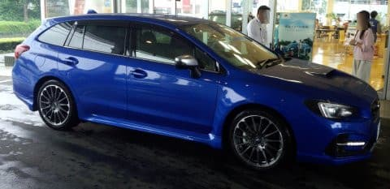

# D型LEVORGに試乗してみた…今度は2.0 STI Sportに乗ってみたよ

📅 投稿日時: 2017-09-20 01:09:07

ということで．

8月に登場した，D型LEVORG．

先日は，1.6 GTの試乗レポートでしたが．

今度はSTI Sport．

それも，1.6Lでなく，2.0Lモデルに乗ってみました…

内装は相変わらず，ボルドーの赤が

目立つ，派手な内装ですが…．

C型からの基本的な変更ポイントは，1.6 GTと同じで．

マルチインフォメーションディスプレイとナビの

画面拡大が大きな変更点で．

その他，静粛性向上，アイサイトツーリングアシスト

採用なども同じですが．

STI Sportのサスペンションは．

C型から多少のチューニングの変更はあるものの．

1.6 GTやGT-Sモデルのように，バネレートや車高まで

変えたほどのドラスティックな変更はないようです．

で．

2.0 STI Sportに乗って走り出したところ…

…

これは．

違う…

1.6GTと，違いすぎる…！！！

1.6GTは．

ある意味，多少のダルな感じをもたせて，

ゆったりとした乗り心地になったけど．

2.0STIは，クイックさが十分残ってますね～！

右，左の切り返し時のライントレース性が

こっちの方が圧倒的にいい感じを受けます…

足の接地感が，2.0 STIの方がダントツに高いです．

かなりのスピードでコーナーに進入しても．

ステアリングを切った瞬間からフロントが反応して，

すっと回っていきます．

1.6 GTだと，フロントのロール剛性を落としたからか，

ロワアームのボディ側後方取り付けマウントが

ゴムブッシュ化されたからか．

ステアリングを切ったあと一瞬のタメがあって，

それからフロントが動き始める感じがあったけど．

2.0 STIはステアリングを回し始めた瞬間から，

フロントがすっと動き始める感じ！

外タイヤの荷重感も，2.0STIのほうがいい．

左右の切り返しに，車が気持ちよく反応する…！！

一般的な「乗り心地」という観点では…

STIの方が，引き締まった感じ．

硬い，というのではなく，ダンピングが早い感じ．

でも，ハンドルを握ってない人は，GTの方が

柔らかくていいって言うかも…

で．

エンジンレスポンスも，

2Lの排気量がある分，1.6Lに比べ出だしのトルク感が良く．

ブーストが効いてない時からも，2Lのトルクで

車が動き始めて，

アクセルに対する車のリニアリティが高く．

右足と車の加速のシンクロ性が高いです．

1.6Lエンジンで感じる，スタート時の低速トルク不足…

というより，ローギヤードで回転数を

引っ張る感じは無く．

低回転から十分なトルクで車が動き出して．

そして，

アクセルを大きく踏み込むと…

うむ．300PSオーバー．

こんな馬力いらんわ…

というくらい加速するし．

登り坂も，まるで平地のように超軽やかに

走っていく…

右足の動きに対する追随も良くて．

アクセルをちょっと踏み込むと，

素早く反応して車を前に引っ張っていきます．

はっきり言って，この2Lエンジン．

かなり気持ちいいです．

ということで．

LEVORGの最安グレードと最高グレードの比較で．

値段が100万以上違う車だし．

比較するのが間違ってる気もするんですが．

2.0 STI Sport．

1.6 GTとは別の車だな，こりゃ…

まぁ，値段の差を考えると．

そのくらいの違いがあってくれないと

困るかもしれないけど…

LEVORG 2.0 STI Sport．

かなり激しく物欲を刺激する

車でした…

欲しい．

欲しいぞ！

…絶対買えないけど（涙）．

## 💬 コメント一覧

### 💬 コメント by (しんちゃん)
**タイトル**: GOLD物欲選手権？
**投稿日**: 2017-09-20 22:12:12

物欲に負けて、試乗されたSUBARUﾌﾞﾙｰのﾚﾎﾞｰｸﾞSTIに乗って、この冬ヤケビに登場してたりして!(^^)!

次期車選びは、ちょっと贅沢な物欲、GOLD物欲選手権になりそうですね。。。(笑)

### 💬 コメント by (Skier_S)
**タイトル**: しんちゃんさま
**投稿日**: 2017-09-21 00:35:36

いや，車を買うって言ったら．

もう物欲選手権のレベルで買ってたら，

家計が破たんします…（笑）

でも，LEVORG2.0STI．

お金があったら明日にでも欲しいです…

### 💬 コメント by (michi)
**タイトル**: たしかに
**投稿日**: 2017-09-21 16:20:47

お久しぶりです。

REVORGネタ見たら反応しちゃいました（笑）

私も2.0STIを代車で借りて乗りましたが、1.6とは別物でしたね。

トルク、パワーが圧倒的に違いました。

前車はレガシィのビル足でしたが家族が固いのを嫌がったのでGTを選択しましたが個人的にはGT-Sが良かったです。

まぁ、燃費やタイヤなどのコストを考えると1.6GTは財布に優しいですけど(^^)

### 💬 コメント by (Skier_S)
**タイトル**: michiさま
**投稿日**: 2017-09-22 01:15:50

ホントに，2.0STIと1.6GTはかなり違いました…

特に，D型1.6GTはかなりSTIと異なる方向に

味付けを降ってきたので，差が明白でした．

私も，次は1.6を買おうかと思っていたのに…

今回の試乗で，2.0が欲しくなってしまいました．

今は2.0GTが無いので，選択肢無しでGT-S

になっちゃいます…

安いGTがあったらうれしかったんですが．

### 💬 コメント by (michi)
**タイトル**: Unknown
**投稿日**: 2017-09-22 17:38:18

Sさま

2.0GTは初期型にはあったグレードですが多分不人気で無くしたんでしょうね。

2.0試乗してしまったら負けです（笑）

街中だといらないパワーなんだと思いますが比べてしまうと絶対2.0が欲しくなりますよね。

### 💬 コメント by (Goku)
**タイトル**: 試乗車が
**投稿日**: 2017-09-23 00:01:36

長野でＣ型の1.6ＳＴＩと2.0ＳＴＩの試乗車が中古で出ていましたが、310万と350万とお高いプライスが付いておりました(-_-;)

### 💬 コメント by (Skier_S)
**タイトル**: Levorg欲しい…
**投稿日**: 2017-09-23 00:58:25

＞michiさま

2.0に試乗したので，いろんな意味で負けです（涙）．

負けてます…

あれはダメです．

1.6に乗れなくなりました…

＞Gokuさま

2.0STIが350万なら，安いくらいだと思います．

ありえないくらい高い車ですから…

