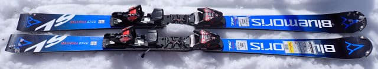
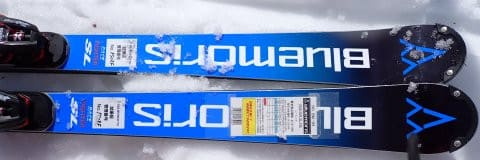
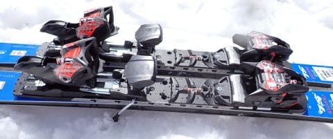
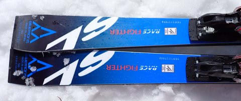
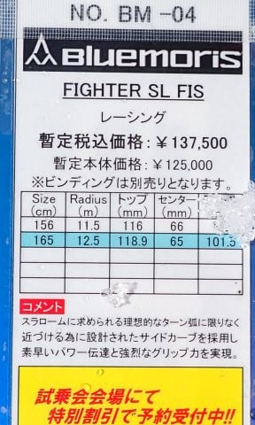

# 2025シーズンモデルのスキー板，試乗レポートその29…BLUEMORIS FIGHTER SL FIS

📅 投稿日時: 2024-07-14 02:58:54

2025シーズンモデルのスキー板の

試乗レポートも，そろそろ29機種目になり．

かなりの数のレポートを書いてきたわけで…

…読者の皆様においては．

そろそろ飽きてきた

という方もいらっしゃるかと思うところ

ですけれど．

…このブログは登山ブログやダイビングブログ，

自動車ブログではなくて．

あくまでスキーブログであるので．

なるべくスキーネタを入れていかないと

という，半分強迫観念で試乗レポートを

書いているところ，果たしてこんな

シロートの試乗レポートが，

誰かの役に立ってるんだろうか…？

という疑問がそこはかとなく湧いてくる

今日この頃，皆様いかがお過ごしでしょうか．

（時候の挨拶）

しかし．今シーズン．

試乗してレポートを書いてない板が

まだまだ残ってるんですよね…

今シーズンは35機種に試乗してきたので．

今回を除くと，残り6機種．

BLUEMORIS FIGHTER GS

OGASAKA KEO's AP

ELAN SLX

NORDICA SLR

VOLKL SL MASTER

K2 MINDBENDER 99

が残ってます．

ブログネタを書かなくてはならない

という強迫観念で，自分の購入対象外の

板まで必死に乗りまくってますから…

いや～．今シーズンは，春スキーのシーズンが

早く終わるかも？？？

ネタを溜めとかないと…！

と，かなり乗りまくりましたから…

あ，ちなみに．

アルペンさんの試乗会は無料なんですが，

毎度無料でネタだけのために試乗するのは

心苦しいので．

板やブーツなどの大物では無いですけど，

試乗会場の先行販売で，ちゃんと商品を

注文しているんですよ…！！

ってなことで．

元手がかかっているこの試乗レポートで，

もうしばらくは冬モードを続けるこのBlog．

今日も2025シーズンモデルの試乗レポート，

今回はブルーモリス編です！

〇BLUEMORIS FIGHTER SL FIS + WC PC INTERFACE + Marker Race12 165cm

'

SL競技用

BLUEMORISのSL用としては，このFIS準拠の

トップモデルとなるFIGHTER SL FISと，

その下のモデルとなるFIGHTER SLという

2機種あるのですが…

こちらは，FISマークの付いたトップ

モデルの方．

ビンディングやプレートがセットでない

この板ですが，試乗板はピストンプレートが

付けてありました．

履いてみましたが…

いや．

出来がすごくいい板ですね…

職人がしっかり作った，サンドイッチの

競技用板という感じで，プロの道具っぽさ

を感じるんだけど…

なぜだかわからないけど，履いた感じの

高級感というか，上級感があります…

なんでだろう？？

履いてみると，かっちりしっかりした張りと，

メタルの強い反発感（ピストンプレートの

反発感なのかも…？）を感じます．

そして，ピストンプレートの重さなのか．

かなりのどっしり感があります．

このどっしり感で，荒れたザブザブの春の

雪でもしっかりと雪面に食らいついて

いってくれて，安定感高くガッツリと

雪面に食らいついたカービングで

荒れた斜面を怖さなくハイスピードで

切り裂いて行けます．

重さと強いグリップがありながらも，

板に強い圧が溜まる感じがあって．

たまった圧を開放してやれば，軽快に

気持ちよくスパンと谷回りのあるべき

場所に板が進んでいってくれます．

強めの反発力が絶妙なタイミングで

絶妙に出るので，板の重さを全く感じず

切り換えることができて．

切り込んでいくときは安定感があるのに，

切り換えの際はまるで重さがなくなった

ように，すっと谷回りに入っていけます．

切り替え時に荒れた斜面に飛ばされても，

まるで何事もなかったかのように

板を空中で返して，しっかり谷回りで

エッジを捉えた状態でガッツリ

カービングでフォールラインに絡んで

行けるし．

安定感・安心感はこれまで履いた

来シーズンモデルの中でも，トップクラス．

整地でも荒れた斜面でもものともせず，

どんな斜面でもガッツリ強いエッジグリップと，

荒れた斜面でもがっつり食い込んで回って

行ってくれる強い旋回性で，

バーンを選ばず力強いカービング小回りを

かましていけます．

安定感が高いので，安心して谷回りから

ガッツリ傾いていけて，春の荒れた斜面だと

荒れた雪が内膝にバシバシぶち当たる

くらいの深いターンができます．

傾きを大きくすれば弧は深くなっていくし．

板の張りが強いので，あまり傾けないで

行けば長めのミドルターンの弧くらい

まで引っ張れるし．

ターン弧の自由度もきわめて高いです…

たわみというより，傾き量で旋回半径を

自由にコントロールできる感じ．

ただ，板が重いので…

やっぱり，基礎体力は必要です．

グリップが強いので，板をずらすには

かなりの筋力がいります．

かなりの筋力はいるけど…

ずらしていった時も旋回性があり，

ズラしを入れての小回りも作っていけます．

…ただ．

高速でずらしを入れようとすると…

かなりの力がいるので，ちと疲れる…

これ，硬い斜面だとがっつり食い込んで

私にはずらせないかも？？

しかし．

カービングをするには，荒れた斜面だろうが

整地だろうがバッチリ行けて，スピード耐性も

鬼のように高く．

フラットバーンだと，私が出せる程度の

スピードなら，どこまでスピードを

出しても板が負けず，怖さを全く感じません．

スピードの許容域もめちゃくちゃ高そう…

とりあえず．

鬼のようなポテンシャルの高さを感じる，

かなり過激な，すごいレベルの高い板

でした．

一日履き続けるには体力が要るかも

しれませんが．

いやーーー．

BLUEMORIS FIGHTER SL FIS，

いいですね！！
