# 子連れコモドダイビングクルーズagain　その34　そして寂しい下船タイム

📅 投稿日時: 2011-10-10 00:27:42

🏷️ カテゴリ: [ダイビング日記](ce3a7a8d424d112fce83ee85c81a0e344.md)

無情にも．

最終日の朝は，やってくるわけで．

まるまる5日間を過ごした船とも，今日でお別れ．

うーーむ．

早い！早すぎる！

なぜ，楽しい時間というのはかくも早く過ぎ去ってしまうのか！

朝8時半の飛行機なので，下船時間は7時半と早めです．

そのため，精算が5時半から，朝食は6時半から．

干している器材の回収を考えると，超早起きが必要ですな…

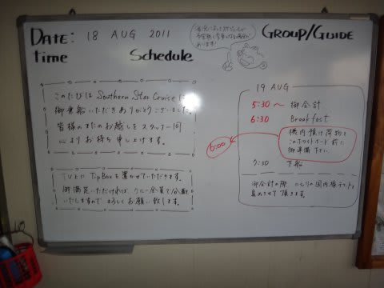

朝，日が昇らないうちから起きだして…

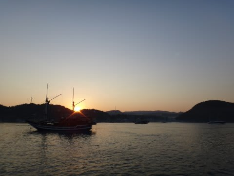

荷物の片づけを始めます．

いつもながらに下船日は寂しいものです…

器材を片付けつつ，いつまでもこの船に乗っていたいなぁ…

と，毎度考えますが．

しかし．

このまま乗船していると，会社の席がなくなってしまうので帰らねば．

んで．

片付けの後は精算．

ここで…

コモド国立公園自然遺産管理・保全・補修費等：一人$25

追加ダイビングフィー：1ダイブ$35

ビール(1本$2.5)など酒代，

Tシャツ等お土産を船上で購入した人の代金…

等などを払います．

あとは，チップボックスにチップを．

一人1日$10くらいを目安ですかね…

我が家は，子供の面倒を見てもらったので，チップはいっぱい払っておきましょう！

精算のあとは，最後の晩餐ならぬ，最後の朝食．

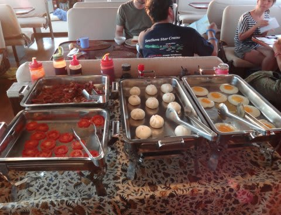

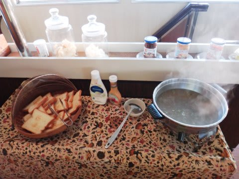

なんとなく，下船直前は食堂も寂しげです…

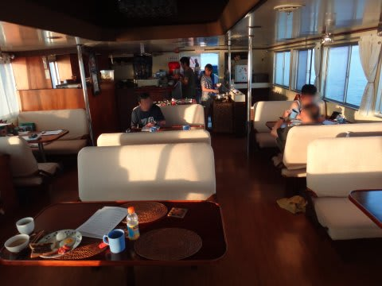

食事が終わった後は．

娘に「もうお船とバイバイだよ」といったからか．

「お船で遊ぶ～」という娘を連れて，下船までのわずかな時間，

朝日が照らす中，船の中をめぐります．

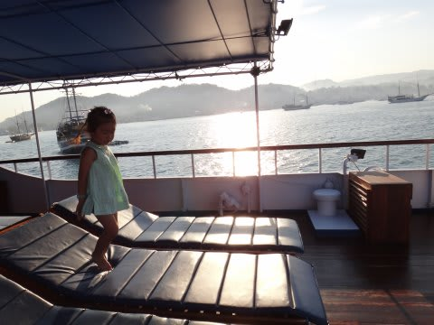

お世話になったね．

しまじ．

そして．

ついに下船時間．

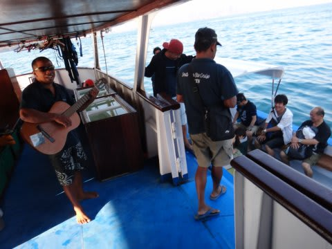

ああーー．

昨日まではこの時間，だいたい海の中にいたころなのに．

今日は．

もう，船を後にするのね…

さよならー！

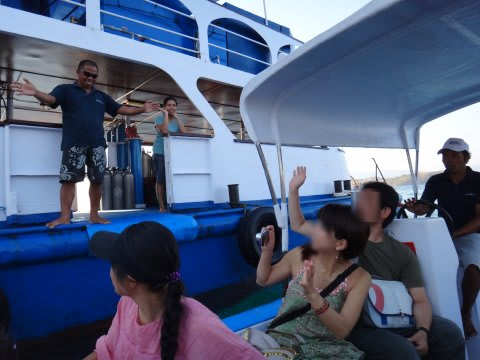

さよなら，スタッフの皆さん．

ありがとう～っ！！！！

そして．

ありがとう～！

しまじ！

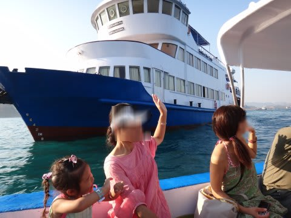

今年も，いっぱい，いっぱい家族の思い出を作ったから．

また，もどってくるからね．

お別れの寂しさを胸に抱えて．

桟橋に到着すると…

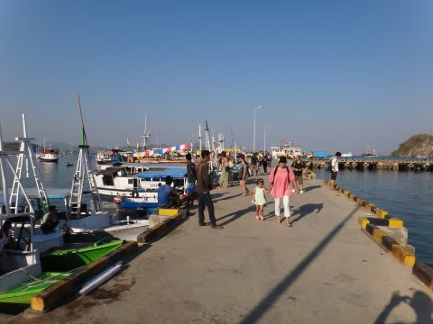

車に乗って5分ほどで，ラブハンバジョーの空港へ．

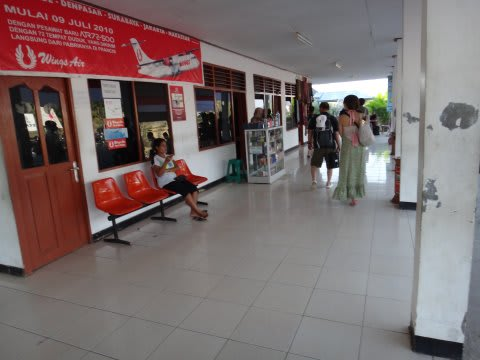

これから，バリ行きの飛行機に乗るわけですが…

揉めてます．

なんだか．

…オーバーブッキングのようですね．

はぁ．なるほど．

本来ジェット機のはずの飛行機が，キャパシティの小さいプロペラ機に

なった，と…

ここで，インドネシア滞在15年以上を誇るダイブガイド兼マネージャ，K澤さん．

必殺のマジックを繰り出したらしく，われわれが無事飛行機に

乗ることができるようになった…

と明らかになったのは，出発直前．

K澤さんとあわただしくお別れをして．

空港使用料10000ルピア（約100円)を払い，待合室へ入るとすでに搭乗が始まってます．

行きのジェット機と違って，帰りはフォッカー50．

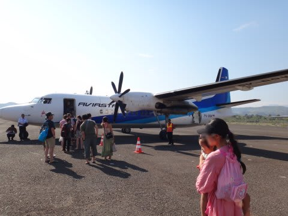

…これは．

日本の某航空会社のお古と一発で分かるカラーリングですな．

…せめて，色くらい塗り替えようよ．

で．

飛行機に乗ると．

また，行きと同じく，機内食として配られた軽食のパウンドケーキみたいなヤツをぱくつく娘．

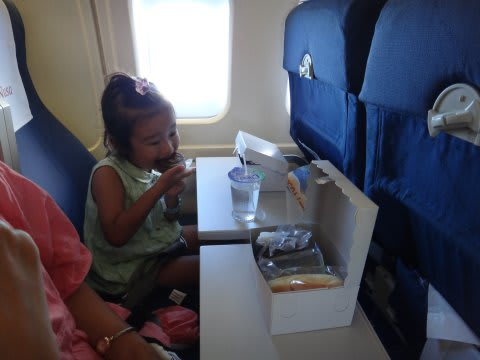

そうこうしていると，約1時間のフライトで，バリに到着．

もう，あれですね．

1時間くらいのフライトなら，おとなしく乗ってますね．娘は．

バリ到着は，朝10時半．

で，日本行きの飛行機は，深夜0時ごろ…

出発まで14時間近く，まだまだ時間があります．

…んじゃ，車をチャーターして，バリ観光に行きましょうか，ということで．

本日は車＋ドライバーを予約済みです．

バリ観光一般を取り扱っている[Lumba-Lumba](://www.s-starcruise.com/company_profile.php)が運営しているクルーズ船ですので．

船に乗っている間にお願いすれば，旅行社経由で観光ツアーだろうがオプショナルダイビングだろうが

なんだろうが，大体のリクエストを聞いてくれます．

ということで，本日は．

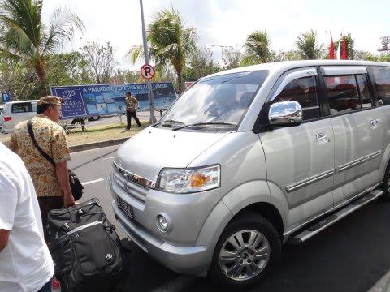

この車に乗って，ガイドつきバリ観光へ，Go!
