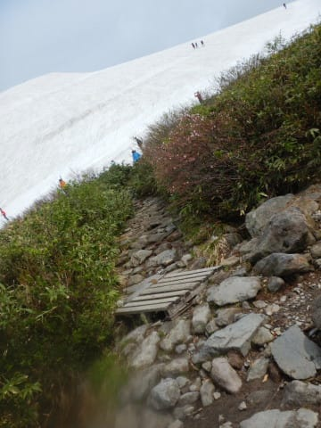
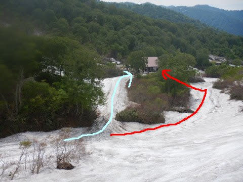

# 2022/6/11(土)の月山スキー場，いまさらの詳細レポートその1…リフト待ちほぼ無し，沢コースはまだ行けるけど，大斜面ほどのコブはないよ

📅 投稿日時: 2022-06-15 01:15:23

ってなことで．

2日間ほど仕事がかなりご無体だったため，

月山レポートを書いている暇が

なかったのですが…（涙）

今日はなんとか時間が取れたので，

今さらながら感が満載ですが．

土曜日の月山スキー場の

ゲレンデ状態の詳細レポートです！←いや，徹夜明けなんだから早く寝ようよ…

えー．

まず．

自宅を朝2時半に出発し，朝8時過ぎに

月山に到着しましたが…

駐車場手前から見ると，まだまだ雪が

たくさん残ってる感じに見えますね！

駐車場からリフト乗り場に歩いて

向かいますが…

駐車場からゲレンデの道は，

もう完全に除雪されてて．

雪の上を歩くことなく，リフト乗り場

まで行くことができます…！

ちなみに駐車場代は無料．

そのかわり1人当たり200円の協力金を

リフト乗り場下の，ここのプレハブで

支払う形になっています…．

ってなことで．

駐車場からトコトコかなりの距離を

歩いて，リフト乗り場までやってきますが…

このBlogでも何度も書いているように，

月山のメインバーンである大斜面．

今シーズンは激しいクレバスのため，

立ち入り禁止になってます（涙）

時々，結構なクレバスができる年は

ありますが．

今年は大雪の時に地震があった影響で，

かなり半端ないクレバスになってるようです…

ちなみに，まだ沢コースが滑れてリフト

グルグルできるので，リフト券はまだ

一日券や半日券が売ってます！

一日券4700円ですが…

ちと高い…(涙)

でも．

今日はリフトはガラガラ！

土曜日というのに，朝8時半時点で

まさかリフト待ちが0とは…！

結局この日は，終日リフト待ちなし

でした～！！

そして．

リフト乗り場には，まだ滑りこんで

来れるようですね…！

そして，6日から9日にかけての

架け替え作業で，リフトは下り乗車

可能な低い位置に掛け替えられてます…

で．

山頂に近づいてきましたが…

まだ6月上旬なので，Tバーがかかって

いるリフト降り場より上の部分は，

まだ雪がたっぷりのこっていて，

真っ白ですね！！

リフトを降りると…

うむ．

残念ながら，ゲレンデに出るまで歩かなくては

ならない，最終形態になってますね(涙)

先週までは，赤矢印に沿って雪の廊下が

残っていて，

リフト降り場すぐからゲレンデに

滑り込めたのですが…

今は雪の廊下は完全に消滅していて，

水色矢印に沿って歩いていかないと

ゲレンデに出られません(泣）

ちなみに，ここにも大斜面立ち入り禁止の

看板が立ってますね…

あ，あと，リフト営業終了は16:30ですか…

うーん．

最後まで滑ったら，車に戻るのが17:30に

なっちゃうから，家に帰りつくのは絶対に

日付変更線を超えるな…

今日は朝2:30に出てきたから，

最期まで滑らず無理はしないようにしよう…

と，あさイチのこの時は思っていたのでした（笑）

で．

リフトを降りてからこんな木道を

しばらく歩いて…

さらに岩場を歩くこと数10m．

リフト降り場からこのくらい歩いて，

ゲレンデに到着です！

大斜面がクローズの今シーズン．

リフトで滑れるのは沢コースだけなので．

必然的に沢コースへ向かうわけですが…

まだ6月上旬．

雪自体は結構残ってますが…

まぁ，この時期の平均的な雪の量かな？

すごく多くもなく，少なくもない感じ…

4月時点ではかなり雪が多かったみたい

ですが，気温が高かった4月，5月で

結構解けちゃったんでしょうね…

沢コースの一番低い部分は，一本続いた

コブラインになってました．

いつもなら藪が立ち始めるここから下の

部分も，まだ藪が立ってないので．

あと1週間程度行けるかな～．

一番最初に穴が開いたりコースが

切れたりするこのあたりも，

一部雪が薄くなってきてはいるものの，

まだ数日はもちそう．

今週は気温が低そうなので，週末まで

もってくれるかな？

そして，リフト降り場は歩かなくては

ならなかったけど．

リフト乗り場はまだ滑りこむコースに

雪がついていて…

この水色のルートを通って，リフト乗り場

すぐに滑りこめます．

雪が無くなると，赤線のように乗り場の

かなり下まで行って，そこから登り返さなくては

ならない最終形態になりますが…

まだ乗り場は最終形態になってません．

上の写真の水色ルートはこんな感じで，

リフト乗り場真横に滑りこめます！

乗り場が最終形態になると，

かなりめんどくさいので…

乗り場まで滑りこめるのはありがたい！

ってなことで．

降り場はちょっと歩くけど．

乗り場は歩かずに済むし，

リフトはガラガラだったので．

意外と快適にリフトグルグルできるな！！

（ちょっと長くなったので，続く…）
