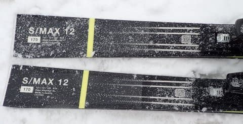

# 2024シーズンモデルのスキー板，試乗レポートその23…SALOMON S/MAX 12

📅 投稿日時: 2023-07-06 01:23:34

🏷️ カテゴリ: [スキー板試乗](c0bd8048615710cee890e403a36cc9a2b.md)

昨日はかなりクリティカルな状況にも

かかわらず．

夕食も食べず，床で一晩寝てしまった

という状況だったわけですが（涙）

昨日の夜は仕事が終わってないのに

寝てしまったため．

今日の大事な打合せの準備が全くできず，

ノーガード戦法で相手と対峙する

という恐ろしい状況に陥ったのですが…

何とか乗り切りました．

よく乗り切った…

このBlogを読んでいる良い子の皆さんは．

「これについてSさんがどうお考えなのか

　じっくり聞かせていただきたい」

という，大勢で個人を1時間以上問い詰めに

来る打ち合わせで，前日寝ちゃってスライドも

資料も全く持たずに乗り切ろうなんてこと，

考えちゃダメだぞ♡

（意味のないハートでごまかす）

しかし．

今日もまだ明日朝イチの宿題が終わってないんだけど．

我ながら，よくこんな状況でBlog書いてるな～…

ってなことで．

昨日はまともに更新できなかったので．

今日は2024シーズンモデルのスキー板試乗レポートです．

今回はサロモン編です．

では，どうぞ～！！

〇SALOMON S/MAX 12 170cm

オールラウンド

オールラウンド板というより，オールマウンテン

板を狙っている板なのかもしれませんが…

今となっては，オールマウンテン系で

センター幅72㎜はかなり幅が狭い部類ですね．

一応，オールラウンド板のS/MAX系としては

最高グレードになるはずのこの板．

試乗したのは，ざぶざぶ雪が冷えて固まって

その上に重い新雪が載っていく最悪の

コンディションで，ちょっと厳しい

状況での試乗となりました．

で，履いた感じですが…

板がすごい軽い！！

滑ってみると，センター太目の170㎝と思えない

軽さで，グリップもそこまでガッツリ食いつく

板でないので，すごく動かしやすい板です．

スピードを出していっても，がっつり食いついて

どうしようもなくカービングしていくというより，

ある程度のルーズさがあり，返りも早くなく

ゆったりした感じの板．

体重や体力がある人ががっつりスピードを

出して切って滑っていくというより，

板の軽さもあるので，体力を使わずに

ゆったりとゲレンデを滑っていく…

という感じの板かな．

ただ，軽くて楽なのはいいけど．

今日のコンディションにはこの軽さと楽さが

災いしてしまい，フレックスが少し柔らかめ

というのもあり…

大勢滑って荒れたざぶざぶ雪がそのまま

固まった難しいバーンでは，ちょいと板が

たたかれてグリップしない感じ…

雪のコンディションが悪すぎたのもあるけど，

スピードを出した領域でもう少し安定感が欲しい．

センター72㎜と太目ではあるけど，荒れた

雪にはもう少し太めでもいいし，重みがあった

ほうが安定感も増すかな～．

でも，軽さと取り扱いやすさで，板の上で傾いて

行くだけで滑っていけるし．

あと，柔らかい新雪っぽい雪にはいいんじゃない

かな～．

残念ながら，この日の試乗コンデションでは

この板は本領を発揮できなかった感じがあり，

この試乗レポートでは，板の持てる

ポテンシャルを正しく表現できてない可能性が

高いので，そのあたりを割り引いて読んで

ください…
