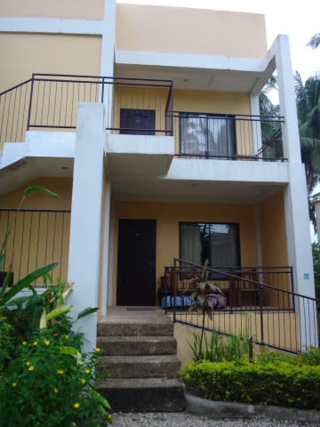
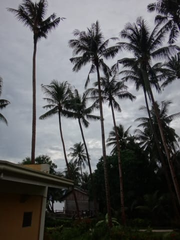
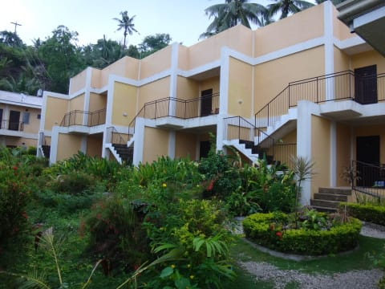
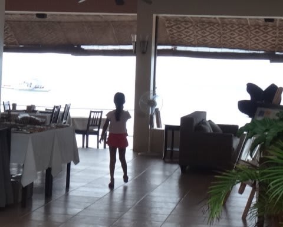
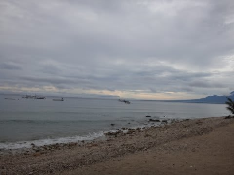
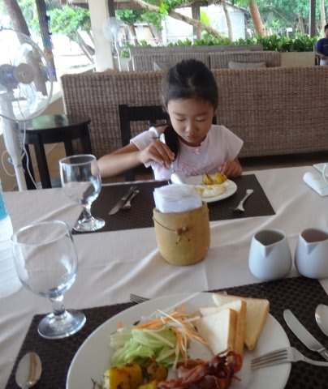
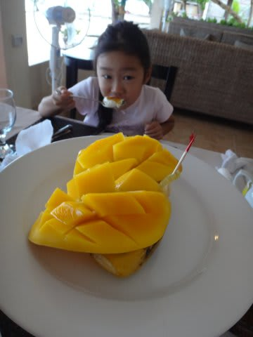
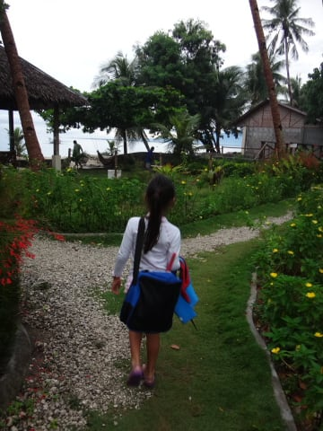
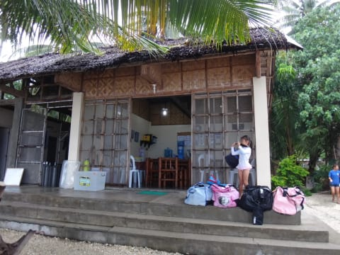
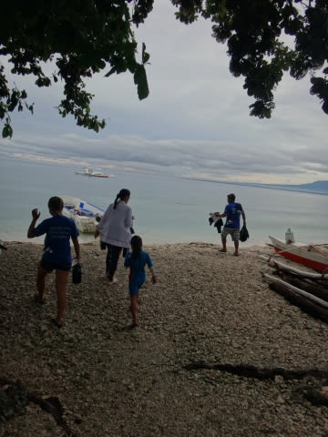

# 2014年8月　オスロブagain…再び，子連れでジンベエザメと泳ぐぞ！　その4

📅 投稿日時: 2014-09-04 01:59:29

🏷️ カテゴリ: [ダイビング日記](ce3a7a8d424d112fce83ee85c81a0e344.md)

ってことで．

ダイビング初日の朝がやってきました．

で．

昨日の到着時に，

「明日はどこに行きたいですか？」

と聞かれたので，

「バリカサグ方面へ行けるなら行きたい！」

とリクエストしておいたところ．

他のゲストも，遠征料金の追加があるバリカサグでも

OKだと言ってくれたようで．

「明日はバリカサグに行きます！」

ということに決まったのですが．

ホテルからバリカサグまでは結構遠く，

船で片道1時間半と，かなりの時間がかかります．

なので．

今日のダイビングの集合は，ちと早目の朝7時15分…

だもんで．

朝6時のホテルの朝食開始時間ぴったりに

レストランへ行こうと，

朝5時半起き…

昨日遅かったので，眠いよ…

で．

部屋の前に出てみると．

…うーむ．

天気はあんまりよくないなぁ…

ちなみに，ホテルのゲストルームの外観はこんな感じで．

ゲストルームは2階建て．1階と2階に3部屋ずつ

同じレイアウトの客室が配置されている，

計6室こっきりの，コンパクトなホテルです．

とりあえず，朝6時に，いつもの海が見えるレストランへ

向かい…

こーゆー感じの，曇り空の海を眺めつつ…

波の音を聴きながらの，ちょっとゆったり気分で朝食です．

うーむ．

天気が良ければもっといいんだけどな～．

そういえば．

毎朝の朝食につくマンゴーがおいしかったな～

で．

食後はダイビングショップへ．

ダイビングショップで，説明を受けますが…

今回，前に来た時は聞かれなかったことを確認されました．

ショップの人「子供さん，普通に乗船だけにします？それとも，　

　　　ガイド付きシュノーケリングにしますか？」

…なるほど．単なる船に同乗じゃなく，子供は

シュノーケリングって手もあるのか！

私　「も，もしかすると…

　　ガイド付きシュノーケリングにすると，その間

　　ガイドさんが子供の面倒見ててくれて，親2人が

　　そろって潜りに行けたりしますかっ！？（期待のまなざし）」

ショップの人「…残念ながら，12歳以下の子供は，

　　基本的に両親のどちらかについていただかないと

　　いけないので…それはできないんですよ…」

…あらら．残念…

私「…ガイド着けても親がいないといけないんですね…

　逆に，親がついてればガイドがいなくても，

　シュノーケリングOKなんですよね…

　だったら，ガイドなしの同乗でいいです」

ってことで．

ガイド付きシュノーケリング（5500円，ライフベストや

シュノーケルセットのレンタルは別料金）ではなく，

同乗（3000円）ということで，今回はお願いしました．

＃ちなみにこのショップ，支払いは日本円

んで．

説明や書類記入が終わったら，

小舟に乗って，ダイビングボートへ乗り込みます…

