# 2月14日の志賀高原は…雪降りながらも，時折晴れ間も

📅 投稿日時: 2015-02-14 23:09:40

というわけで．

本日は（も？），予定通り志賀高原に来ているわけですが．

…今日は．

長野ICでのチェーン規制渋滞に30分以上つかまり．

焼額の営業開始に30分遅れるという屈辱の朝で

始まりました…（涙）．

…しかし，長野ICから先の高速，本格的積雪でしたね～

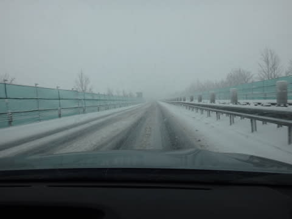

で．

志賀高原に到着すると…

はうう．

なんということだ．

吹雪いてるよ．

何も見えんよ．

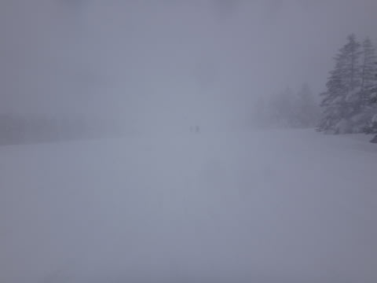

そして，やはり…第2ゴンドラと奥志賀ゴンドラが止まっているよ．

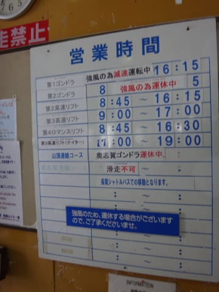

で．

気温はマイナス13から14度と，ほぼ予想通りの

かなり寒－－－－－－－－－－－－い気温で．

…かつ，激しく雪が吹きつけ．

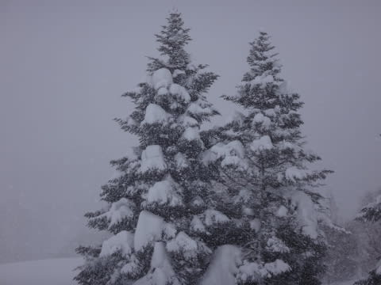

ぐふーん．

テンションダウン…（涙）

…でも．

でも．

雪質はいいのだ！

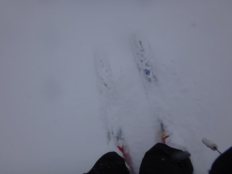

圧雪コースでも，10cm以上，ところによっては20cm以上の

パフパフで…

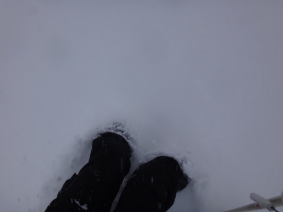

オリンピックコースに飛び込むと…

こ，これは，太ももパフ！？？

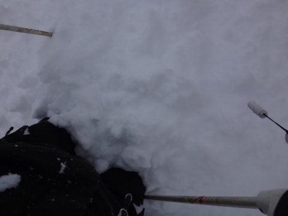

予想ではブーツパフだったけど…

朝，かなり積もったようで．

ふむ．

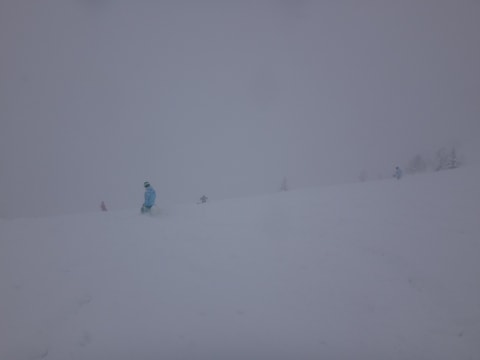

これはっ！

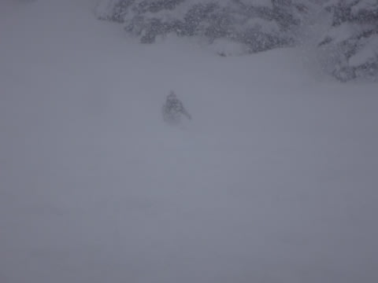

かなり幸せなパフパフだっ！

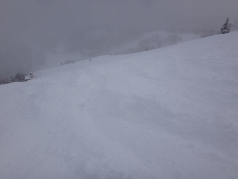

…え，営業開始に30分遅れたのが，死ぬほど悔しい…

で．

ひたすらパフパフを味わっていると．

なんと．

なんと．

終日雪降りの予想のはずが．

10時半ごろから，太陽が顔をのぞかせるタイミングが！

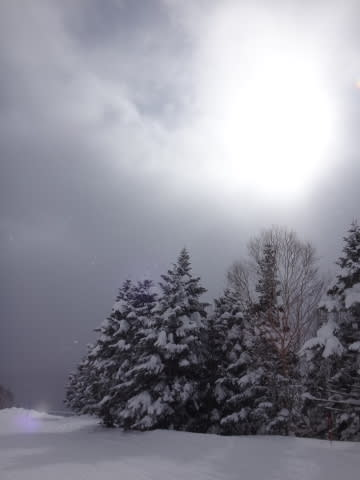

基本的には曇りで，太陽が顔を出すのは一瞬ですが．

時折すっきり視界がクリアに！

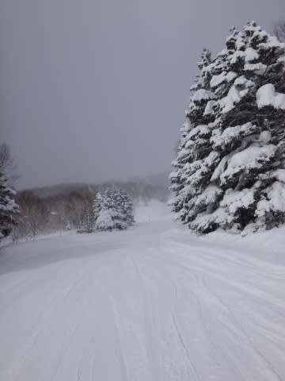

ふわははは．

これは，我が日ごろの行いのたまもの…

と，思っていたところ．

はやや．

あんだ，これは．

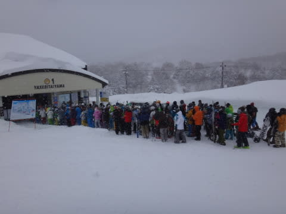

…第2ゴンドラが動いてないので，人が集中する第1ゴンドラ，

10分以上待ち…（涙）．

10時過ぎから11時半まで，1時間半ほど

ゴンドラ待ちが続きました（悲）

で．

天気はやはり，基本的に雪降りだったけど．

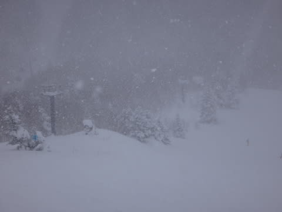

12時ごろには，風も収まったのか，第2ゴンドラも動き出し…

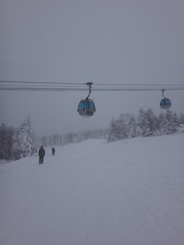

そして，午後は雪が弱まり，

時々日がさすタイミングもあったりして．

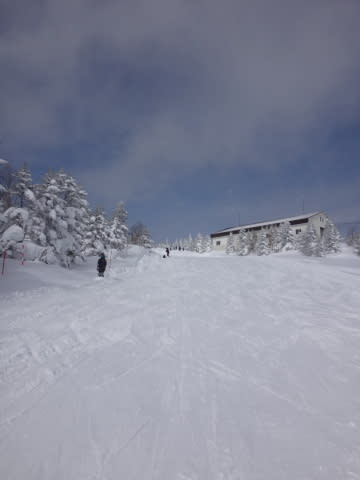

そういうタイミングでは，おいしくコース脇

パフパフをいただいたり…

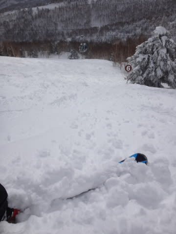

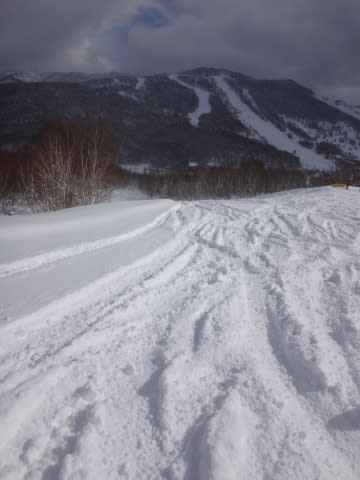

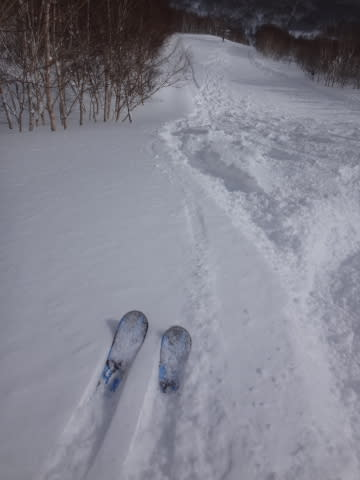

雪質の良い圧雪を堪能してましたが．

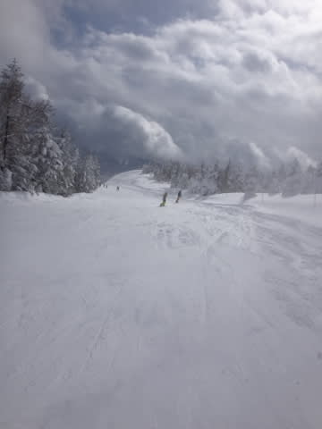

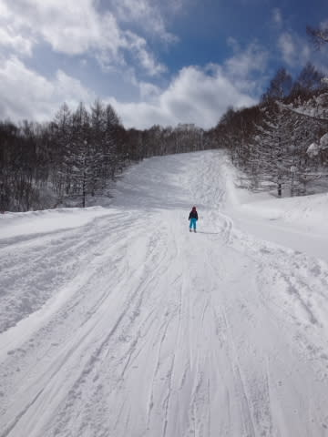

うーん．

でも．

人はちょっと多めだったかな～．

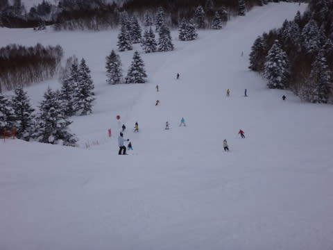

ってことで，夕方は予想通り，ゲレンデはちょっと荒れ初めて

きちゃいましたけど．

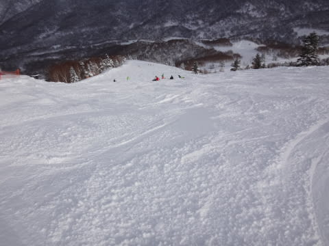

んでも，夕方まで，雪質は冷えひえで最高で．

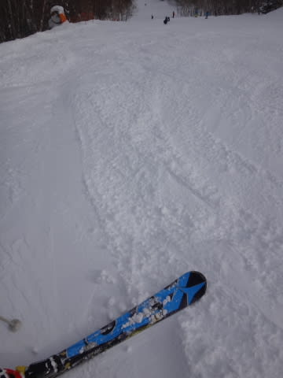

日が暮れるまで，たっぷり楽しめたのでした～！

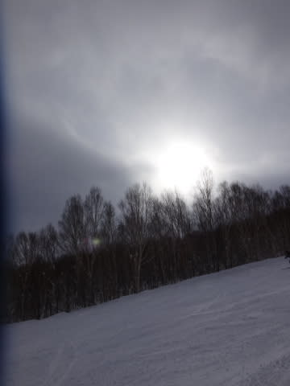

いや，夕方は，意外と天気がひどくなく，

良かったなぁ…

でも．

ここで終わらない．

当然ナイターに繰り出す，Skier_S．

ナイターのタイミングでは，また激しい雪が

降っててですね～．

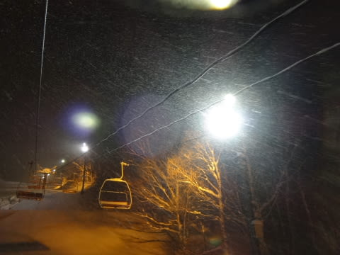

なんだか，圧雪かけたてナイターなのに．

すでに新雪が積もり始めていて

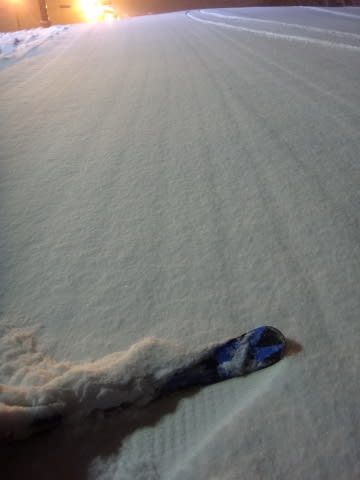

うっすら新雪のぴかぴかバーン！

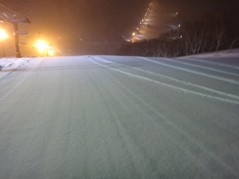

チョー軽い新雪を蹴散らしながらの，快適

がらがらナイターを…

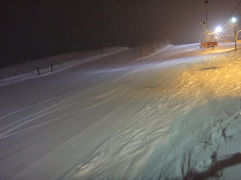

ナイターストップまで

楽しんだのでした！

…今も結構降り積もってるので．

明日の朝は，やっぱりパフパフデーになるかなっ！

## 💬 コメント一覧

### 💬 コメント by (Goku)
**タイトル**: Unknown
**投稿日**: 2015-02-14 23:26:18

あれ～おかしいな～

まだ買っていなかったんですね。太ーいヤツ。

深雪のオリンピックコースを整地並みのスピードで滑って行くＳさん見たいな～（笑）

### 💬 コメント by (はなげの女房)
**タイトル**: ありがとうございました!!
**投稿日**: 2015-02-15 00:13:38

はじめまして!!

ダイヤモンドのナイターご一緒させて頂き、ありがとうございました♪

色々なお話しを伺えて、とても楽しかったです。明日も、パフパフバーンだといいですね！

親分も喜んでました。(もう飲んで寝てますが…)

### 💬 コメント by (Skier_S)
**タイトル**: Gokuさま
**投稿日**: 2015-02-15 18:16:40

…買ってません…

買ってませんのでっ!

…まだ、今のところは…。

### 💬 コメント by (Skier_S)
**タイトル**: はなげの女房さま
**投稿日**: 2015-02-15 18:22:08

昨日のナイターはありがとうございました～！

おかげさまで、楽しめました。

今日は、残念ながらコンディション良く

なかったですね…(泣)

でも、娘が←ここ強調するところ

リフトストップまで滑りたがるので、

４時過ぎまで滑ってしまいました…

今、湯田中で温泉中。

今日も帰宅は深夜パターンです…

また、ご一緒しましょう！

