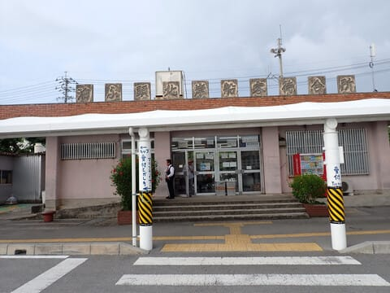

# 2024年8月，今年も座間味で親子ダイビング！その1…いざ出発！

📅 投稿日時: 2024-08-16 01:31:57

この時期，みんなお盆休みをとる人が

多いので．会議もほとんどないため．

いつもに比べればすごい平和な一日を

過ごせるのですが…

朝から夜まで会議が続く普段の日は，

「この会議がなければもっと効率よく

　仕事が進むのに…！」

と思うのに．

実際に会議がない日は，

「あの時できなかったこれをやっておかなきゃ…！」

とか，「時間がある今のうちに，これまで

放置してきたこいつも見ておくか…」

という感じで，気づくと本来やりたかった

ことと違うことばかりやっていて．

せっかく時間があるというのに，

肝心な本業が進んでない

という数日間を過ごしてしまい，

落ち込んでいるSkier_Sです．

ってなことで．今日は座間味ダイビング

旅行記です！！

---

というわけで．

待ちに待った夏休み．

座間味出発当日がやってきましたが…

いつも通り，前日夜中まで仕事を

していたので．

そこからほぼ徹夜で荷物を作り，

睡眠時間2時間で出発（涙）

なぜ，スキーもダイビングも，いつも

睡眠不足で出発することになるのか…

とりあえず．

朝6時過ぎに家を出て．

9時すぎに羽田空港へ到着．

手荷物カウンターやら何やらが

結構混雑していたのもあり．

結構時間がなくバタバタして，

ラウンジでくつろぐ間もなく

10時25分定刻の飛行機の搭乗時間に

なっちゃって，バタバタと搭乗！

うん．

今回の機体はB787だけど…

787-8かな？9かな？正面からじゃわからん…

乗ってみたところ．

これは787-8ですな…

エンジンはロールスロイスのトレントエンジン．

機内エンターテイメントのディスプレイがない，

787としては古めの機体．

飛行機は定刻ちょっと遅れで離陸！

羽田も那覇も，台風やら雷雨やらの

心配がない，快適な飛行でした～！

機内エンターテイメント用のディスプレイがない

国内線機体でも，機内Wifi経由でスマホや

タブレットにつなぐと，映画やら何やらが

サービスされているのが便利だけど…

窓からの景色を眺めるのが好きな私に

とっては，リアルタイムで地図が見られる

のが一番便利…

ってなことで．

飛行機が好きな私と娘にとっては，

一瞬ともいえる2時間ちょいの飛行で，

沖縄上空にやってきて…

定刻ちょい遅れ気味で，那覇空港の

RWY36Lへタッチダウン！

那覇空港で飛行機から降りると…

東京の最高気温36度とか37度とかに比べ，

那覇の方が予想気温が低いものの…

やっぱり暑いよ．

那覇に到着したのは1時過ぎ．

お昼を過ぎたので，那覇空港で

お昼ご飯タイムですね…

知っている人は良く知っている，

那覇空港で一番安く食事ができる

空港食堂でお昼ご飯を食べて．

ご飯を食べ終わったら，泊港へ移動！

今回，ダイビングの荷物もでかいし．

うちの両親を含め全員で5人もいるので

モノレールとジャンボタクシーの

値段がそんなに変わらない…

ということで．

ジャンボタクシーで泊港へ！

空港から泊港までは，タクシーなら

15分ほど．

泊港も，座間味行きの高速船が出るのは

とまりんターミナルではなく，

メインのターミナルから離れた，

こんな感じの寂しい待合室．

タクシーで泊港に着いたのは14時半過ぎ

なので，乗船開始の15時半まで1時間

近くもありますね…

今日は睡眠時間2時間でここまでやって

きたうえ，飛行機は大好きなのでなるべく

頑張って寝ないようにしてきたので…

かなり眠い…

なので，待合室で寝たかったけど．

あんまり寝心地のいい椅子ではないな（涙）

なので．

飛行機も好きだけど，船も好きな私としては，

これから乗船するクイーン座間味が着岸する

のを眺めて…

乗船開始時間になったら，一番に乗船！

16時発のクイーン座間味は，定刻ぴったりに

出港して…

一路座間味へ向かいます！

（[続く](e86399c76375d8de37328d5f1eb8e0788.md)）

## 💬 コメント一覧

### 💬 コメント by (1kamakura)
**タイトル**: Unknown
**投稿日**: 2024-08-16 08:11:06

江戸の秋

わー！始まりましたね♪

飛行機の機種、よくご存知ですね。

私は全くわかりません。

私も飛行機に乗ったら外を見るのが大好きです。地図を画面に表示させて。

絶対眠りませんよー。

窓際で寝ている人の気が知れません😁

外見ないなら通路側でいいやんね。

ダイビング記事好きな江戸の秋です。

楽しみだわ😊

### 💬 コメント by (あかじま)
**タイトル**: Unknown
**投稿日**: 2024-08-16 17:55:19

いつもお忙しい中の投稿（笑）楽しみにしています。

沖縄あんまし行った事が無いのですが

今度阿嘉島行くんです。

本島でも阿嘉島でも

行っといた方がいいとことかありますか？

### 💬 コメント by (Skier_S)
**タイトル**: 座間味はいいですよ
**投稿日**: 2024-08-16 22:01:07

＞江戸の秋さま

始まりましたよ～！

これからまた長いダイビング日記が続きますのでお楽しみに～！！

…でも，このBlogでダイビング日記が一番人気がないですが

＞あかじまさま

人気のないダイビング日記を楽しみにしてくれてありがとうございます．

阿嘉島はかつて20年近く前に行ったのが最後なのですが…

阿嘉島は特にここというところはないですね～．

強いて言えば，ニシバマくらいでしょうか．ゆっくり島を散歩して，

島の雰囲気を楽しむのが一番です！

### 💬 コメント by (阿嘉島)
**タイトル**: Unknown
**投稿日**: 2024-08-17 20:59:36

ありがとうございます。

のんびり散歩しますね！

これからも志賀高原とダイビングとスキー板のお話楽しみにしています！

### 💬 コメント by (Skier_S)
**タイトル**: >阿嘉島さま
**投稿日**: 2024-08-19 21:33:26

夏休みを取っていたので，回答遅れてすみません！

阿嘉島，楽しんできてください～！

もし，かなり時間があってそこそこの距離を歩くのもいとわないなら，慶留間島に

足を延ばしてもよいかもです．阿嘉大橋からの景色もいいし，高良家住宅まで行ってもよいですし…

