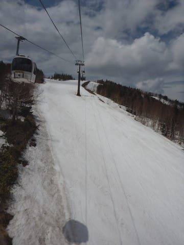

# 今更だけど，このGWの志賀高原，最後はどれだけ雪が残っていたのか…？2019/5/6の志賀高原スキー場の積雪状態を記録に残してみる

📅 投稿日時: 2019-06-04 01:10:03

🏷️ カテゴリ: [スキー雑談](c1f9d2cb7478308da16419928ea3945e9.md)

ホントはGW直後にやりたかったこのネタ．

GW明けの週は，10連休の反動で

悲しいほど忙しく．

結構死んでいたので，記事に

できなかったのですが．

…すごい今さらながらの感があるものの．

今シーズンの積雪状況はどうだったのか…

というところを，今後の記録のために

残しておこうかと思いまして．

今シーズンのGW最終日．

志賀高原の一の瀬・寺子屋・高天ヶ原エリアと，

焼額・奥志賀の積雪状態がどうだったかと

いう記録を．

ちょっと書いておきましょうか…←どうしようもない今さら感にあふれまくって

いるんですけど…こんな記事を今読みたい人いるのか！？？

まず．

わがホームゲレンデ，焼額．

昨シーズンから春営業が

第1ゴンドラになりましたが．

昨シーズンは雪不足で，GW前に

ほぼ死に絶えたため．

実体として，焼額の歴史上初めて

GSコースがちゃんと滑れるGWと

なりました…

営業最終日，5/6の朝のGSコースは…

山頂は全面雪たっぷり．

朝はコース途中も全面真っ白だし…

全く土が出てくる気配はなく．

いつも一番最初にブッシュが出始める，

雪付きの悪い右ターンの落ち込み部分も

ブッシュの気配なし！

ただ，最終日の夕方，営業終了時．

ゴンドラをくぐったあたりの

コース真ん中部分，わずかにブッシュが

出始めてきましたね…

とはいえ，一番下の部分もまだ全面

真っ白だし…

ホテル前も，ようやっとわずかに

土が出始めてきたかな…

という感じで．

雪不足だった昨シーズン並みの根性で

雪を寄せれば，まだまだ1-2週間は

イケるんじゃないか？？？

という感じだったので．

こんな状況で営業終了にするのは

スキーの神様に申し訳が立たないのでは？

と思うような状況でした…

焼額のパノラマコースも．

GW最終日まで，幅いっぱい真っ白！

全く問題なく滑れたので…

このコースも，あと1週間は

いけそうな感じでしたね．

サウスコースの麓に近い部分も，

わずかに右側に土が顔を出し始めた

くらいだったので．

あぁ…

なんでこれで営業終了しちゃうのかな…

と，涙を禁じえませんね（泣）

焼額の唐松コースは．

例年なら，意地でもGWまでもたせるために，

人工雪をたっぷり載せるのですが．

今シーズンは1ゴンが滑れるよう，

GSコースに人工降雪を集中したのか．

このコースが一番雪が少なかったですね…

右側に結構土が出てきてたし．

一番最後の落ち込み部分．

真ん中にポッコリ穴が開いちゃいました…

まぁ，このコースは真南を向いているので．

人工雪が無ければ，速攻で雪が解ける

斜面と考えれば，良くもった方か…

でも．一番下のリフト前．

ここに全然土が出てくる気配が

なかったところに，今年の春の

雪の多さを感じさせますね…

ただ，遠くから眺めてみると．

GW前日にクローズとなったオリンピックコース．

この写真で赤く囲った部分ですが…

さすがにこれは全然ダメですね．

GWの，まさに一日前まで滑れたのに，

10連休の間に一気に雪解けが

進みましたね～．

まぁ，人工雪を全くつけてない

南東向きバーンですから．

良くここまでもったというべきか…

そして，雪出し用にあえて4月1週で

クローズした，白樺＆ブナコース．

ここも，人工雪を全くつけてないうえ，

南向きの日当たりのいい斜面ですから．

ちょっとダメな感じですね…

そして．

次は奥志賀を見てますが．

ここは人工降雪機が無いので，

GWまで滑れるかどうかは自然の

天候勝負となるわけですね．

まぁ，北向きなので，焼額より

雪は融けにくく，長持ちしますが…

まず，ゴンドラ側のダウンヒルコース．

山頂付近は完全に全面真っ白ですね…！

そして．

最近では春の奥志賀の名物（？）と化している，

圧雪車の故障．

なぜか毎年，この時期になると奥志賀の

圧雪車がどこかでぶっ壊れて息絶えて

いるんですが．

今シーズンは，ダウンヒルコース

1壁下で壊れてましたね…

いつもはGWになると，そろそろ

ヤバさを醸し出す2壁も，

かなり白く見えますが…

でも，近くで見ると．

そろそろ穴が開きそうな感じでした…

ダウンヒルコースの麓付近は，

やっぱりかなり土が出てきてますね…

コース上は雪が残ってますが．

ゴンドラ乗り場前は，もうそろそろ

ヤバいかな…

という感じ．

でも，雪出しすれば，あと1週間は

イケたんじゃないかな～．

で．次は．

奥志賀のリフト側，エキスパートコース．

いつもなら，GWのこの時期．

夕方になると，コブ溝にヤバい

ところが出てくるのですが．

今シーズンは全然大丈夫でしたね～！！

下の緩斜面，第1ゲレンデも

まだ完全に全面雪が残ってたし．

…これ，雪出しとかしなくても，

問題なくあと1週間は営業できたのでは？？？

…なんてったって．

昨シーズンのGWはこんな状況に

なっても営業してたんだし…

（以上2枚，2018シーズンGWの奥志賀）

うーん．

あと1週間は営業してほしかった…

続いては，一の瀬ファミリー．

ほぼ全面真っ白に見えますが．

正面バーン上部を拡大すると．

ちょっと土が出始めているように

見えますね…

近づくとこんな感じで．

もう穴があきはじめてました…

ただ，下半分は，

真ん中部分に大きな穴が一か所

開いているところを除くと，

まだほぼ全面雪に覆われてましたし．

うーむ．

これも，あと1週間は問題なく

営業できた感じ…

勿体ない…

勿体なさ過ぎる…！！

ちなみに，パノラマコースも全く

ブッシュが出てくる気配はなく．

天狗コースもまだまだ滑れそうでした…

ただ，GW前半で終わっちゃったパーフェクターコース．

ここは，コース上部がほぼ途切れかけてますね…

でも．

早い時期には，4月上旬で終わるこのコースが，

GWまでもっただけすごい…

次は，一の瀬ダイヤモンドスキー場．

上部に結構土が出て，ちょっとヤバそうな

感じに見えますね…

でも，人工雪を着けてあった

クワッドリフト沿いは，

まだまだ雪の厚みがある感じでした．

そして，次は高天ヶ原．

残念ながら，モーグルバーン側の上部は

雪が途切れていて．

モーグルバーンそのものも，

かなり土が出てダメな感じに

なってました…

でも，メインバーン側．

いつもなら，GWはNHKバーン側に雪を寄せて，

それ以外のコースはクローズするところ．

今年は雪寄せはされず，全面OKでした！！

いやーーー．

これが営業終了の日の写真とは思えない…

で．

ラストは寺子屋！

まぁ，ここは人工雪もないし．

風にさらされて，トップシーズンは

雪が飛ばされるばかりで全く積もらない

スキー場ですから．

それを考えると，

標高が高い，日当たりの悪い西斜面

とはいえ．

よくここまでもったもんだ…

という感じでしょうか．

…これもその気になれば，

まだ1週間以上営業できそうな

感じ…

という感じで．

焼額・奥志賀・一の瀬エリアとも．

あと1-2週間は営業できたのでは？？？

と思った今シーズン．

うーん．

GWで終わってしまったのが惜しかった…

おそらく，このあとしばらく．

志賀高原上空を，大量のもったいないお化けが

覆っていたことでしょう…
