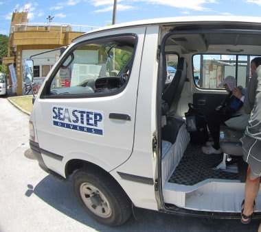
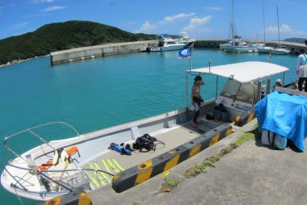
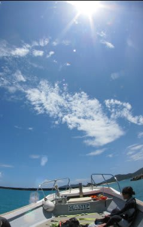
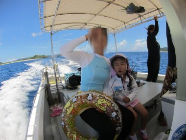

# 2012年7月　子連れ座間味ダイビング旅行記3　慶良間のダイビングスタート

📅 投稿日時: 2012-07-30 00:55:00

っつー感じで．

宿について昼ごはんをかきこんで，ダイビングの準備を済ませたら．

1時半，ダイビングショップのお迎えの車がやってきたので，港へ向かいます．

…実は本日．

当初予定のダイビングショップ，ザマミセーリングさんは残念なことに満員らしく．

本日午後の2本のみ，「シーステップ」さんを利用することに．

このショップも「子連れ乗船可能」ということだったので，

…ただ，このショップ．

朝から夕方まで海上で過ごすザマミセーリングさんと違って，

1本ずつ港に戻ってくるパターンで，船はちょいと小さめ．

ということで．

船は和船タイプですね…．

どーでもいいですけど，またまた船を見て超ハイテンションな娘．

…おまえ，どんだけ船が好きなんだ？？？

娘ともども船に乗り込んで，いざ，慶良間の海へ！

船は娘と妻とを乗せて，慶良間の海を進みます．

娘は船に乗っているだけですげー嬉しそうなんですけど．

…そこまで船，好きか？？？

まぁ，船が嫌いに育ったらダイビングに連れて行けないわけなので．

船が大好きに育って良かったと言う事で…

で．

船は5分ほどでポイントへ到着．

本日のダイビングは．

いろいろな厳正かつ公正なる話し合いの結果，

妻が娘番で，私が潜りに行くことに．

さーて．

今シーズン初のダイビング．

毎度ながら．

8ヶ月のスキーシーズン中はまったくダイビングをしない私．

シーズン始めの1本は，だいたい10ヶ月ぶりくらいのブランクダイバー

なわけですね～．

10ヶ月だなんて．

たとえば，私が10ヶ月スキーしなかったら．

「スキーって，どうやって滑るんだったかなぁ？」

ってのは確実に忘れちゃいますし．

「スキーって，どっちが前なんだっけ？」

ってことまで忘れてしまいかねないレベルです．

＃どんだけ記憶力悪いんじゃ

ちゃんと潜れるかなぁ…

レギュレータをくわえ，エアが来ていることを確認したら．

バックロールでGo!

どぼーん．

南国の暖かい水が，体を包む久しぶりの感覚！

ああ．またこの海に，戻ってきた…
