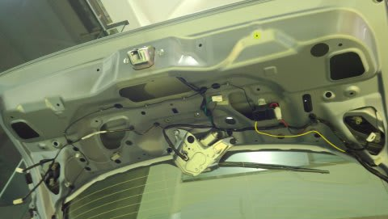
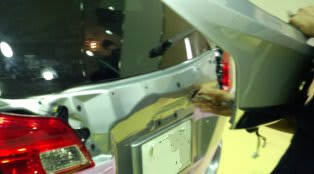
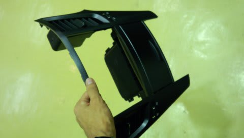
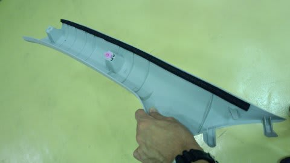
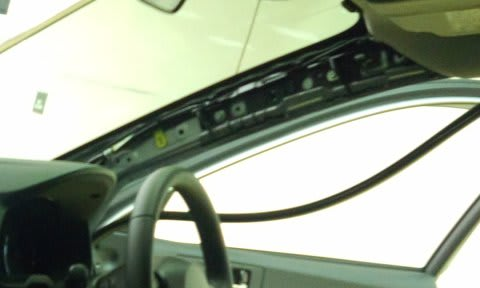
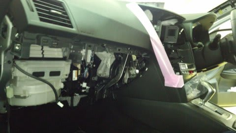
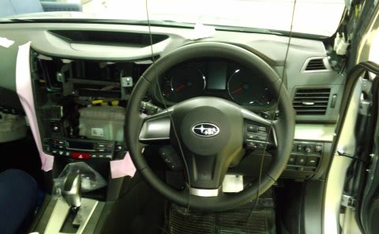
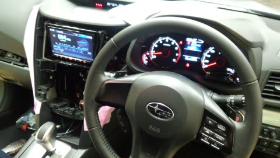
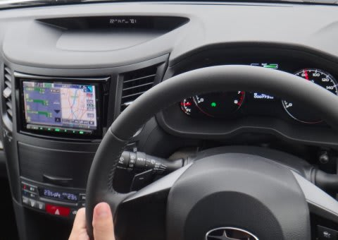

# プロジェクトX第2章…ナビが付いたよ

📅 投稿日時: 2013-06-20 01:35:57

🏷️ カテゴリ: [車](cba0e8330b3f2ded7c1addfacc75d4547.md)

えー．

月山スキーネタでしばらく中断してましたが．

プロジェクトX第2章，復活です．

前回，[ナビを購入した](e09e2ec6505c6a1935719a3fdc95d554d.md)ところまで紹介しましたが…

今回，月山に行くために，急ぎでナビ取り付けました…

で．

本来であれば，自分で取り付けようと思っていたんですが．

…ですが．

時間が無かったのと．

内装やガーニッシュのはずし方が分からない部分が一部あったので．

…

…恥ずかしながら，今回は業者さんに取り付けをお願いすることにしました…(恥）．

ということで．

今回．仕事が終わってからの午後7時以降の取り付けという，

かなり無謀なリクエストだったのですが．

わがままを聞いてくれる業者さんだったので．

夜7時半から作業開始です．

まず，バックカメラの取り付けからスタート！

リアゲートの内張りをはずします…

そして，自分で取り付けをあきらめた原因のひとつ，

リアガーニッシュの取り外し．

ねじ12箇所だったか14箇所だったか，エクステンションをつけないと

回せないような奥深くのねじを多数はずしたあと．

さらに，なかなか頑丈に留まっているクリップを，

大人二人がかりで強引に引っ張って何とかはずすという力仕事．

…これは自分一人では難しいわ…

はずしたガーニッシュに，リアカメラを取り付けて，

ゲートの内側を配線．

その後，今度はナビ本体の取り付けへ．

センタークラスターを取り外します．

そして，自分で外そうと思って外せなかったAピラー内張りを外します．

うーむ．

Aピラーには，カーテンエアバッグユニットが入るので

普通のクリップ止めじゃないんだな～．

これは外せなかったわけだ…

あとは，グローブボックスまわりも外し…

そこから，ガシガシ配線を始めます．

…やっぱりプロは手際がいいのお…

ETCアンテナと地デジアンテナは，アイサイトカメラの邪魔にならないフロントガラスへ．

GPSアンテナは，純正ナビでの取り付け位置のインパネ内側に固定．

あとは，車速パルス＆リバース＆パーキング線を運転席足元のオプションコネクタから，

電源＆スピーカ線その他をオーディオコネクタから，

FM,AMアンテナ線を助手席足元から引っ張ってきて，ナビに取り付け．

この時点で，一回起動させて動作チェック．

…オプションのHDMIケーブルのコネクタがちゃんと刺さってなくて，

映像が映らないというミスがあったものの．

さすがプロ，オプション以外の通常配線はミス無く一発で動作しましたね～．

ってことで．

あとは元通りくみ上げて．

無事，取り付け完了！

作業時間は3時間ちょい．

夜10時半ごろ終了でした…

今回，難関だったAピラー内装のはずし方とリヤガーニッシュの

外し方も分かったし．

次からは，自分でナビをつけられるのだ！←ナビがついちゃった車に，さらにナビをつける気か？
