# 2024/4/6(土)の志賀高原スキー場は…終日晴れ＆高温．朝はそこそこ冷えたけど日が当たるところはザブザブ，日が当たらない西斜面は結構もったよ

📅 投稿日時: 2024-04-07 00:35:03

ってなことで．

本日も睡眠時間3時間弱で志賀高原に

やってきているので…

本日の志賀高原レポートです！！

今日から朝6時からの早朝営業をやっていた

わけですが．

さすがに早朝に間に合うよう，徹夜で

家を出るわけにはいかず．

通常営業開始の８時前に焼額に到着しますが…

道路は完全ドライで，スタッドレスタイヤが

なくてもこれちゃうレベルですね…

春ですね…

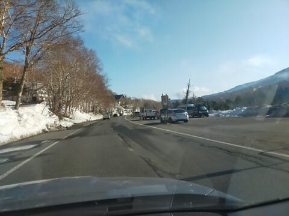

焼額第1ゴンドラ駐車場は，早朝営業の

お客さんでかなり混んでましたが…

通常営業待ちはわずか数人だけ．

みんな早朝から滑ってるんだなぁ…

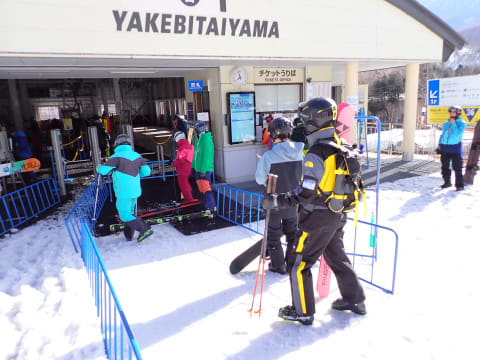

で．朝８時の通常営業開始のゴンドラに

乗り，山頂へ着くと…

朝８時から気温はプラスですね（涙）

まぁ，予想してましたが，

実際に朝からプラス気温だとちょっと

テンションダウン（泣）

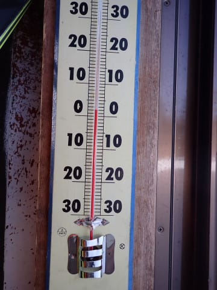

朝から晴天なのは悪くはないけど…

日差しで朝から雪は緩んでるし（涙）

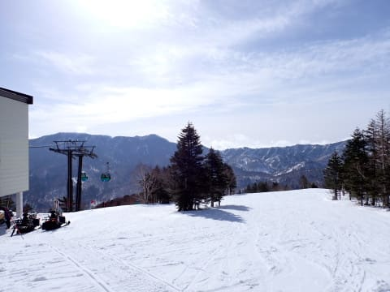

さらに早朝6時からゲレンデはオープンして

いるので．

早朝のバーンは硬かったらしいけど，

通常営業開始時にはすでに緩んだ上に，

多くの人に蹴散らされて…

朝8時だと，早くもちょっと荒れ気味の

雪ですね（泣）

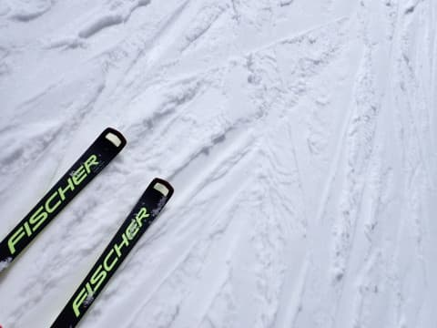

いや．

今日はこんなに晴れなくてもいいんですけど…

むしろ雪が解けないよう，曇ってほしい…

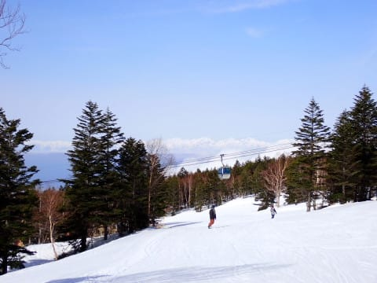

今日は朝８時には，GSコースもパノラマ・サウス

コースも緩み気味だったけど．

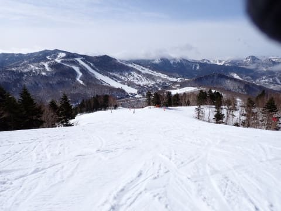

でも，朝日が当たるのが遅れる唐松コースは，

９時ごろになっても緩まず，しっかり硬めの

バーンコンディション！！

朝９時過ぎまで，第２高速沿いの唐松コースを

ぐるぐるしてました…

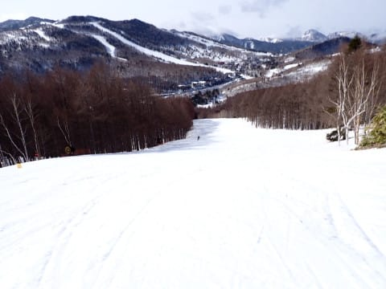

で．

今日はとあるミッションのため，久しぶりに

焼額を脱出し，一ノ瀬方面へ向かいます！！

山の神リフトが動いてないので，

焼額→一ノ瀬は車かバスで移動するしか

ないのがすごく残念……

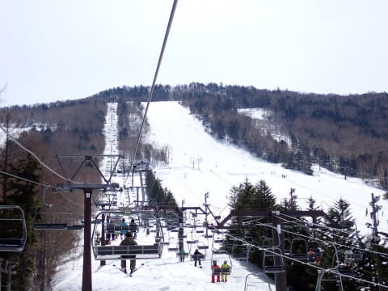

で．

一ノ瀬へやってきましたが…

朝９時半ごろの一ノ瀬正面バーンは，

朝日が当たらない西斜面なので，

昨晩固まったバーンがまだ緩んでない，

硬めのバーン！！

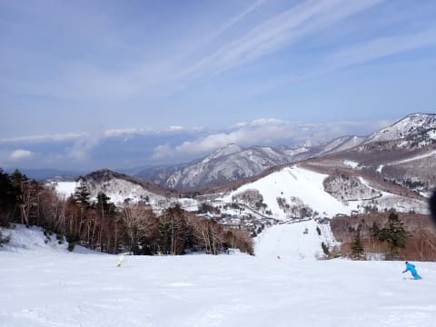

硬めだけど，表面は適度に緩み始めてるので，

エッジが効く感じの比較的すべりいい

バーン状態ですよ！！

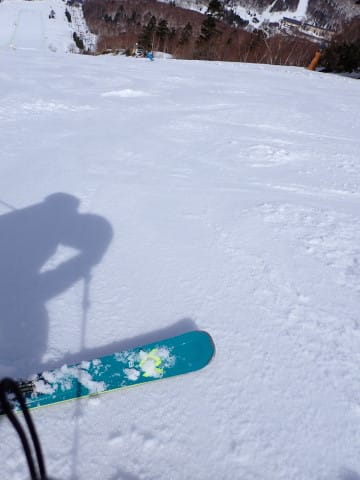

パーフェクターコースも，入り口部分に

多少土が出ているものの，

コースは十分雪があって

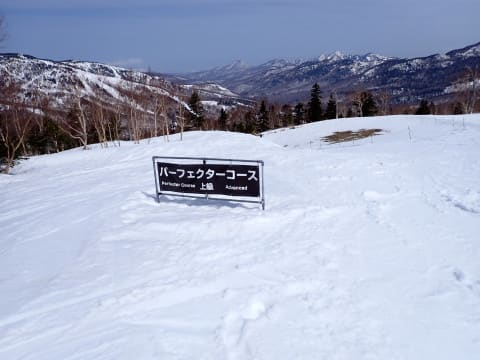

雪不足の年は，４月上旬に雪がヤバくなる

ことを考えると．

３月の積雪がかなり救いになったことが

よくわかる感じで，

これ，まだまだパーフェクターコース

行けそうですね…！！

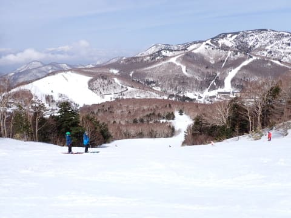

そして．

朝10時近くになってもまだフラットで，

雪も締まっていて，全然滑りやすい

ですよ…！！

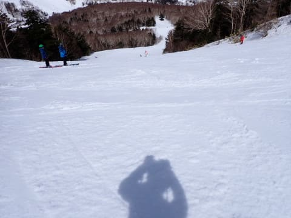

これだけいい感じなのに，

リフトは全然混んでませんね…

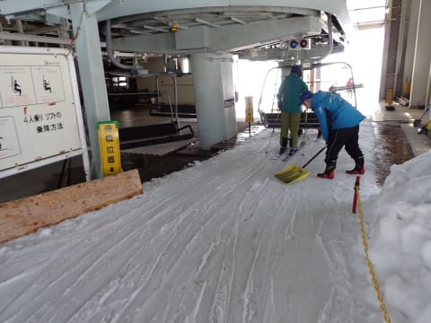

そんなに混んでないのは，正面バーン下部の

一番おいしい真ん中が競技用にクローズされてて

滑れないから，人が来ないのかな…？

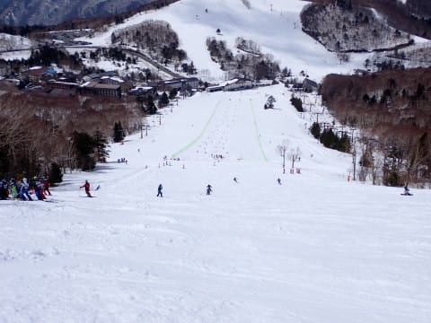

それでも，昼の12時を過ぎても正面バーンは

全然荒れてなくて…

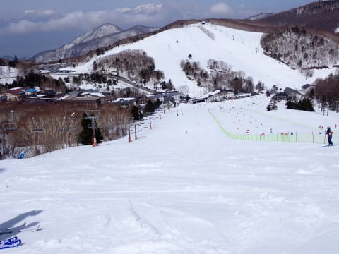

結構飛ばせるフラットバーンのままで

いてくれたし．

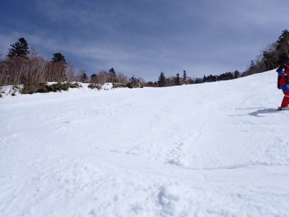

パーフェクターコースも，昼過ぎくらい

まではフラットでいてくれました～！！

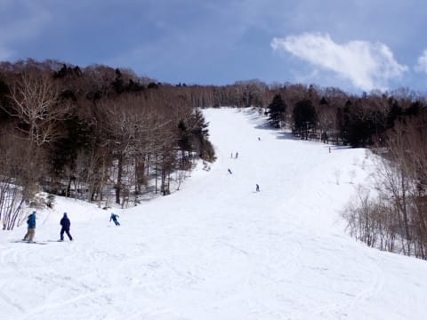

ただ，日差しが強く，気温も高かった本日．

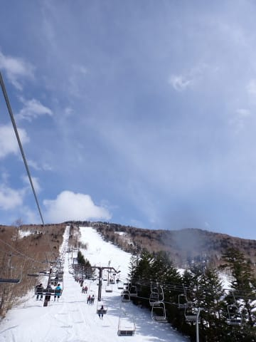

さすが午後1時ごろには緩んだ雪が荒れ始め…

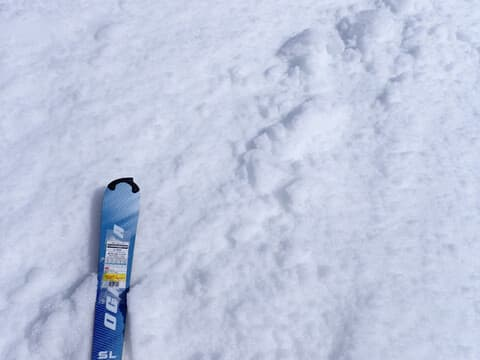

午後2時には，パーフェクターとりつきも

結構荒れてきたし．

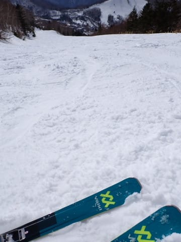

パーフェクター中盤も，結構凸凹に

なってきちゃいました…

でも，ひどくザブザブのコブコブに

なってないのがまだ救い！！

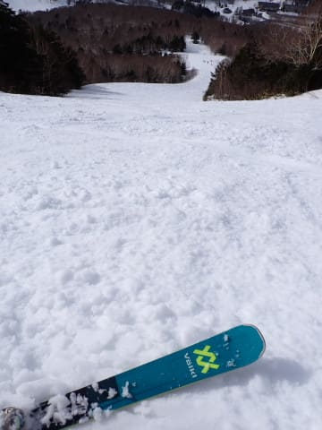

ただ．

さすがに午後3時を過ぎると，

一ノ瀬正面バーンも真ん中部分はかなり

コブ斜面になってきて…

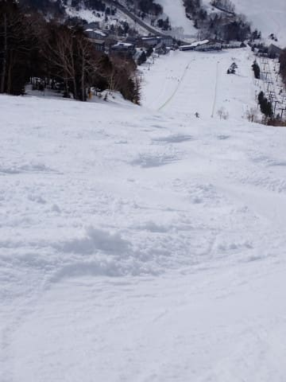

午後4時20分の営業終了の直前には，

正面バーンはほぼ全面コブか小回りレーンに

なってきてました（涙）

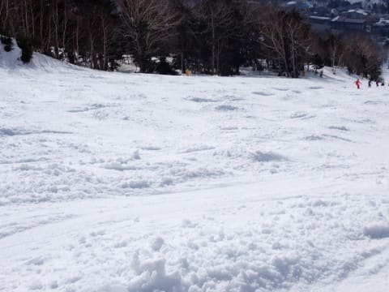

でも，今日は終日晴天だったうえ，

昼過ぎまで比較的しまったフラットバーンを

滑れたので，まぁ良かったということに

しておこう…

と．

なぜか上から目線の感想を抱きつつ．

今日も一ノ瀬の営業終了4:20まで，

ひたすら昼休みも取らず滑り倒したのでした…

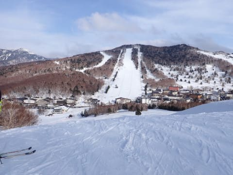

でも．

今日は唐松や一ノ瀬は，通常営業でも

かなり締まったバーンを滑れたけど．

今晩は氷点下に落ちなさそうなので，

明日は朝から雪が緩そう…（涙）

明日も早朝は行かず，通常営業から

参戦予定です！！

## 💬 コメント一覧

### 💬 コメント by (副院長)
**タイトル**: Unknown
**投稿日**: 2024-04-07 10:35:31

ん？オガサカの板！物欲の調査ですね。オガサカの小回り、いかがでしたでしょうか？また、インプレッション報告。楽しみに、いています。

### 💬 コメント by (雪山じいじ)
**タイトル**: Unknown
**投稿日**: 2024-04-07 16:42:04

横手山は１０時までカリカリの

アイスバーン状態でした。だから

フォルクルレ―スタイガーＲ３０でも

オガサカＴＣ―ＬＦでも楽しめました。

渋峠はシャバ雪でしたが楽しめました。

### 💬 コメント by (いか)
**タイトル**: Unknown
**投稿日**: 2024-04-07 23:57:00

土曜日は早朝から昼すぎまでお邪魔しておりました。見かけないなーと思ってたら、やはり試乗会でしたか〜。

6時〜 電撃ビリビリバーン、7時〜 しっとり快適バーン、8時〜 2ゴン沿いシマシマ、9時〜 2高沿い固めバーン、10時〜 コブから回り込んで3高沿いで昼過ぎまで、という回遊でした。早朝から滑れて満足度高かったですね！

### 💬 コメント by (Skier_S)
**タイトル**: 火曜夜は雪になるかも？
**投稿日**: 2024-04-08 01:53:19

＞副院長さま

はい．物欲を刺激されに行ってきました…

というより，ブログネタの収集といった方が正解ですね（笑）．

＞雪山じいじさま

横手山は10時まで硬かったんですね…

さすが標高2300m！

＞いかさま

土曜いらしてたんですね…

残念ながら，私は9時過ぎに焼額を脱出してました．

早朝は最初はマッサージバーンだったけど，途中から良かったみたいですね．

気温は高かったけど，雪はストップ雪ならなかったし，結構楽しめた

一日でしたね．

