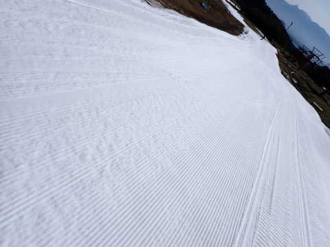
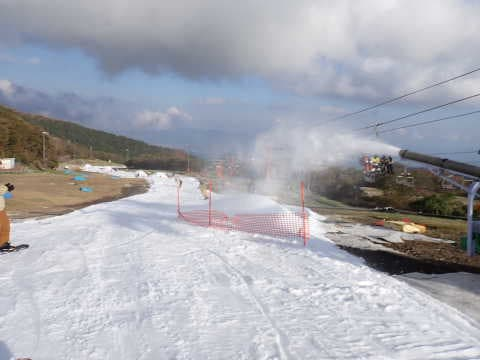

# 2022/10/23(日)イエティ滑走詳細レポート！…2023シーズン，ついにスタート！晴天だけどいつも通り混みぎみ…

📅 投稿日時: 2022-10-25 03:16:17

🏷️ カテゴリ: [2023スキー滑走日記](cd943df30cfcc3d0896469e2ff98720cd.md)

えー．

本日24日朝．

志賀高原では結構雪が積もったらしく…

横手や渋峠はかなり白くなったようです！！

（[横手山ホームページ](https://yokoteyama2307.com/news/18525/)より）

25日までは冷えるので，横手では

人工降雪が打てそうですが…

その後，そこまで冷えなさそうなので

11月3日まで雪がもつかな？？

うーん．

とりあえず，横手がホントに11月3日に

オープンできたら，すごいことだな…

ってなことで，本題へ．

昨日速報した，2023シーズンオープン週の

日曜，10月23日のイエティでの初滑り，

詳細レポートです！

えー．まずは．

今シーズンもやってきました，Yetiへ！

9時からオープンで，8:40の段階では，

リフト券売り場の列は無く．

そのかわり，入場ゲートの開き待ちの

列がかなり伸びてました…

ちなみに，今シーズンは土日は一日券が

4500円ですが…

メルマガ会員は400円引き．

そして2回目，4回目，6回目は半額サービス

ってのは今シーズンも残りました！

…半額サービスは大きいので，残って

くれて良かった…

で．

9時にゲートが開き，入場！

そして…

やってきましたよ．ゲレンデへ…！！

来たぞ，来ましたよ～…

うわーーーー！！

うひょーーーー！！

雪だ…

これは…

雪だっ！！！

長らく夢に見た雪がここに！！！←アイスクラッシュの氷だってば

ぐおーーーー！

実に久しぶりの感触！！！

6月11日に月山で滑って以来．

約4か月と10日間…

実に久しぶりに，雪の上に

戻ってきたよ！！！←だから，雪じゃなくアイスクラッシュの氷だってば

そして…

あさイチはガラガラですよっ！！！

好きなライン取り放題！！

そして，硫安でいい感じに締まったバーン！！！

ぐほほほほ～！！

気持いいっ！！

すばらしいっ！！！

良いのか？？

シーズン一本目から，これでいいのか？

こんな気持ちよくていいのか？？

もう，例年シーズンの1本目は大事に滑ろうと

思ってるんだけど…

ダメだ．

そんな理性は見事に吹っ飛び，快楽のまま

滑るっ！！！

そして，リフトも朝のうちは飛び乗り！！

さらに朝の30分ほどはガラガラ！！

シーズン初めからこんな晴天ガラガラで…

もう，理性はどこへやら．

最初から全力で飛ばしまくる！！

…と，気持ちよかったのも9時半くらいまで．

9時半を過ぎると，人が増えてきて…

あぁ…リフト待ちも伸びてきちゃった（涙）

そして．10時を過ぎると，ゲレンデは

だいたい平均的にこんな人口密度に

なっちゃって…

あさイチに比べると，快感度が著しく

低下…（泣）

そして．リフト待ちも伸びてきて…

午前11時ごろ，最大このくらいまで

伸びましたね～…

まぁ，この日は平均的にこのくらいの

待ち時間．3分から最大6-7分待ちって

ところでしょうか．

でも，朝10時から並行するペアリフトも

動いていて．

こちらは待ち時間0だったので，

リフト待ちはそんなに気にならなかったかな．

ただ．

やっぱり気になるのは，ゲレンデの人口密度．

結構人が固まるタイミングや…

時折，自分の前の人が少な目になる

タイミングもあったりしますが．

やっぱり人は多く，あさイチのように

気持ちよくかっ飛ばすことはでき

ません…（涙）

でも，

昼休み時間の1時間くらいは人も少なめで，

リフト待ちも短かったし．

終日天気も良く．

ちょっと雲が多い時もあったけど，

暖かくて穏やかな一日だったし．

晴天の日は日差しで雪が解けて，

午後になると雪があれて穴が

開きまくる時があったりするけど．

今回は夕方になっても雪はそこまで

ザブザブにならず，ひどい荒れ荒れ

バーンにはならなかったし．

夕方16時の整備直前でこれだったら，

バーンの状況としてはいい方だな～…

ただ，リフト乗り場手前の落ち込み

部分だけ，ちょっと雪が薄いところが

出てきたけど…

でも，穴が開いちゃったような場所は

最後までなかったです…

ってなことで．

16時から，コース整備のために1時間

コースクローズとなりますが…

いきなり初日から，22:00までナイター

営業があるわけですから．

ここは当然，17時のナイターの

営業開始を待って．

17時のナイター営業開始に飛び込む！！

うはーー！！

今日2度目のシマシマ！！

シーズン初日から，こんなシアワセな

シマシマを2度も滑れるとは…！

ってな感じで．

ナイターも開始2-3本は人が少なくて，

気持ちよく滑れるはず…

と，思っていたら．

意外とすぐに人が増えてきて…

ありゃ？？

2本目で，すでに気持ちよく滑れる

人口密度を超えてました（涙）

さらに，コース上の人口密度は

上がる一方で…

これ，昼間より混んでない？？

薄暗い中，この人口密度で，

これだけの狭いコースを滑るのは

ちょっと怖い…（泣）

そしてとどめ．

リフト待ちが，昼間より伸びてるんですが…！！？？

いや…

昼間より混んでて，そしてリフト待ちが

長いのは耐えられない…

と，ナイターは1時間だけとして，

「初日だから，このくらいで許してやるか」

って感じで．

18時には切り上げたのでした…

しかし．

ナイターは混んだものの．

昼間はリフト待ちはそこまでひどくなく．

天気が良かったのに，雪もそこまで

緩まず，バーンも思ったほど荒れ

なかったし．

朝9時から18時まで，約50本ほど

リフトに乗れたし．

シーズン初日としては，かなり満足な

一日を過ごせたのでした～！！

いやーーー．

久しぶりに滑ったけど．

やっぱりスキーって，楽しい…

やっぱり自分にとっては，

スキーLOVE♡

ですね…

ってなことで．

私の2023シーズンが無事に始まりました～！！

## 💬 コメント一覧

### 💬 コメント by (西舘)
**タイトル**: Unknown
**投稿日**: 2022-10-25 12:33:50

良かった!ほんとに良かった！

無事のシーズンインおめでとうございます!

そして青四郎くん頑張ってますね。

### 💬 コメント by (Skier_S)
**タイトル**: ＞西舘さま
**投稿日**: 2022-10-26 02:55:48

無事シーズンインできました～！

四朗君は，このYetiで最後のご奉公です…

