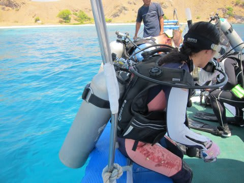
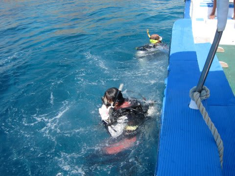
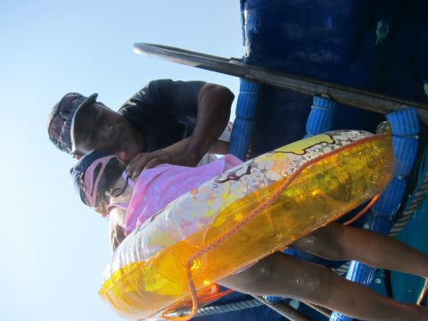
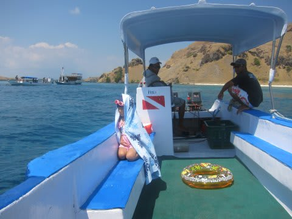
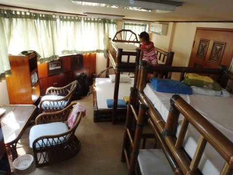
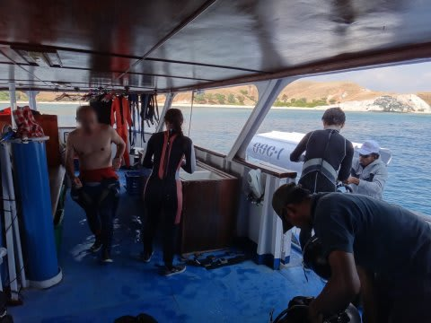
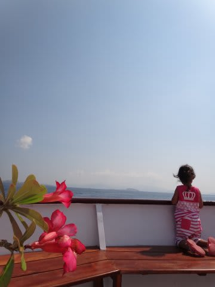
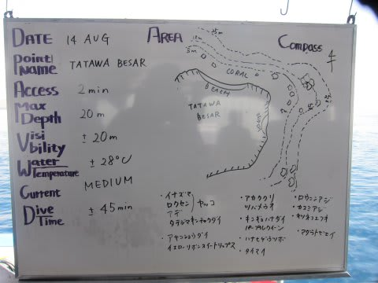
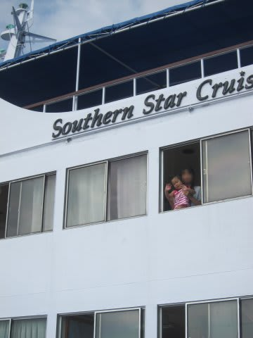

# 子連れコモドダイビングクルーズagain　その5　娘，意外とヘタレだった…

📅 投稿日時: 2011-09-01 00:36:05

🏷️ カテゴリ: [ダイビング日記](ce3a7a8d424d112fce83ee85c81a0e344.md)

ということで．

娘は海水浴のため，ダイビングボートに一緒に乗り込み．

ママがエントリーするのを見送ったあとは…

今度は娘がエントリー！

…

しかし．

去年は喜んで泳いでいたのに…

今年は．

海に漬かった娘から，驚きの発言が！！！

娘「怖い～！サンゴが足に刺さりそうで怖い～」

えっ？

確かに，海の透明度はかなり高いので，足元にサンゴは見えるけど．

こ，ここは深度5m以上ありますがな．

あれが足に刺さるって，どんだけお前足が長いっちゅーねん．

お前の足は，5mもあるんかい！！！

…それを娘に説得しても

「怖いー．サンゴ足に刺さりそうで怖いー．あがる～」

と，浮き輪につかまったまま，なんとか水面から足を出そうと

必死に反り返る娘．

浮き輪につかまったまま反り返っている娘を，見ている分には面白いんですが…

…結局．10秒でリタイヤ．

船に上がります．

底にサンゴが見える海がダメとは…

予想外！！！

ということで．

すぐにボートに戻ってしまい．

うーん．さすがにこれから1時間，ダイビングが終わるみんなを

ボートで待つのはつらいなぁ…

娘「お船に戻りたい…」

ということで．

ボートスタッフにお願いして，本船へ．

娘のために，K村さんが気を使ってくれた，

スペシャルなダイビングボート同乗だったんだけどなぁ．

…ダメじゃん．娘．

あとは，本船で妻が戻ってくるのを待つばかり…

娘は，お部屋のはしごを嬉しそうに上り下りしてました．

ダイビングを終えた妻が戻ってきて…

本船は多少移動します．

娘は，なんか飽きずに外を眺めてましたね～

で．1時間ほど移動したら，2本目のポイントへ到着．

今度のポイントは

「TATAWA BESAR」

と言う名のポイントです．

縦長の島の，長いほうに沿って流していくダイビング．

1本目は妻が潜りに行ったので，今度は…

私が潜りに行く番だよね．

娘に見送られて…

いってきま～す．
