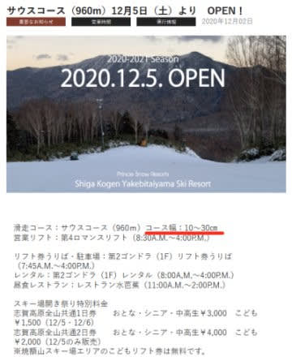
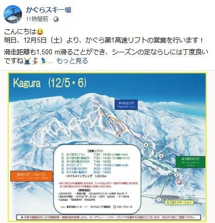
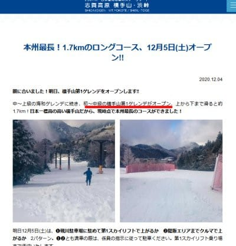

# この週末も志賀高原へ行ってます！わがホームゲレンデ焼額で滑ってます…土日は概ね晴れの，ほぼ100%人工雪

📅 投稿日時: 2020-12-05 00:50:01

ということで．

明日，予定通りわがホームゲレンデの

焼額山スキー場がオープンするようなので．

明日は早速，第4ロマンスの

幅10~30cm

という，ヤケビの職人が素晴らしく

細い幅で仕上げたらしいコースを

滑ってます…！

（[焼額山スキー場ホームページ](https://www.princehotels.co.jp/ski/shiga/informations/open/)より）

で．

この週末は．

かぐらもクワッドが動き始めるようですし…

（[かぐらスキー場Facebook](https://www.facebook.com/snowkagura/photos/a.307362099391117/3333335483460415/?type=3&theater)より）

アサマ2000も[丸沼もオープン](https://twitter.com/marunumakogen/status/1334647272508858373)したみたいですし．

…そして，

志賀高原の横手山は，

なんと．明日土曜から，

第1ペアが動くようです…！

（[横手山スキー場ホームページ](https://yokoteyama2307.com/news/12470/)より）

まさか，今週末に第1が動くとは…！

熊の湯は，今週末に馬の背が滑れる

かも…と期待していましたが．

今のところアナウンスは出てませんね…

ってことで．

今週末の志賀高原は，

・横手山　第1，第4リフト

・熊の湯　第2ペア下半分

・高天ヶ原　トリプル

・一の瀬ファミリー下部　ペアA,B線

・焼額　第4ロマンス

が運転ということになりますね…

で．

この土日の天気は，概ね水曜に予想した通り．

土曜：午前は雲が多いかもしれないけど

　概ね晴れ．

　あさイチは冷えて雪は締まってるけど，

　昼間は気温が0℃をちょっと上回るくらい

　まで上がり，午後は雪がわずかに緩む．

日曜：晴れ．朝イチは放射冷却で冷えて

　締まった人工雪バーン．

　斜度のあるところは下地の硬いのが

　出てくるかも．

　昼間は日差しもあり暖かく感じ，

　0℃をわずかに上回り，雪も表面が

　緩み始める

といった感じでしょうか…

残念ながら，土日とも天然雪の降雪は

なさそうです（涙）

ということで．

今週末も志賀高原を滑ってます～！

…あと3時間後に出発か…

また2時間ちょいしか寝られない…（涙）

## 💬 コメント一覧

### 💬 コメント by (m&t)
**タイトル**: Unknown
**投稿日**: 2020-12-05 23:57:53

Sさん、お久しぶりです。

m&tのホーム、アサマ2000がようやくオープン。行ってきました！

昨晩少し雪が降った様で、チェリーパークラインはスケートリンクの様でした。アサマに来る方は下界が雪の時は４ＷＤ＋スタッドレス以外の場合はチェーンを着けて下さいね。登れません。

スキー場は第2ステージのみのオープンです。

焼額の10〜30㌢には負けますが、1/3幅の30㍍位です。

コースは狭いのに、駐車場は一杯。リフト待ちこそほとんど無いものの、コースは人だらけ!レーシングキャンプがたくさん入っていました。

朝イチは昨晩の新雪３㌢位で雪はちょっと重いもののシーズン初めとしては良かったですが、あっという間に下のアイスバーンが出てきて、アサマらしいハードバーンに早変わりです。

10時頃には更に人が増え危険な感じになってきたので、怪我をもらう前に早々に退散しました。

年末年始には志賀高原に参戦予定です。朝礼か終礼に参加しますので、よろしくお願いします。

### 💬 コメント by (Skier_S)
**タイトル**: ＞m&tさま
**投稿日**: 2020-12-06 00:39:43

やっとアサマ2000オープンしましたね…！

でも，そんなに混んだんですか…

焼額はガラガラでしたよ～！！

アイスバーンもなく，かなり楽しかったです．

年末年始と言わず，ぜひもっと志賀へお越しください！

朝礼メンバー一同，お待ちしてます．

