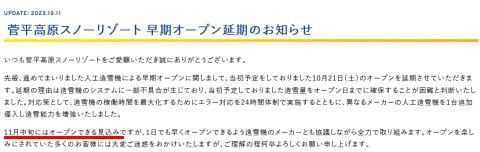
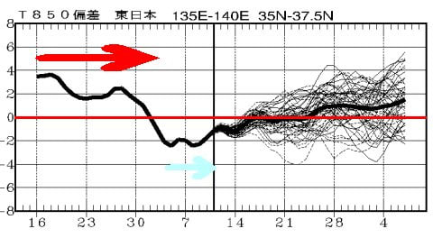

# イエティの2023/2024シーズンオープン日，予想通りの10月20日で確定！…そして菅平は11月中旬オープンという案内が…

📅 投稿日時: 2023-10-13 00:34:09

えー．

ついに出ましたね．

イエティのオープン予告が…

予想通り，10月20日(金)のオープンです！！

（[スノーパークイエティホームページ](https://www.yeti-resort.com/)より)

菅平が10月21日オープンを予告したので．

その1日前を狙って，日本最速のオープンを

狙うのかな…と思ってましたが．

やはり10月20日のオープンでした！

…ただ．

おとといの記事に書いたように．

菅平は人工降雪機の不具合でオープンが

遅れ．

10月中どころか，11月上旬もダメみたいで…

11月中旬オープンめどになったようです（涙）

これなら，イエティはもう1週間遅らせても

余裕で日本最初のオープンでしたね…

（[菅平スノーリゾートホームページ](https://sugadaira-snowresort.com/news/1377/)より）

しかし．

造雪機，新しく追加導入までしたのに，

オープンが11月中旬って…

菅平のスタッフにとっては，かなり残念な

感じだろうなぁ…

ってなことで．

イエティのオープンが10月20日という

ことなので…

私のスキーシーズンインは10月21日の

土曜になりそうです…！！

いやー．

あと1週間ちょいで，2023/2024シーズンインですよ～！！！

…でもまだ全然心の準備ができてない…

ってなことで．

シーズンイン目前ですが．

[FCVX14](https://n-kishou.com/ee/image4/lfax/fcvx14_202310112100.png?x=36&y=6)でこれから11月上旬までの気温傾向を見ると…

赤矢印で記した，9月30日までのおかしい

ほどの高温期間と，

そのあとの青矢印で示した，山沿いに

雪が積もるほどの低温期間があったという

極端な気候だったのがよくわかるグラフ

ですが．

今後を見ると…

…うん．10月21日くらいまでは

平年並みですが．

その後は，11月上旬にかけて気温が

上がりそうですね…（涙）

うーん．

まぁ，平年比+1度程度ですが…

平年より冷えてくれないと，横手山，

予告通りの11月3日のオープンは

厳しいだろうなぁ…

とりあえず．

菅平のオープンは遅れそうだけど．

イエティは10月20日，

そして軽井沢は11月1日オープンと，

スキーシーズンはもうすぐですよ～っ！！
