# 2013年9月　子連れタイ・タオ島ダイビング旅行記　その１

📅 投稿日時: 2013-10-01 02:01:33

🏷️ カテゴリ: [ダイビング日記](ce3a7a8d424d112fce83ee85c81a0e344.md)

ってことで．

やってきました，出発の日．

…つーても，今回の旅行．

羽田発着にしたので，

羽田出発の国際線の定番である．

「真夜中出発，ド早朝帰国」

というパターンになるわけで．

んだもんで．

この日も，夜まで仕事をして．

「え？今日も普通に仕事してましたけど，何か？」

と，涼しい顔で会社を後にし．

それから全力で帰宅．15分でシャワーを浴びて着替えたら，

前日にパッケージングしておいた荷物を持って，

直ちに空港へ出発…．

…って感じで．

夜8時ごろまで仕事してたと言うのに．

夜10時過ぎには，羽田空港国際線ターミナルへ到着！

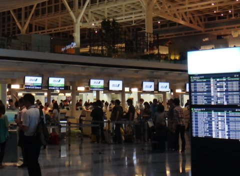

で．

バンコク行きANA便のチェックインをするわけですが．

スターアライアンスゴールド会員の我が一家．

いつも通りANAラウンジが使えるよね～，

と，思っていたところ…

カウンター係員「ただいまラウンジが大変混雑しており，ラウンジの

　利用は11時以降にしていただきたいのですが…」

ええっ！？

そんなことがあるの？

…私にとって，初めての経験．

子供がいるので，ラウンジが使えるとありがたいんだけどな～．

…でも，手荷物検査＆出国審査その他に10分以上かかるだろうし，

残り30分ちょっと待てば，あと1時間はラウンジが使えるし，

まぁ，仕方ないかな？

と，思ったところ．

カウンター係員「そのかわり，空港内で使えるお食事券を…」

ってことで．

なぜか3人分で，総額こんなにもなる利用券をもらってしまった…

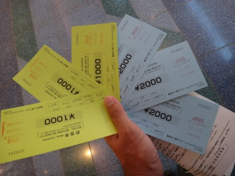

わずか30分待てばラウンジが使えるというのに，

それの対価としては，かなり太っ腹な金額だな～…

＃結局，このお食事券はビール＆ジュース1杯ずつしか利用しなかったけど…

ってことで．

チェックイン後，

手荷物検査と出国ゲートをくぐりぬけ．

＃…くぐり抜けてはいけません．ちゃんと通過しています

それなりにでかい空港内のお店を冷やかしつつうろついていると，

ラウンジ利用OKになる11時．

ってことで．

ラウンジはちょっと混んでたけど．

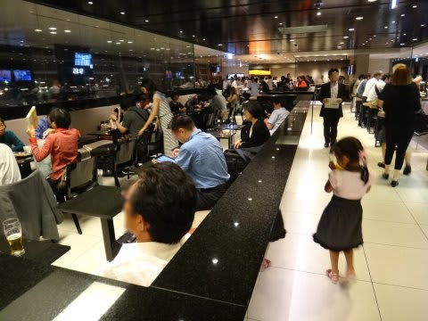

一日の仕事を終えてきて．

これから後は寝るだけ，と言う開放感で，ビールやらワインをたらふく飲み．

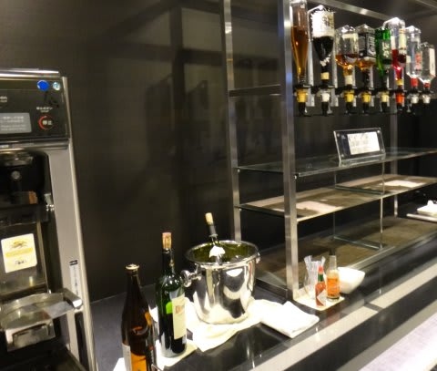

深夜0時すぎ，搭乗！

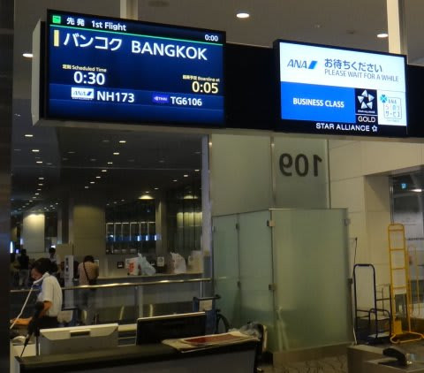

深夜だと言うのに，飛行機大好きな娘は．

いつも通り，空港に着いたときからハイテンションで，

「早く飛行機乗りたい～」と言っていて．

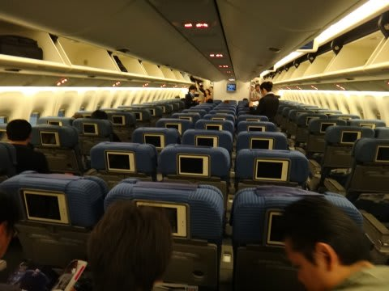

飛行機に乗れて超うれしそう．

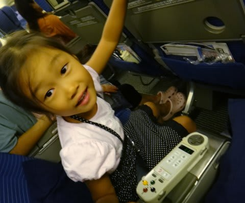

離陸後，早速映画鑑賞して満足げな娘．

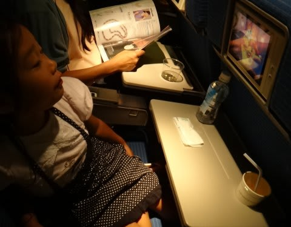

ホントにおまえ，どんだけ飛行機すきやねん…

離陸後1時間たたずに，軽食が配られましたが…

大人はクラッカーやスナック類．

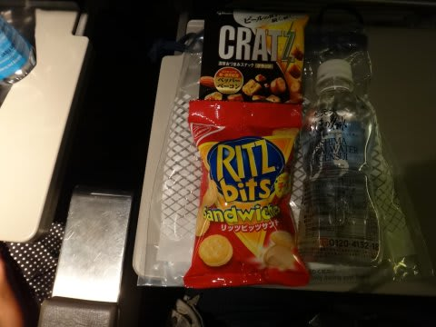

チャイルドミールはサンドイッチ＆フルーツ．

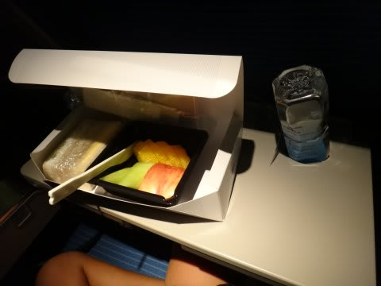

なんだ．チャイミルのほうがゼイタクっぽく見えるじゃないか…

映画やら機内食やらに喜んでいた娘は，かなり夜遅くまで

起きてましたが．

じきに，コテンと寝てしまいました．

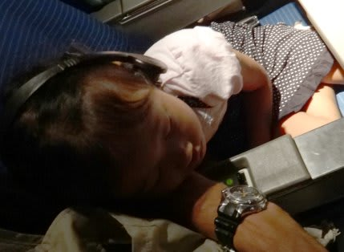

ホントに，長距離フライトに関しては何も心配しなくていい，

海外旅行するのに楽な娘に育ったことよ…

## 💬 コメント一覧

### 💬 コメント by (ZENKO)
**タイトル**: タオ島ダイビング
**投稿日**: 2013-10-01 12:36:43

いよいよ始まりましたね！

タオ島ツアー記。

楽しみにしております！

### 💬 コメント by (Skier_S)
**タイトル**: ZENKOさま
**投稿日**: 2013-10-02 00:01:12

をを！

タオ勝ち組(^^;)のZENKOさん！

おひさです～．

面白いレポートを書けるかどうか…

仕事が忙しくて難航中ですが，

お楽しみに～

